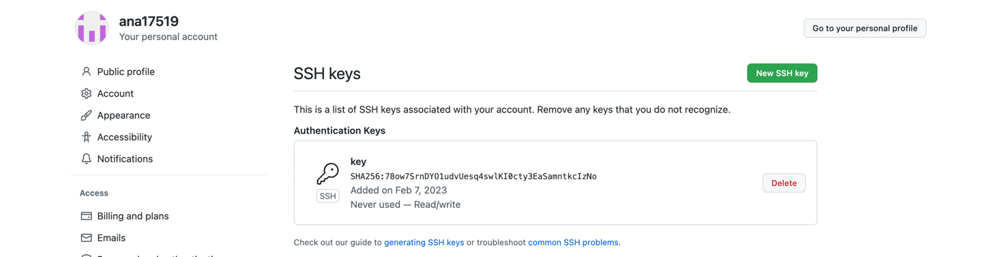
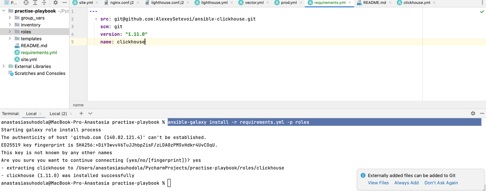
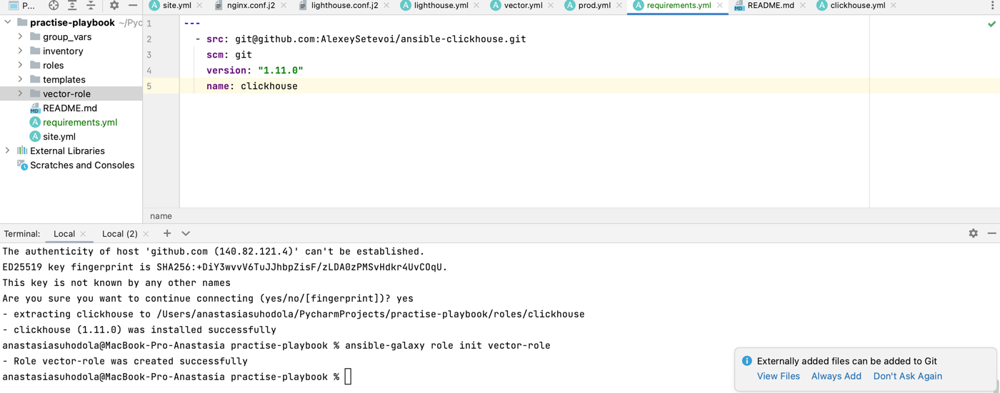
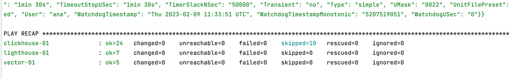

**Домашнее задание к занятию "4. Работа с roles"**

**Подготовка к выполнению**

* (Необязательно) Познакомьтесь с lighthouse
* Создайте два пустых публичных репозитория в любом своём проекте: vector-role и lighthouse-role.
* Добавьте публичную часть своего ключа к своему профилю в github.



**Основная часть**

Наша основная цель - разбить наш playbook на отдельные roles. 

* Задача: сделать roles для clickhouse, vector и lighthouse и написать playbook для использования этих ролей. 
* Ожидаемый результат: существуют три ваших репозитория: два с roles и один с playbook.

1. Создать в старой версии playbook файл requirements.yml и заполнить его следующим содержимым:

```
---
  - src: git@github.com:AlexeySetevoi/ansible-clickhouse.git
    scm: git
    version: "1.11.0"
    name: clickhouse
```

2. При помощи ansible-galaxy скачать себе эту роль.

`ansible-galaxy install -r requirements.yml -p roles`



3. Создать новый каталог с ролью при помощи ansible-galaxy role init vector-role.



4. На основе tasks из старого playbook заполните новую role. Разнесите переменные между vars и default.




5. Перенести нужные шаблоны конфигов в templates.
6. Описать в README.md обе роли и их параметры.
7. Повторите шаги 3-6 для lighthouse. Помните, что одна роль должна настраивать один продукт. 
8. Выложите все roles в репозитории. 
Проставьте тэги, используя семантическую нумерацию добавьте roles в requirements.yml в playbook.
9. Переработайте playbook на использование roles. Не забудьте про зависимости lighthouse и возможности совмещения roles с tasks. 
10. Выложите playbook в репозиторий. 
11. В ответ приведите ссылки на оба репозитория с roles и одну ссылку на репозиторий с playbook.

**lighthouse**: [https://github.com/ana17519/lighthouse-role/tree/1.0.0](https://github.com/ana17519/lighthouse-role/tree/1.0.0)

**vector**: [https://github.com/ana17519/vector-role/tree/1.0.0](https://github.com/ana17519/vector-role/tree/1.0.0)

**playbook**: [https://github.com/ana17519/practise-playbook/tree/feature/roles](https://github.com/ana17519/practise-playbook/tree/feature/roles)