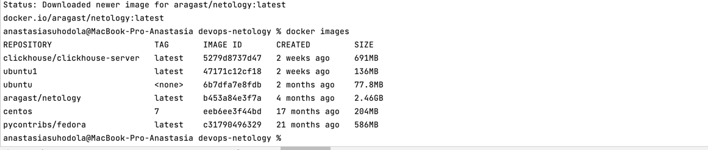
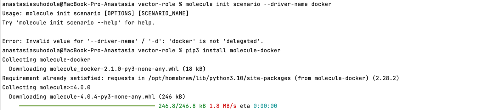
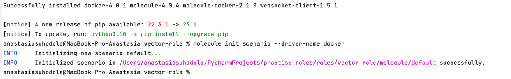

**Домашнее задание к занятию "5. Тестирование roles"**

**Подготовка к выполнению**

1. Установите molecule: pip3 install "molecule==3.5.2"
2. Выполните docker pull aragast/netology:latest - это образ с podman, tox и несколькими пайтонами (3.7 и 3.9) внутри



**Основная часть**

* Наша основная цель - настроить тестирование наших ролей. 
* Задача: сделать сценарии тестирования для vector. 
* Ожидаемый результат: все сценарии успешно проходят тестирование ролей.

**Molecule**

1. Запустите molecule test -s centos7 внутри корневой директории clickhouse-role, посмотрите на вывод команды.

`molecule test -s centos_7`

2. Перейдите в каталог с ролью vector-role и создайте сценарий тестирования по умолчанию при помощи 
molecule init scenario --driver-name docker.

при запуске `molecule init scenario --driver-name docker` выводится ошибка: 

`Error: Invalid value for '--driver-name' / '-d': 'docker' is not 'delegated'.`

поэтому вначала запустила: `pip3 install molecule-docker`, затем  `molecule init scenario --driver-name docker`





3. Добавьте несколько разных дистрибутивов (centos:8, ubuntu:latest)
для инстансов и протестируйте роль, исправьте найденные ошибки, если они есть.

в `roles/vector-role/meta/main.yml` в блок `galаxy-info` и `platforms` добавлено инфо:

```
galaxy_info:
  role_name: vector
  namespace: ana17519

...

platforms:
  - name: centos8
    image: docker.io/pycontribs/centos:8
    pre_build_image: true
  - name: ubuntu
    image: docker.io/pycontribs/ubuntu:latest
    pre_build_image: true

```

