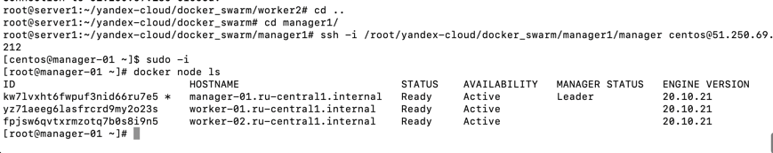
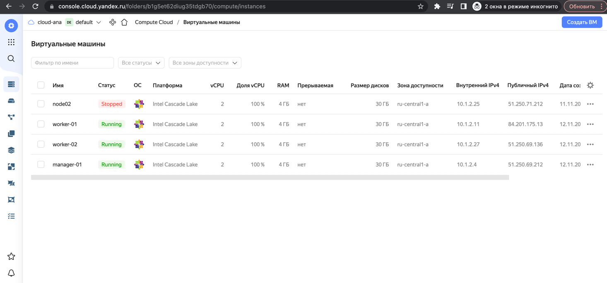
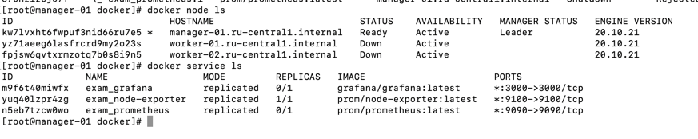
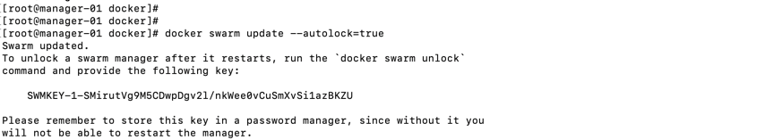

**Домашнее задание к занятию "5. Оркестрация кластером Docker контейнеров на примере Docker Swarm"**

**Задача 1**

**Дайте письменные ответы на следующие вопросы:**
**В чём отличие режимов работы сервисов в Docker Swarm кластере: replication и global?**

Режимы Replicated и Global
Существует два типа развертывания сервисов: replicated и global.

global это означает, что данный сервис будет запущен ровно в одном экземпляре на всех возможных нодах. 
А replicated означает, что n-ое кол-во контейнеров для данного сервиса будет запущено на всех доступных нодах.

**Какой алгоритм выбора лидера используется в Docker Swarm кластере?**

В кластере существует Manager node, worker node. Manager node
находится в сети поддержания согласованности по алгоритму Raft. Raft –
алгоритм, использующийся для решения задач нахождения консенсуса в сети
ненадёжных вычислений. Для обеспечения отказоустойчивости в Docker
Swarm обычно создают несколько серверов с ролью менеджера, и из них будет
избираться лидер по алгоритму Raft, и эта нода теперь имеет роль Leader node.

**Что такое Overlay Network?**

Overlay Network — общий случай логической сети, создаваемой поверх другой сети. Узлы оверлейной сети могут быть 
связаны либо физическим соединением, либо логическим, для которого в основной сети существуют один или несколько 
соответствующих маршрутов из физических соединений. Примерами оверлеев являются сети VPN и одноранговые сети, 
которые работают на основе интернета и представляют собой «надстройки» над классическими сетевыми протоколами, 
предоставляя широкие возможности, изначально не предусмотренные разработчиками основных протоколов. 
Коммутируемый доступ в интернет фактически осуществляется через оверлей (например, по протоколу PPP), 
который работает «поверх» обычной телефонной сети.

**Задача 2**

**Создать ваш первый Docker Swarm кластер в Яндекс.Облаке**

**Для получения зачета, вам необходимо предоставить скриншот из терминала (консоли), с выводом команды:**

docker node ls

**Задача 3**

**Создать ваш первый, готовый к боевой эксплуатации кластер мониторинга, состоящий из стека микросервисов.**

Для получения зачета, вам необходимо предоставить скриншот из терминала (консоли), с выводом команды:

docker service ls

**Задача 4 (*)**

**Выполнить на лидере Docker Swarm кластера команду (указанную ниже) и дать письменное описание её функционала, 
что она делает и зачем она нужна:**

см.документацию: https://docs.docker.com/engine/swarm/swarm_manager_locking/
docker swarm update --autolock=true

Журналы Raft, используемые менеджерами swarm, по умолчанию зашифрованы на диске. Это шифрование в состоянии 
покоя защищает конфигурацию и данные вашего сервиса от злоумышленников, которые получают доступ к зашифрованным 
журналам Raft. Одна из причин, по которой эта функция была введена, заключалась в поддержке функции секретов Docker .

При перезапуске Docker в память каждого узла менеджера загружаются как ключ TLS, используемый для шифрования связи 
между узлами swarm, так и ключ, используемый для шифрования и расшифровки журналов Raft на диске. Docker может 
защитить общий ключ шифрования TLS и ключ, используемый для шифрования и расшифровки журналов Raft в состоянии покоя, 
позволяя вам стать владельцем этих ключей и требовать ручной разблокировки ваших менеджеров. Эта функция называется автоблокировкой .

Когда Docker перезапустится, вы должны сначала разблокировать swarm, используя ключ шифрования, сгенерированный 
Docker, когда swarm был заблокирован. Можно изменить этот ключ шифрования в любое время.

