**Домашнее задание к занятию "6.5. Elasticsearch"**

**Задача 1**

В этом задании вы потренируетесь в:

* установке elasticsearch
* первоначальном конфигурировании elasticsearch
* запуске elasticsearch в docker

**Используя докер образ centos:7 как базовый и документацию по установке и запуску Elasticsearch:**

* составьте Dockerfile-манифест для elasticsearch
* соберите docker-образ и сделайте push в ваш docker.io репозиторий
* запустите контейнер из получившегося образа и выполните запрос пути / c хост-машины

Требования к elasticsearch.yml:

* данные path должны сохраняться в /var/lib
* имя ноды должно быть netology_test

**В ответе приведите:**

* текст Dockerfile манифеста

`FROM --platform=linux/amd64 centos:7`

`#RUN echo "2q222232hello world"`

`EXPOSE 9200 9300`

`USER 0`

`RUN export ES_HOME="/var/lib/elasticsearch" && \`

`    yum -y install wget && \`

`    wget https://artifacts.elastic.co/downloads/elasticsearch/elasticsearch-7.17.0-linux-x86_64.tar.gz && \`

`    wget https://artifacts.elastic.co/downloads/elasticsearch/elasticsearch-7.17.0-linux-x86_64.tar.gz.sha512 && \`

`    sha512sum -c elasticsearch-7.17.0-linux-x86_64.tar.gz.sha512 && \`

`    tar -xzf elasticsearch-7.17.0-linux-x86_64.tar.gz && \`

`    rm -f elasticsearch-7.17.0-linux-x86_64.tar.gz* && \`

`    mv elasticsearch-7.17.0 ${ES_HOME} && \`

`    useradd -m -u 1000 elasticsearch && \`

`    chown elasticsearch:elasticsearch -R ${ES_HOME} && \`

`    yum -y remove wget && \`

`    yum clean all`

`COPY --chown=elasticsearch:elasticsearch config1/* /var/lib/elasticsearch/config/`

`USER 1000`

`ENV ES_HOME="/var/lib/elasticsearch" \`

`    ES_PATH_CONF="/var/lib/elasticsearch/config"`

`WORKDIR ${ES_HOME}`

`CMD ["sh", "-c", "${ES_HOME}/bin/elasticsearch"]`

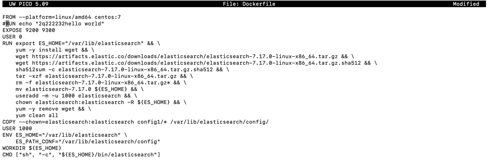

build:

`docker build -t asukhadola/bbb -f Dockerfile .`

`docker run --rm -d --name bbb -p 9200:9200 asukhadola/bbb`

`docker exec -it bbb bash`

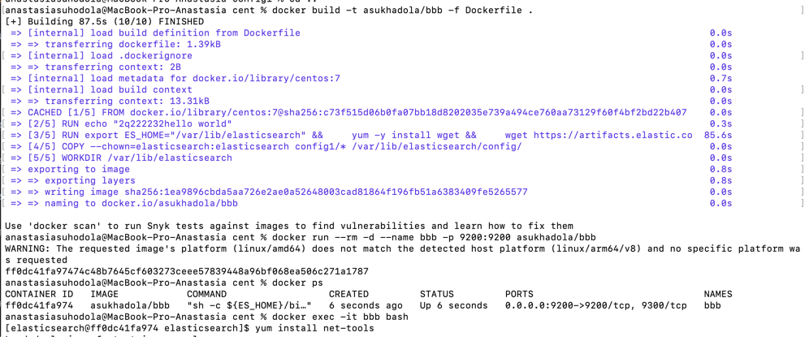

* ссылку на образ в репозитории dockerhub - https://hub.docker.com/repository/docker/asukhadola/bbb

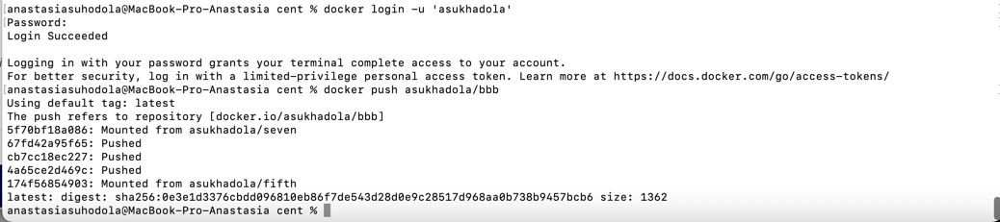

* ответ elasticsearch на запрос пути / в json виде

`[elasticsearch@ff0dc41fa974 elasticsearch]$ curl localhost:9200`

`{`

`  "name" : "netology_test",`

`  "cluster_name" : "netology_test",`

`  "cluster_uuid" : "tNz_1agsSLSlh1DEPSX9nA",`

`  "version" : {`

`    "number" : "7.17.0",`

`    "build_flavor" : "default",`

`    "build_type" : "tar",`

`    "build_hash" : "bee86328705acaa9a6daede7140defd4d9ec56bd",`

`    "build_date" : "2022-01-28T08:36:04.875279988Z",`

`    "build_snapshot" : false,`

`    "lucene_version" : "8.11.1",`

`    "minimum_wire_compatibility_version" : "6.8.0",`

`    "minimum_index_compatibility_version" : "6.0.0-beta1"`

`  },`

`  "tagline" : "You Know, for Search"`

`}`

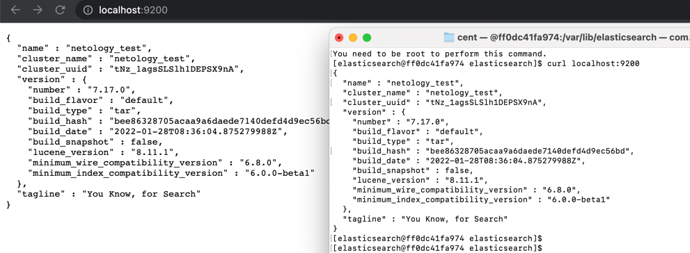

Подсказки:

* возможно вам понадобится установка пакета perl-Digest-SHA для корректной работы пакета shasum
* при сетевых проблемах внимательно изучите кластерные и сетевые настройки в elasticsearch.yml
* при некоторых проблемах вам поможет docker директива ulimit
* elasticsearch в логах обычно описывает проблему и пути ее решения
* Далее мы будем работать с данным экземпляром elasticsearch.

**Задача 2**

В этом задании вы научитесь:

* создавать и удалять индексы
* изучать состояние кластера
* обосновывать причину деградации доступности данных

Ознакомьтесь с документацией и добавьте в elasticsearch 3 индекса, в соответствии со таблицей:

Имя	Количество реплик	Количество шард

ind-1	0	1

ind-2	1	2

ind-3	2	4

`curl -X PUT "localhost:9200/ind-1?pretty" -H 'Content-Type: application/json' -d'
{
  "settings": {
    "number_of_shards": 1,
    "number_of_replicas": 0
  }
}
'`

`curl -X PUT "localhost:9200/ind-2?pretty" -H 'Content-Type: application/json' -d'
{
  "settings": {
    "number_of_shards": 2,
    "number_of_replicas": 1
  }
}
'`

`curl -X PUT "localhost:9200/ind-3?pretty" -H 'Content-Type: application/json' -d'
{
  "settings": {
    "number_of_shards": 4,
    "number_of_replicas": 2
  }
}
'`

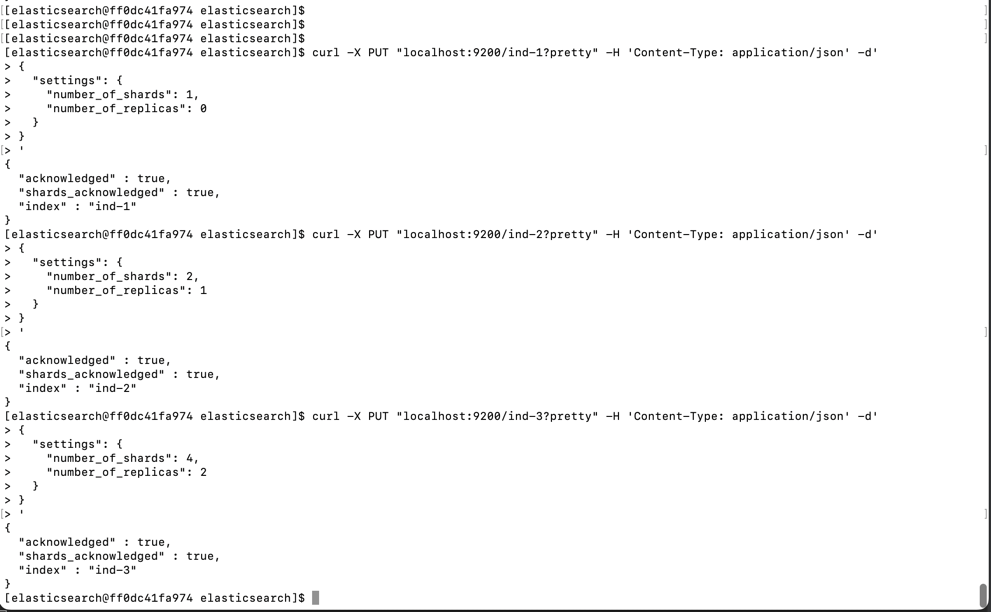

**Получите список индексов и их статусов, используя API и приведите в ответе на задание.**

`curl 'localhost:9200/_cat/indices?v'`

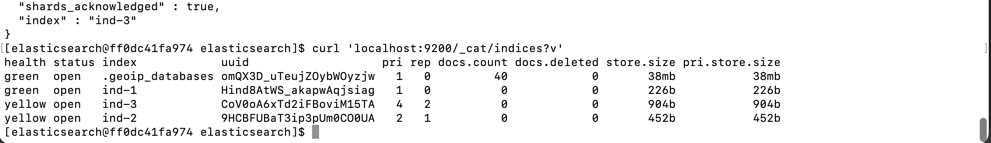

**Получите состояние кластера elasticsearch, используя API.**

`curl -X GET "localhost:9200/_cluster/health?pretty"`

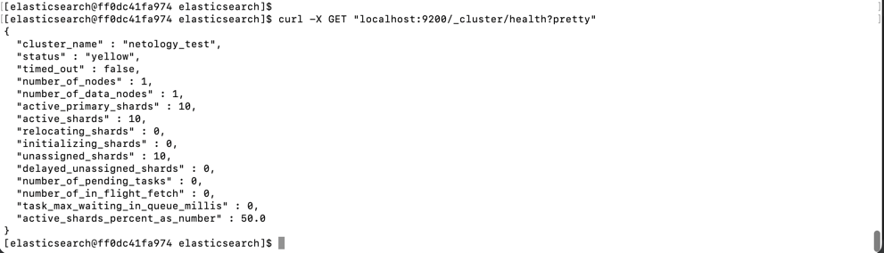

**Как вы думаете, почему часть индексов и кластер находится в состоянии yellow?**

Первичный шард и реплика не могут находиться на одном узле, если копия не назначена. Таким образом, один узел не может размещать копии

**Удалите все индексы.**

`curl -X DELETE 'http://localhost:9200/_all'`

Важно

При проектировании кластера elasticsearch нужно корректно рассчитывать количество реплик и шард, 
иначе возможна потеря данных индексов, вплоть до полной, при деградации системы.

**Задача 3**

В данном задании вы научитесь:

* создавать бэкапы данных
* восстанавливать индексы из бэкапов

Создайте директорию {путь до корневой директории с elasticsearch в образе}/snapshots.

`mkdir $ES_HOME/snapshots`

Используя API зарегистрируйте данную директорию как snapshot repository c именем netology_backup.

`path.repo: "/var/lib/elasticsearch/snapshots"`

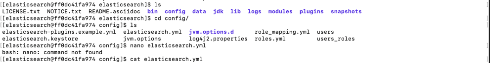

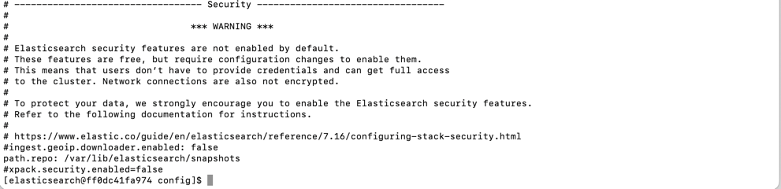

`curl -X PUT "localhost:9200/_snapshot/netology_backup?pretty" -H 'Content-Type: application/json' -d'`

`{`

`  "type": "fs",`

`  "settings": {`

`    "location": "/var/lib/elasticsearch/snapshots",`

`    "compress": true`

`  }`

`}'`

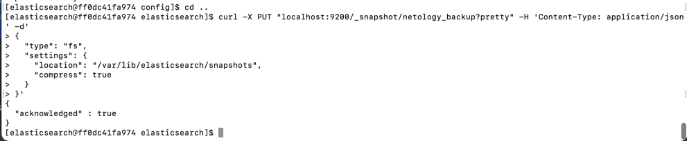

Приведите в ответе запрос API и результат вызова API для создания репозитория.

Создайте индекс test с 0 реплик и 1 шардом и приведите в ответе список индексов.

`curl -X PUT "localhost:9200/test?pretty" -H 'Content-Type: application/json' -d'`

`{`

`  "settings": {`

`    "number_of_shards": 1,`

`    "number_of_replicas": 0`

`  }`

`}`

`'`

`curl 'localhost:9200/_cat/indices?v'`

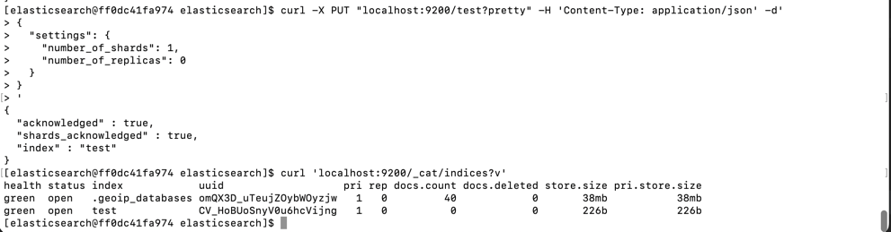

Создайте snapshot состояния кластера elasticsearch.

`curl -X PUT "localhost:9200/_snapshot/netology_backup/snapshot_1?wait_for_completion=true&pretty"`

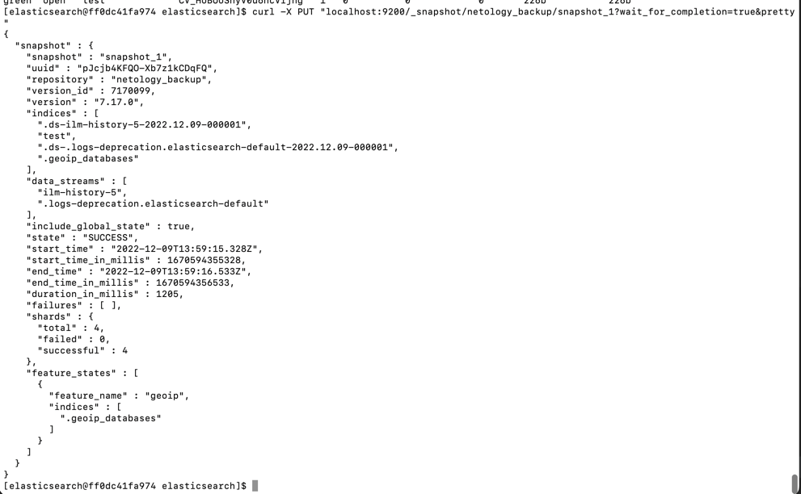

Приведите в ответе список файлов в директории со snapshotами.

`ls -l /var/lib/elasticsearch/snapshots/`

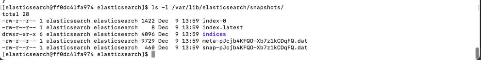

Удалите индекс test и создайте индекс test-2. Приведите в ответе список индексов.

`curl -X DELETE "localhost:9200/test?pretty"`

`curl -X PUT "localhost:9200/test-2?pretty" -H 'Content-Type: application/json' -d'`

`{`

`  "settings": {`

`    "number_of_shards": 1,`

`    "number_of_replicas": 0`

`  }`

`}`

`'`

список индексов:

`curl 'localhost:9200/_cat/indices?pretty'`

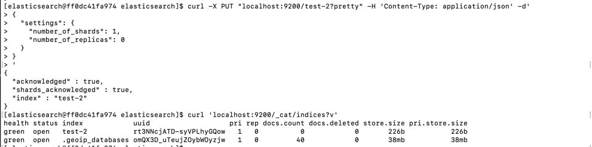

Восстановите состояние кластера elasticsearch из snapshot, созданного ранее.

`curl -X POST "localhost:9200/_snapshot/netology_backup/snapshot_1/_restore?pretty" -H 'Content-Type: application/json' -d'`

`{`

`  "indices": "*",`

`  "include_global_state": true`

`}`

`'`

`curl 'localhost:9200/_cat/indices?v'`  - список индексов

Приведите в ответе запрос к API восстановления и итоговый список индексов.

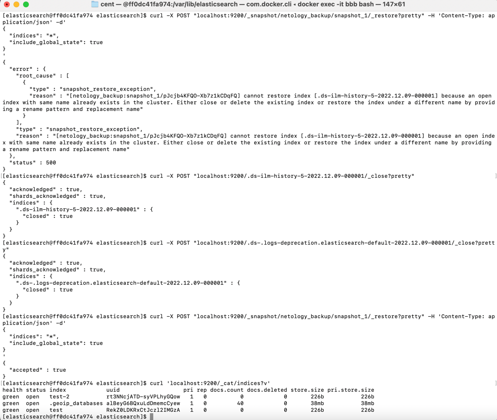

Подсказки:

возможно вам понадобится доработать elasticsearch.yml в части директивы path.repo и перезапустить elasticsearch

elasticsearch.yaml:

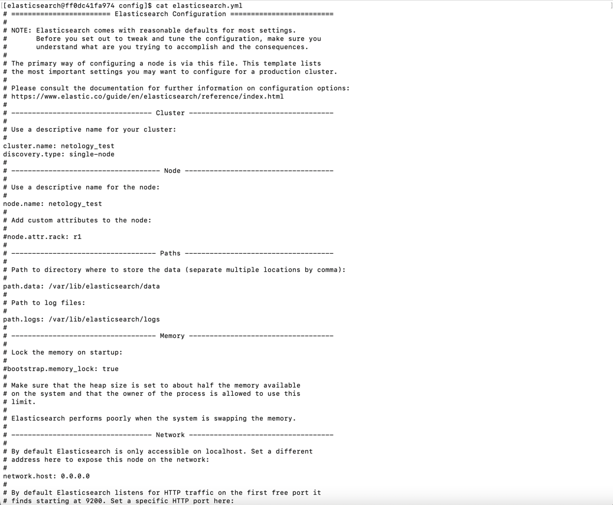
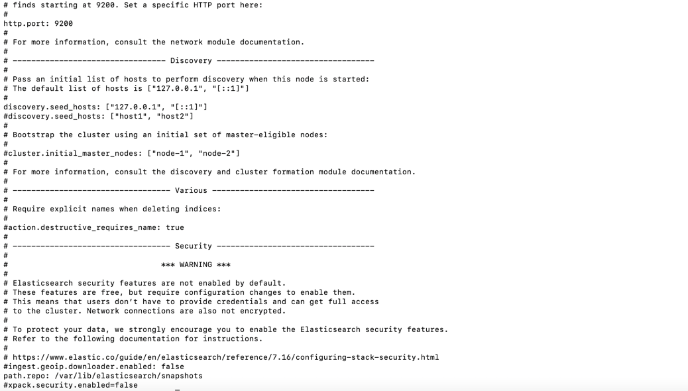