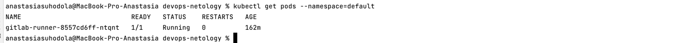
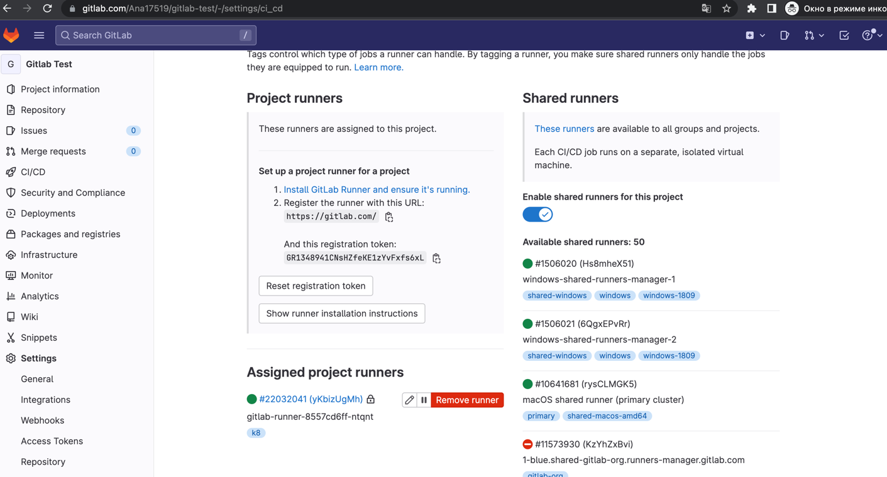
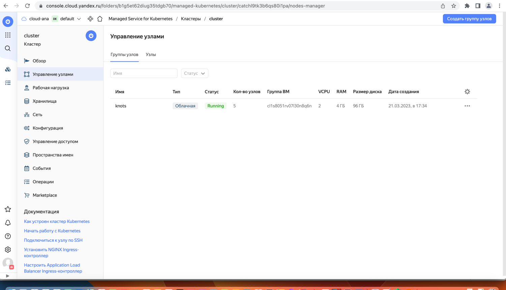
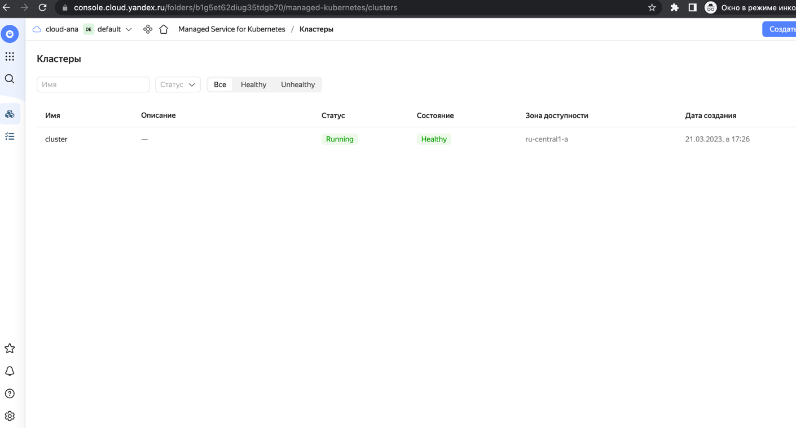
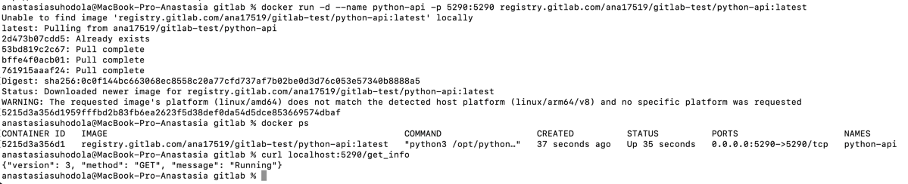
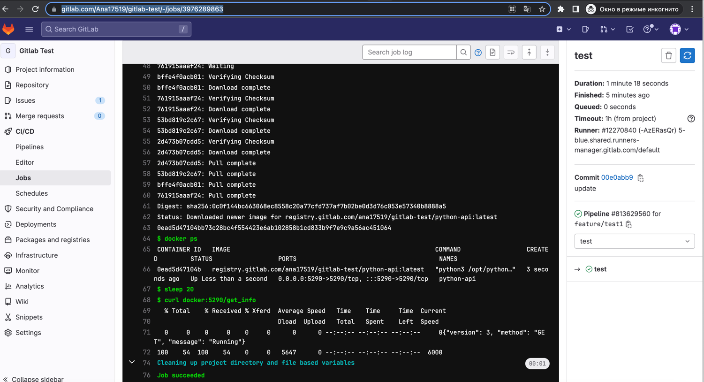

**Домашнее задание к занятию 12 «GitLab»**

**Подготовка к выполнению**

1. Подготовьте к работе GitLab по [инструкции](https://cloud.yandex.ru/docs/tutorials/infrastructure-management/gitlab-containers).
2. Создайте свой новый проект.
3. Создайте новый репозиторий в GitLab, наполните его [файлами](https://github.com/netology-code/mnt-homeworks/tree/MNT-video/09-ci-06-gitlab/repository).
4. Проект должен быть публичным, остальные настройки по желанию.

**Основная часть**

**DevOps**

В репозитории содержится код проекта на Python. Проект — RESTful API сервис. 
Ваша задача — автоматизировать сборку образа с выполнением python-скрипта:

1. Образ собирается на основе [centos:7](https://hub.docker.com/_/centos?tab=tags&page=1&ordering=last_updated).
2. Python версии не ниже 3.7.
3. Установлены зависимости: flask flask-jsonpify flask-restful.
4. Создана директория /python_api.
5. Скрипт из репозитория размещён в /python_api.
6. Точка вызова: запуск скрипта.
7. Если сборка происходит на ветке master: должен подняться pod kubernetes на основе образа python-api, 
иначе этот шаг нужно пропустить.

* [ссылка на репозиторий](https://gitlab.com/Ana17519/gitlab-test/-/tree/main)
* [Dockerfile](https://gitlab.com/Ana17519/gitlab-test/-/blob/main/Dockerfile)
* [gitlab-ci.yml](https://gitlab.com/Ana17519/gitlab-test/-/blob/main/.gitlab-ci.yml)
* первая часть по build образа прошла успешно [ссылка](https://gitlab.com/Ana17519/gitlab-test/-/jobs/3986224197)
* вторая часть с поднятием pod kubernetes прошла успешно [ссылка](https://gitlab.com/Ana17519/gitlab-test/-/jobs/3986248935)

**после обновления Dockerfile (добавлен python версии 3/7)первая часть по build образа прошла успешно [ссылка](https://gitlab.com/Ana17519/gitlab-test/-/jobs/4053172957)**

dockerfile:

```
FROM centos:7
RUN yum makecache \
    && yum install -y gcc openssl-devel bzip2-devel libffi-devel wget make
RUN wget https://www.python.org/ftp/python/3.7.0/Python-3.7.0.tgz \
    && tar xzf Python-3.7.0.tgz \
    && cd Python-3.7.0 \
    && ./configure --enable-optimizations \
    && make altinstall \
    && rm -rf ../Python-3.7.0.tgz ../Python-3.7.0
COPY python-api.py /opt/python_api/python-api.py
RUN pip3.7 install -U  --upgrade pip && pip3.7 install flask flask-jsonpify flask-restful
EXPOSE 5290
CMD ["python3.7", "/opt/python_api/python-api.py"]
```




Количество узлов - увеличено до 5 штук:




**Product Owner**

Вашему проекту нужна бизнесовая доработка: нужно поменять JSON ответа на вызов метода 
GET /rest/api/get_info, необходимо создать Issue в котором указать:

1. Какой метод необходимо исправить.
2. Текст с { "message": "Already started" } на { "message": "Running"}.
3. Issue поставить label: feature.

[Issue](https://gitlab.com/Ana17519/gitlab-test/-/issues/1)

**Developer**

Пришёл новый Issue на доработку, вам нужно:

1. Создать отдельную ветку, связанную с этим Issue.
2. Внести изменения по тексту из задания.
3. Подготовить Merge Request, влить необходимые изменения в master, проверить, что сборка прошла успешно.

[Merge Request](https://gitlab.com/Ana17519/gitlab-test/-/merge_requests/1)

[Job succeed](https://gitlab.com/Ana17519/gitlab-test/-/jobs/3975840299) 

**Tester**

Разработчики выполнили новый Issue, необходимо проверить валидность изменений:

1. Поднять докер-контейнер с образом python-api:latest и проверить возврат метода на корректность.
2. Закрыть Issue с комментарием об успешности прохождения, указав желаемый результат и фактически достигнутый.




**Необязательная часть**

Автомазируйте работу тестировщика — пусть у вас будет отдельный конвейер, который автоматически 
поднимает контейнер и выполняет проверку, например, при помощи curl. 
На основе вывода будет приниматься решение об успешности прохождения тестирования.

добавила отдельный [stage](https://gitlab.com/Ana17519/gitlab-test/-/blob/feature/test1/.gitlab-ci.yml) в gitlab-ci.yml - 
делала в ветке feature/test1 - в целевом варианте stage test должен быть перед deploy 
[link](https://gitlab.com/Ana17519/gitlab-test/-/pipelines/813638936) - ветка не вмержена:

```
test:
  image: docker
  stage: test
  before_script:
    - docker login -u $CI_REGISTRY_USER -p $CI_REGISTRY_PASSWORD $CI_REGISTRY
    - apk add --update curl && rm -rf /var/cache/apk/*
    - docker run -d --name python-api -p 5290:5290 $CI_REGISTRY/ana17519/gitlab-test/python-api:latest  
    - docker ps
  script:
    - sleep 20
    - curl docker:5290/get_info
  only:
    - feature/test1
```

успешно прошла [джоба](https://gitlab.com/Ana17519/gitlab-test/-/jobs/3976289863) :



[Issue added ](https://gitlab.com/Ana17519/gitlab-test/-/issues/1)
