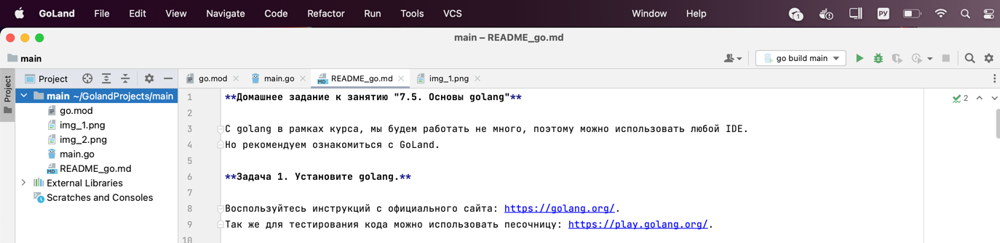
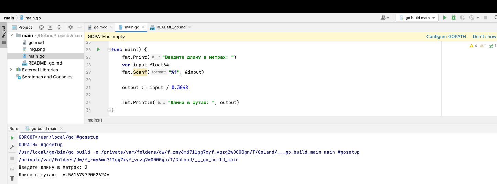
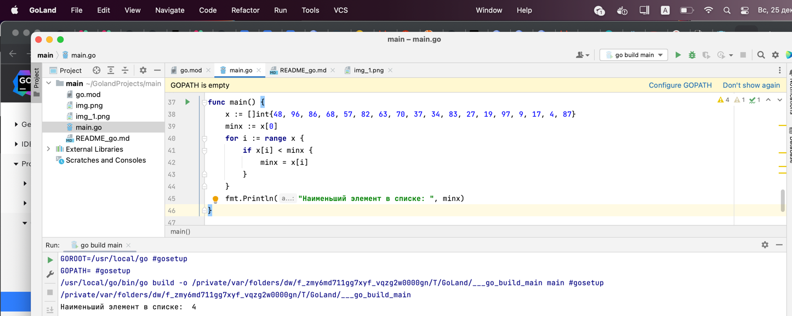
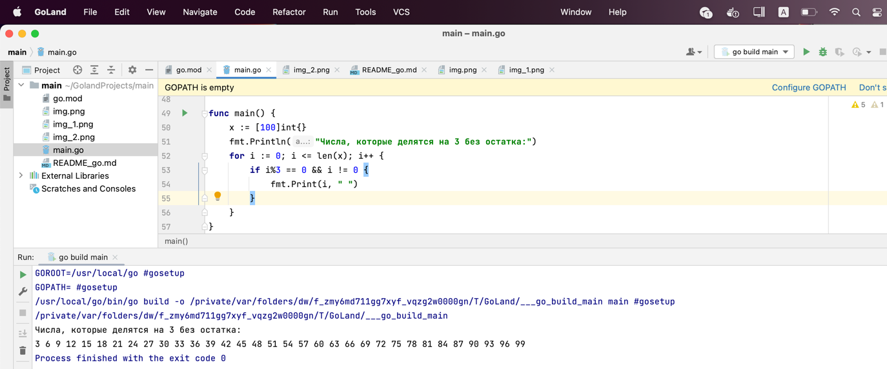
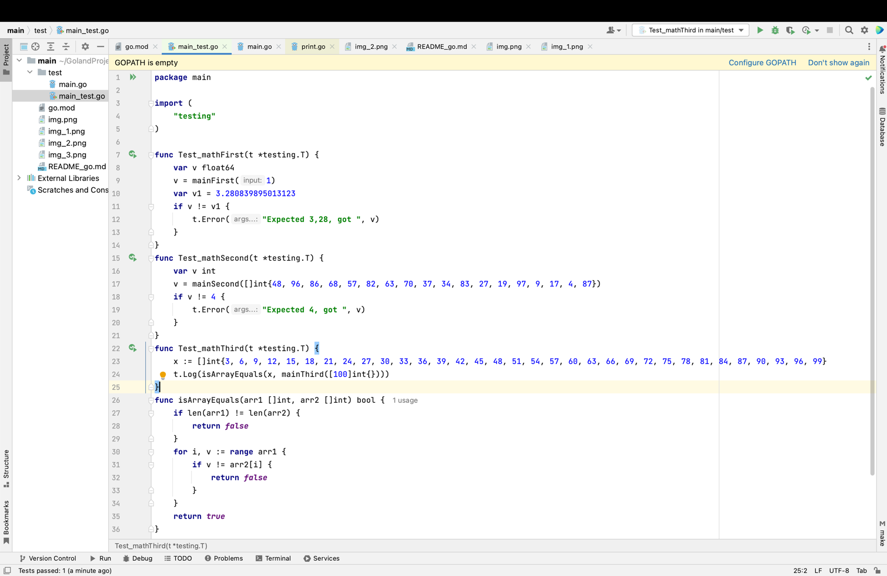
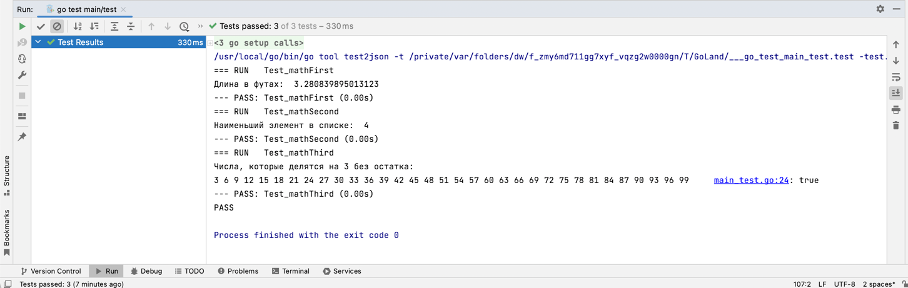
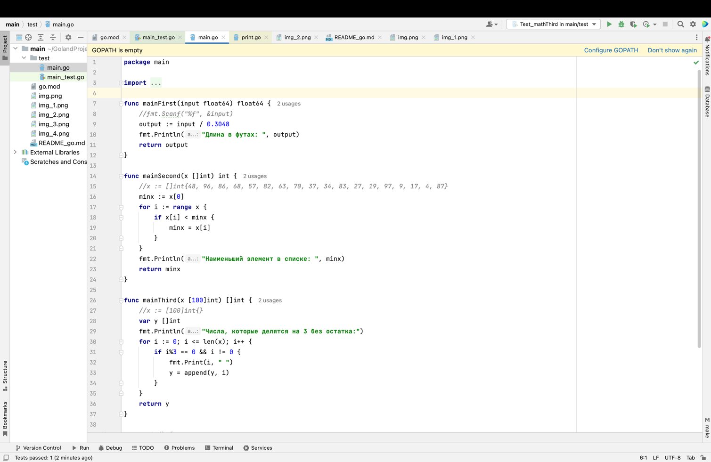
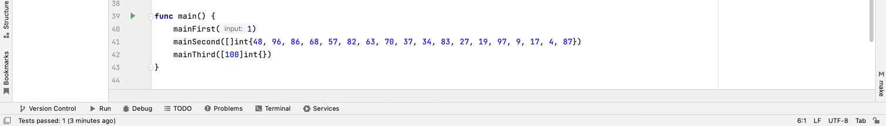

**Домашнее задание к занятию "7.5. Основы golang"**

С golang в рамках курса, мы будем работать не много, поэтому можно использовать любой IDE.
Но рекомендуем ознакомиться с GoLand.

**Задача 1. Установите golang.**

Воспользуйтесь инструкций с официального сайта: https://golang.org/.
Так же для тестирования кода можно использовать песочницу: https://play.golang.org/.

Выполнено.

**Задача 2. Знакомство с gotour.**

У Golang есть обучающая интерактивная консоль https://tour.golang.org/.
Рекомендуется изучить максимальное количество примеров. В консоли уже написан необходимый код,
осталось только с ним ознакомиться и поэкспериментировать как написано в инструкции в левой части экрана.

В процессе изучения

**Задача 3. Написание кода.**

Цель этого задания закрепить знания о базовом синтаксисе языка.
Можно использовать редактор кода на своем компьютере, либо использовать песочницу: https://play.golang.org/.

* Напишите программу для перевода метров в футы (1 фут = 0.3048 метр). Можно запросить
  исходные данные у пользователя, а можно статически задать в коде. Для взаимодействия с
  пользователем можно использовать функцию Scanf:

`func main() {`

`fmt.Print("Введите длину в метрах: ")`

`var input float64`

`fmt.Scanf("%f", &input)`

`    output := input / 0.3048`

`    fmt.Println("Длина в футах: ", output)`

`}`

* Напишите программу, которая найдет наименьший элемент в любом заданном списке, например:

`  x := []int{48,96,86,68,57,82,63,70,37,34,83,27,19,97,9,17,}`

Решение:

`func main() {`

`x := []int{48, 96, 86, 68, 57, 82, 63, 70, 37, 34, 83, 27, 19, 97, 9, 17, 4, 87}`

`minx := x[0]`

`for i := range x {`

`if x[i] < minx {`

`minx = x[i]`

`}`

`}`

`fmt.Println("Наименьший элемент в списке: ", minx)`

`}`

* Напишите программу, которая выводит числа от 1 до 100, которые делятся на 3. То есть (3, 6, 9, …).

`  func main() {`

`  x := [100]int{}`

`  fmt.Println("Числа, которые делятся на 3 без остатка:")`

`  for i := 0; i <= len(x); i++ {`

`  if i%3 == 0 && i != 0 {`

`  fmt.Print(i, " ")`

`  }`

`  }`

`  }`

  

В виде решения ссылку на код или сам код.

**Задача 4. Протестировать код (не обязательно).**

Создайте тесты для функций из предыдущего задания.

тесты:

для тестов немного изменила код функций в части принимаемых параметров:

