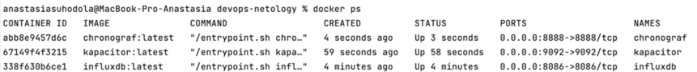
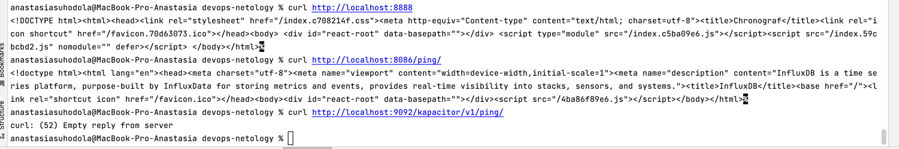
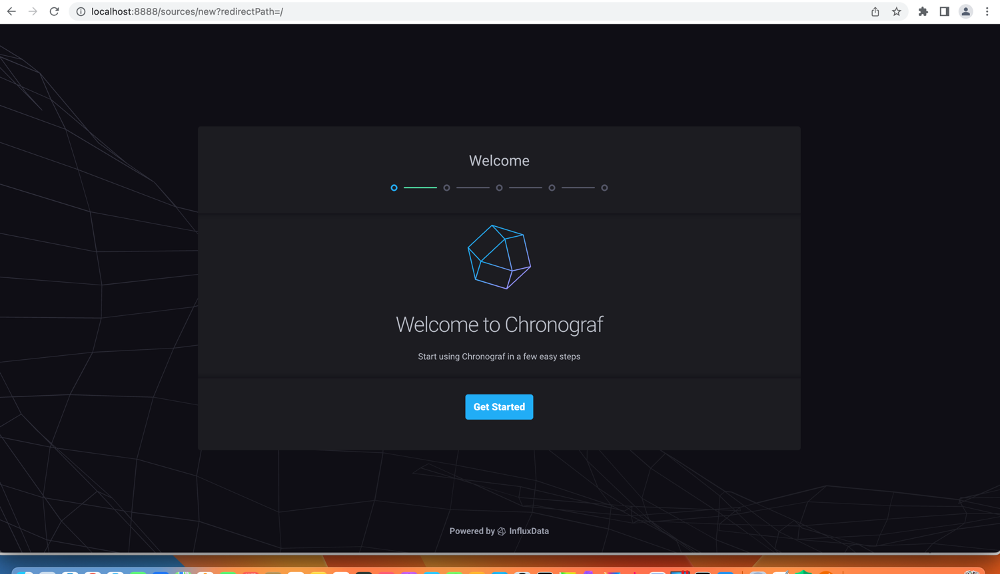

**Домашнее задание к занятию 13 «Введение в мониторинг»**

**Обязательные задания**

1. **Вас пригласили настроить мониторинг на проект. На онбординге вам рассказали, что проект представляет 
из себя платформу для вычислений с выдачей текстовых отчётов, которые сохраняются на диск. 
Взаимодействие с платформой осуществляется по протоколу http. 
Также вам отметили, что вычисления загружают 
ЦПУ. Какой минимальный набор метрик вы выведите в мониторинг и почему?**

Существует три основных подхода к сбору метрик: USE, RED,LTES.

В методологии USE для каждого ресурса (CPU, дисковая подсистема, память и т.д.) рекомендуется снимать следующие метрики:
* Utilization — время или процент использования ресурса, занятого «полезной работой»;
* Saturation — насыщенность, то есть количество отложенной или поставленной в очередь «работы»;
* Errors — количество ошибок в работе компонента.

RED предлагает мониторить:
* Rate — количество запросов в единицу времени (например, rps на микросервис или сервер);
* Errors — количество ошибок;
* Duration (оно же latency) — время обработки одного запроса.

В LTES по аналогии с двумя предыдущими методологиями отслеживают:
* Latency — время на обработку одного запроса (с разделением на успешные и ошибочные запросы);
* Traffic — количество запросов к компоненту (для веб-сервера это могут http-запросы, для базы данных — транзакции и т.п.);
* Errors — количество ошибок;
* Saturation — здесь это количественная метрика, отражающая, насколько компонент использует свои ресурсы и сколько у него «работы в очереди».

Исходя из этого, минимальный набор метрик для мониторинга:

* CPU LA - информация о нагрузке на центральный процессор
* RAM/swap - информация об утечках памяти
* IOPS - число операций с диском в секунду
* inodes - переполнение индексных дискрипторов
* FS - свободное место на диске

Далее добавила бы метрики работоспособности, производительности приложения:

* Частота ошибок
* Ошибки сервиса и перезагрузки
* Производительность и задержка ответов
* Использование ресурсов

Также метрики сети:

* Скорость получения данных по сети.
* Скорость отправки данных по сети.
* Количество пакетов, отброшенных при получении.
* Количество пакетов, отброшенных при отправке.
* Количество ошибок при получении.
* Количество ошибок при отправке.
* Интенсивность получения данных по сети.
* Интенсивность отправки данных по сети.

2. **Менеджер продукта, посмотрев на ваши метрики, сказал, что ему непонятно, что такое RAM/inodes/CPUla. 
Также он сказал, что хочет понимать, насколько мы выполняем свои обязанности перед клиентами и какое 
качество обслуживания. Что вы можете ему предложить?**

* RAM - загруженность оперативной памяти 
* inodes - это структура данных в которой хранится информация о файле или директории в файловой системе, метрика показывает переполнение индексных дискрипторов
* CPU LA - информация о нагрузке на центральный процессор

Для понимания, насколько выполняются обязанности перед клиентами и какое 
качество обслуживания, следует заключить SLA (Service level agreement) 
— так называемое «соглашение об уровне доступности сервиса», которое определяется как
обязательство перед клиентом, включающий в себя последствия невыполнения SLO. Для понимания,
качества обслуживания служит индикатор SLI.

Нужно заключить соглашение по основным метрикам: доступность платформы, количество успешно сохраненных отчётов, время формирования текстовых отчётов.

3. **Вашей DevOps-команде в этом году не выделили финансирование на построение системы сбора логов. 
Разработчики, в свою очередь, хотят видеть все ошибки, которые выдают их приложения. 
Какое решение вы можете предпринять в этой ситуации, чтобы разработчики получали ошибки приложения?**

Если используется openshift или kubernetes, можно смотреть логи в подах сервиса, в том числе и ошибки, пока нет системы сбора логов.
Можно использовать, к примеру, ELK stack с открытым исходным кодом, предоставить доступ в kibana для разработчиков 
и тестировщиков на индексы, соответствующие сервисам, для анализа собранных логов.

4. **Вы, как опытный SRE, сделали мониторинг, куда вывели отображения выполнения SLA = 99% 
по http-кодам ответов. Этот параметр вычисляется по формуле: summ_2xx_requests/summ_all_requests.
Он не поднимается выше 70%, но при этом в вашей системе нет кодов ответа 5xx и 4xx. Где у вас ошибка?**

Возможно, ошибка в том, что в формуле не учитываются редиректы (3хх) и информационные (1хх) коды ответов.

5. **Опишите основные плюсы и минусы pull и push систем мониторинга.**

* Push-модель подразумевает отправку данных с агентов (рабочих машин, с которых собирается мониторинг) в
систему мониторинга через вспомогательные службы или программы (через UDP);
* Pull-модель подразумевает последовательный или параллельный сбор системой мониторинга с агентов 
накопленной информации из вспомогательных служб;

плюсы Push-модели:
* упрощение репликации данных в разные системы мониторинга или их резервные копии
* более гибкая настройка пакетов данных с метриками
* UDP - менее затратный способ передачи данных, из-за чего может возрасти производительность сбора метрик

плюсы Pull-модели:
* легче контролировать подлинность данных
* можно настроить единый proxy-server до всех агентов с TLS
* упрощенная отладка получения данных с агентов

минусы Pull-модели:
* привязанность к инструментам, оперирующим pull'ами

**6. Какие из ниже перечисленных систем относятся к push модели, а какие к pull? А может есть гибридные?**

1. Prometheus - работает в соответствии и с Pull-моделью
2. TICK - работает в соответствии и с Push-моделью
3. Zabbix - работает в соответствии и с Push-моделью и с Pull-моделью
4. VictoriaMetrics - работает в соответствии и с Push-моделью и с Pull-моделью
5. Nagios - работает в соответствии и с Push-моделью


**7. Склонируйте себе [репозиторий](https://github.com/influxdata/sandbox/tree/master) и запустите TICK-стэк, используя технологии docker и docker-compose.**
В виде решения на это упражнение приведите выводы команд с вашего компьютера (виртуальной машины):

```
- curl http://localhost:8086/ping
- curl http://localhost:8888
- curl http://localhost:9092/kapacitor/v1/ping
```

А также скриншот веб-интерфейса ПО chronograf (http://localhost:8888).

P.S.: если при запуске некоторые контейнеры будут падать с ошибкой - проставьте им режим Z, например ./data:/var/lib:Z





8. **Перейдите в веб-интерфейс Chronograf (http://localhost:8888) и откройте вкладку Data explorer.**

1. Нажмите на кнопку Add a query
2. Изучите вывод интерфейса и выберите БД telegraf.autogen
3. В measurments выберите mem->host->telegraf_container_id , а в fields выберите used_percent. Внизу появится график утилизации оперативной памяти в контейнере telegraf.
4. Вверху вы можете увидеть запрос, аналогичный SQL-синтаксису. Поэкспериментируйте с запросом, попробуйте изменить группировку и интервал наблюдений.

Для выполнения задания приведите скриншот с отображением метрик утилизации места на диске (disk->host->telegraf_container_id) из веб-интерфейса.