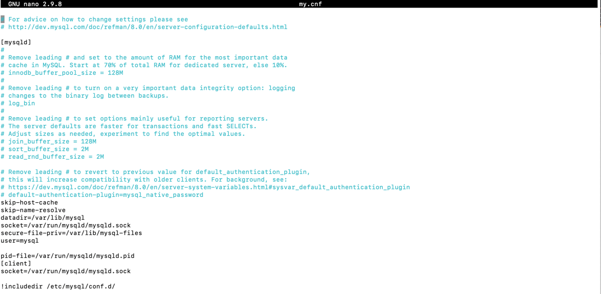

**Домашнее задание к занятию "6.3. MySQL"**

**Введение**

**Перед выполнением задания вы можете ознакомиться с дополнительными материалами.**

**Задача 1**

**Используя docker поднимите инстанс MySQL (версию 8). Данные БД сохраните в volume.**

`docker run --name mysql1 -v "/home/vagrant/mysql/db/:/var/lib/mysql/" -v "/home/vagrant/mysql/backup/:/tmp/backup" -e MYSQL_ALLOW_EMPTY_PASSWORD=yes --rm -d mysql:8
`

`docker exec -it mysql1 bash`

**Изучите бэкап БД и восстановитесь из него.**

`mysql -e 'create database test_db;'`

`mysql test_db < /tmp/backup/test_dump.sql`

**Перейдите в управляющую консоль mysql внутри контейнера.**

bash-4.4#` mysql -u root -p`

**Используя команду \h получите список управляющих команд.**

**Найдите команду для выдачи статуса БД и приведите в ответе из ее вывода версию сервера БД.**

`mysql> \s`
--------------
`mysql  Ver 8.0.31 for Linux on aarch64 (MySQL Community Server - GPL)`

**Подключитесь к восстановленной БД и получите список таблиц из этой БД.**

`mysql> connect test_db`

`mysql> show tables;`

**Приведите в ответе количество записей с price > 300.**

**В следующих заданиях мы будем продолжать работу с данным контейнером.**

**Задача 2**

**Создайте пользователя test в БД c паролем test-pass, используя:**

плагин авторизации mysql_native_password

срок истечения пароля - 180 дней

количество попыток авторизации - 3

максимальное количество запросов в час - 100

аттрибуты пользователя:

Фамилия "Pretty"

Имя "James"

`CREATE USER 'test' IDENTIFIED WITH mysql_native_password BY 'test-pass' WITH MAX_QUERIES_PER_HOUR 100 PASSWORD EXPIRE INTERVAL 180 DAY FAILED_LOGIN_ATTEMPTS 3 ATTRIBUTE '{"surname": "Pretty", "name": "James"}';
`

**Предоставьте привелегии пользователю test на операции SELECT базы test_db.**

`GRANT SELECT on test_db.* TO test;`

**Используя таблицу INFORMATION_SCHEMA.USER_ATTRIBUTES получите данные по пользователю test и приведите в ответе к задаче.**

`SELECT * FROM INFORMATION_SCHEMA.USER_ATTRIBUTES where user='test';`

**Задача 3**

**Установите профилирование SET profiling = 1. Изучите вывод профилирования команд SHOW PROFILES;.**

**Исследуйте, какой engine используется в таблице БД test_db и приведите в ответе.**

**Измените engine и приведите время выполнения и запрос на изменения из профайлера в ответе:**

**на MyISAM** -- 0.02520250

**на InnoDB** -- 0.02470425 

**Задача 4**

**Изучите файл my.cnf в директории /etc/mysql.**

**Измените его согласно ТЗ (движок InnoDB):**

Скорость IO важнее сохранности данных

Нужна компрессия таблиц для экономии места на диске

Размер буффера с незакомиченными транзакциями 1 Мб

Буффер кеширования 30% от ОЗУ

Размер файла логов операций 100 Мб

Приведите в ответе измененный файл my.cnf.

install nano:

`microdnf update`

`microdnf install nano sudo -y`

bash-4.4# `mysqladmin --help | grep -A1 'Default options'`

`Default options are read from the following files in the given order:`

`/etc/my.cnf /etc/mysql/my.cnf /usr/etc/my.cnf ~/.my.cnf `

bash-4.4# `cat /etc/mysql/my.cnf`

`cat: /etc/mysql/my.cnf: No such file or directory`

bash-4.4# `nano my.cnf`

ответ:

**Скорость IO важнее сохранности данных**

innodb_flush_log_at_trx_commit = 0 

Значение “0” даст наибольшую производительность. В этом случае буфер будет сбрасываться в лог файл независимо от транзакций. 
В этом случае риск потери данных возрастает.

**Нужна компрессия таблиц для экономии места на диске**

innodb_file_per_table = ON

**Размер буффера с незакомиченными транзакциями 1 Мб**

innodb_log_buffer_size = 1M

**Буффер кеширования 30% от ОЗУ**

innodb_buffer_pool_size = 300M

**Размер файла логов операций 100 Мб**

innodb_log_file_size = 100M

