**Домашнее задание к занятию "6.4. PostgreSQL"**

**Задача 1**

**Используя docker поднимите инстанс PostgreSQL (версию 13). Данные БД сохраните в volume.**

`docker run --name postgres -e POSTGRES_HOST_AUTH_METHOD=trust -v "/home/vagrant/postgres/db/:/var/lib/postgresql/data" -v "/home/vagrant/postgres/backup/:/tmp/backup" --rm -d postgres:13.3
`

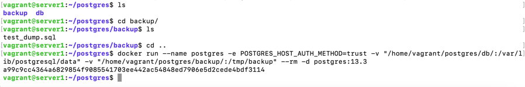

Подключитесь к БД PostgreSQL используя psql.

`docker exec -it postgres psql -U postgres`

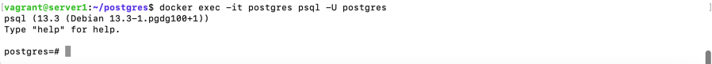

Воспользуйтесь командой \? для вывода подсказки по имеющимся в psql управляющим командам.

Найдите и приведите управляющие команды для:

вывода списка БД

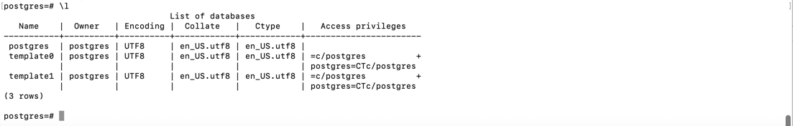

подключения к БД

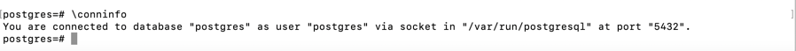

вывода списка таблиц

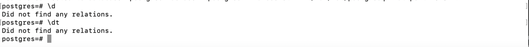

вывода описания содержимого таблиц

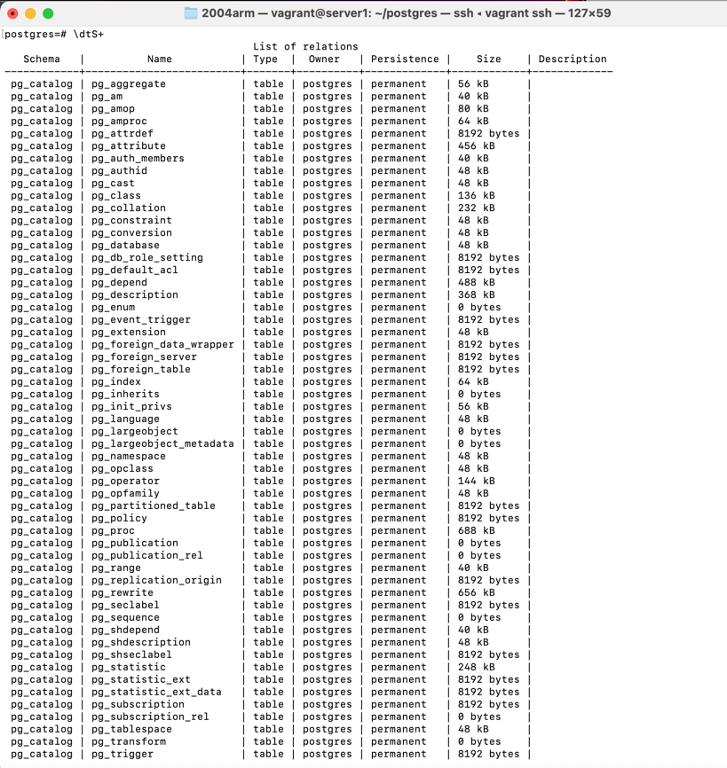

выхода из psql

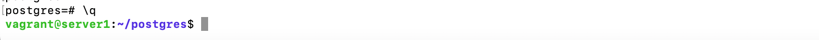

**Задача 2**

Используя psql создайте БД test_database.

`create database test_database;`

Изучите бэкап БД.

Восстановите бэкап БД в test_database.

postgres=# `\c test_database`

You are now connected to database "test_database" as user "postgres".

test_database=# `\i /tmp/backup/test_dump.sql`

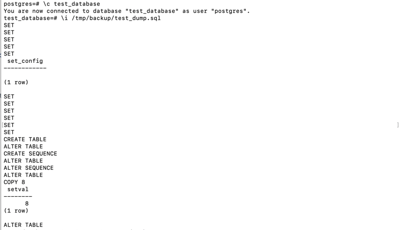

Перейдите в управляющую консоль psql внутри контейнера.

Подключитесь к восстановленной БД и проведите операцию ANALYZE для сбора статистики по таблице.

test_database=# `ANALYZE VERBOSE public.orders;`

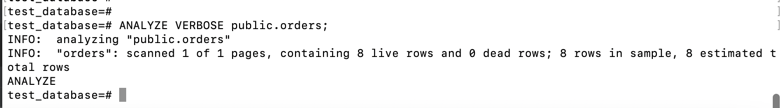

Используя таблицу pg_stats, найдите столбец таблицы orders с наибольшим средним значением размера элементов в байтах.

test_database=# `SELECT tablename,attname,avg_width FROM pg_stats WHERE tablename='orders' ORDER BY avg_width DESC LIMIT 1;`

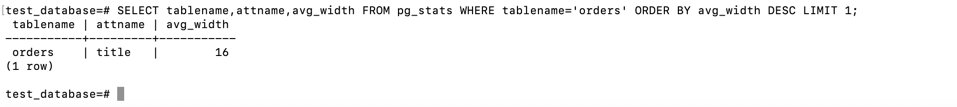

Приведите в ответе команду, которую вы использовали для вычисления и полученный результат.

**Задача 3**

Архитектор и администратор БД выяснили, что ваша таблица orders разрослась до невиданных размеров и поиск по ней занимает долгое время. 
Вам, как успешному выпускнику курсов DevOps в нетологии предложили провести 
разбиение таблицы на 2 (шардировать на orders_1 - price>499 и orders_2 - price<=499).

Предложите SQL-транзакцию для проведения данной операции.

`BEGIN;`

`CREATE TABLE orders_new(id SERIAL, title VARCHAR(80) NOT NULL, price integer DEFAULT 0) PARTITION BY RANGE (price);`

`CREATE TABLE orders_1 PARTITION OF orders_new FOR VALUES FROM (500) TO (2147483647);`

`CREATE TABLE orders_2 PARTITION OF orders_new FOR VALUES FROM (0) TO (500);`

`INSERT INTO orders_new SELECT * FROM orders;`

`DROP TABLE orders;`

`ALTER TABLE orders_new RENAME TO orders;`

`COMMIT;`

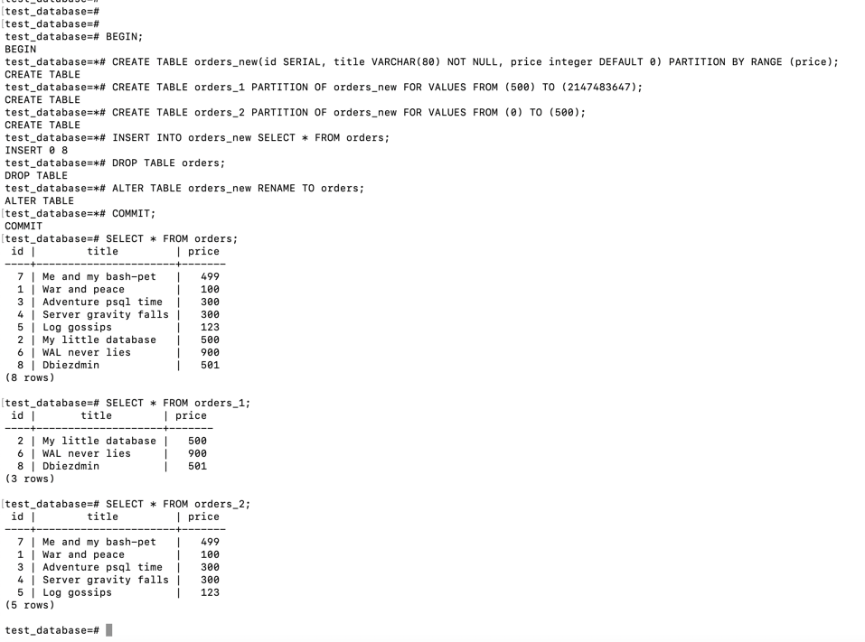

Можно ли было изначально исключить "ручное" разбиение при проектировании таблицы orders?

Да, если создать таблицу orders как секционированную таблицу с предложением PARTITION BY, указав метод разбиения (RANGE) и список столбцов, 
которые будут образовывать ключ разбиения - PARTITION BY RANGE (price);

**Задача 4**

**Используя утилиту pg_dump создайте бекап БД test_database.**

`pg_dump -U postgres test_database > my_dump.sql`

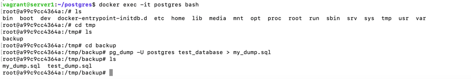

Как бы вы доработали бэкап-файл, чтобы добавить уникальность значения столбца title для таблиц test_database?

При создании таблиц для столбца title добавила бы UNIQUE:

`title character varying(80) NOT NULL UNIQUE,`

 т.е.

`CREATE TABLE public.orders (
    id integer NOT NULL,
    title character varying(80) UNIQUE NOT NULL,
    price integer DEFAULT 0
);`