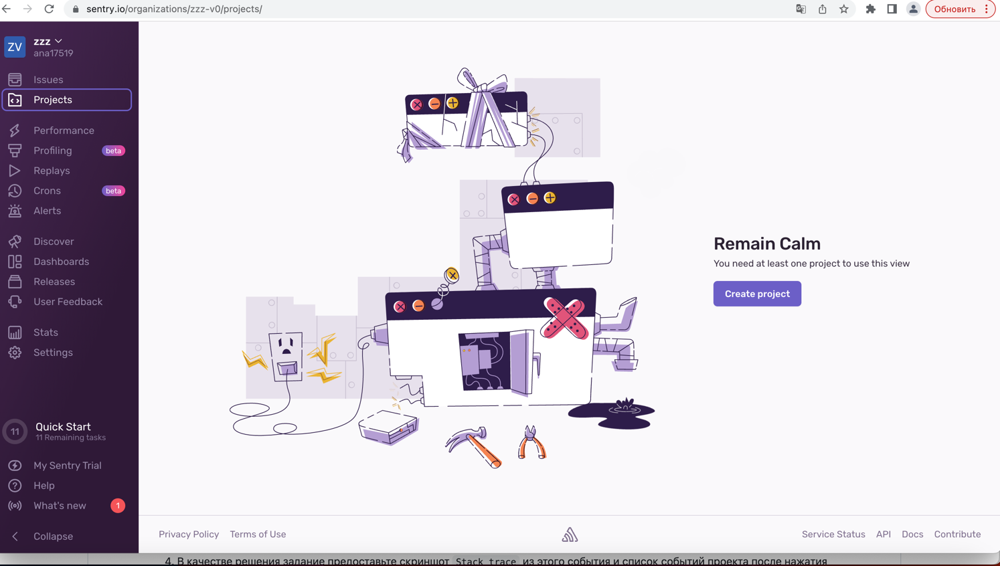
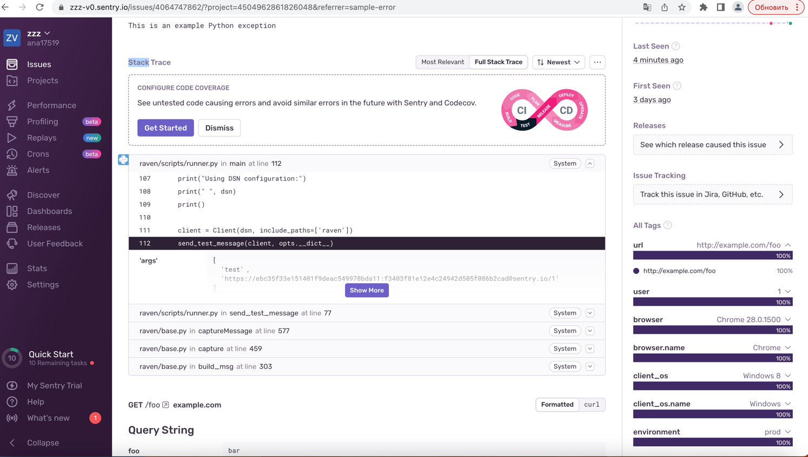
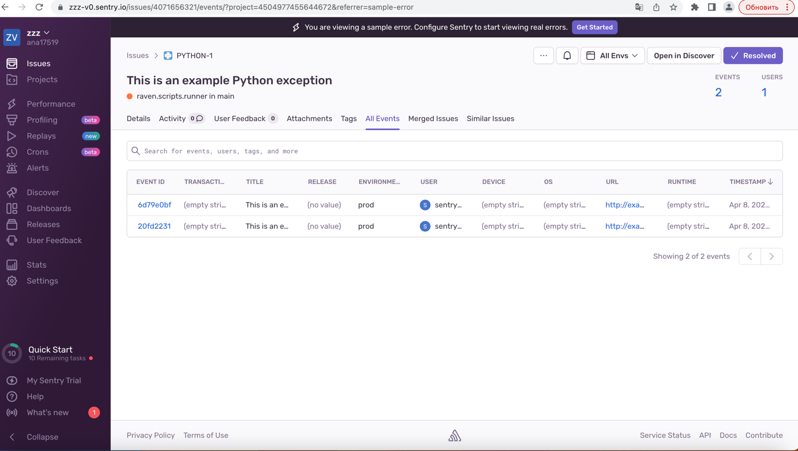
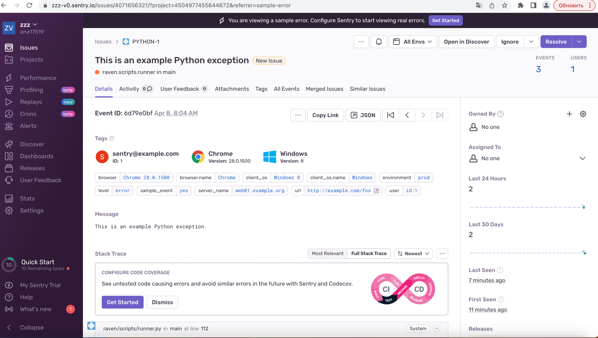
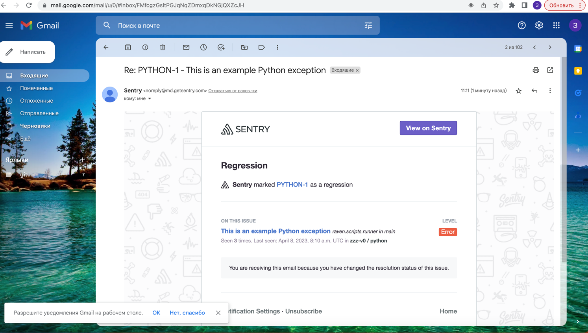
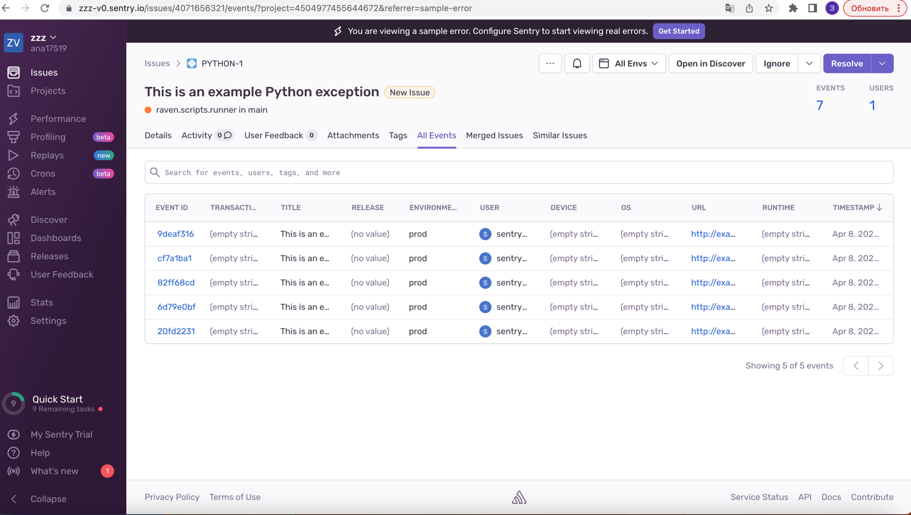

**Домашнее задание к занятию 16 «Платформа мониторинга Sentry»**

**Задание 1**

Так как Self-Hosted Sentry довольно требовательная к ресурсам система, мы будем использовать Free Сloud account.

Free Cloud account имеет ограничения:

1. 5 000 errors;
2. 10 000 transactions;
3. 1 GB attachments.

Для подключения Free Cloud account:

1. зайдите на sentry.io;
2. нажмите «Try for free»;
3. используйте авторизацию через ваш GitHub-аккаунт;
4. далее следуйте инструкциям.

В качестве решения задания пришлите скриншот меню Projects.

**Задание 2**

1. Создайте python-проект и нажмите Generate sample event для генерации тестового события.
2. Изучите информацию, представленную в событии.
3. Перейдите в список событий проекта, выберите созданное вами и нажмите Resolved.
4. В качестве решения задание предоставьте скриншот Stack trace из этого события и список событий проекта после нажатия Resolved.

 
**Задание 3**

1. Перейдите в создание правил алёртинга.
2. Выберите проект и создайте дефолтное правило алёртинга без настройки полей.
3. Снова сгенерируйте событие Generate sample event. Если всё было выполнено правильно — через некоторое время вам на почту, 
привязанную к GitHub-аккаунту, придёт оповещение о произошедшем событии.
4. Если сообщение не пришло — проверьте настройки аккаунта Sentry (например, привязанную почту),
что у вас не было sample issue до того, как вы его сгенерировали, и то, что правило алёртинга выставлено по дефолту (во всех полях all). 
Также проверьте проект, в котором вы создаёте событие — возможно алёрт привязан к другому.
5. В качестве решения задания пришлите скриншот тела сообщения из оповещения на почте.
6. Дополнительно поэкспериментируйте с правилами алёртинга. Выбирайте разные условия отправки и создавайте sample events.

