**Домашнее задание к занятию "6.2. SQL"**

**Задача 1**

**Используя docker поднимите инстанс PostgreSQL (версию 12) c 2 volume, в который будут складываться данные БД и бэкапы.**

**Приведите получившуюся команду или docker-compose манифест.**

`docker run -d --name postgresql -e POSTGRES_PASSWORD=postgresql -p 5432:5432 -v $HOME/docker/volumes/postgres/data:/var/lib/postgresql/data -v $HOME/docker/volumes/postgres/bckp:/var/lib/postgresql/bckp postgres:12`

`root@server1:~/sql# docker exec -it postgresql psql -U postgres -d test_db`

`psql (12.13 (Debian 12.13-1.pgdg110+1))`

`Type "help" for help.`

`test_db=# `

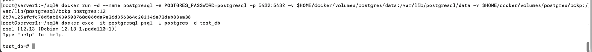

**Задача 2**

В БД из задачи 1:

создайте пользователя test-admin-user и БД test_db

`CREATE USER "test-admin-user";`

`CREATE DATABASE test_db;`

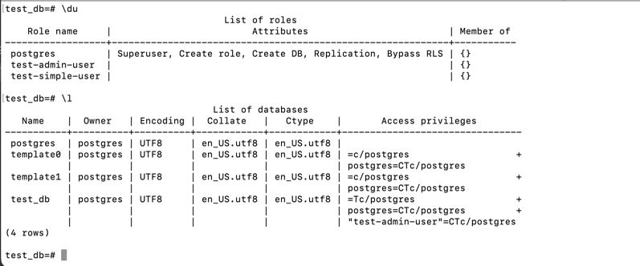

в БД test_db создайте таблицу orders и clients (спeцификация таблиц ниже)

`CREATE TABLE orders (
	id	serial PRIMARY KEY,
	order_name	varchar(25) NOT NULL CHECK (order_name <> ''),
	price	integer NOT NULL CHECK (price > 0)
);`

`CREATE TABLE clients (
        id      serial PRIMARY KEY,
        last_name	varchar(45) NOT NULL CHECK (last_name <> ''),
	country	varchar(35) NOT NULL CHECK (country <> ''),
	order_number	integer REFERENCES orders
);`

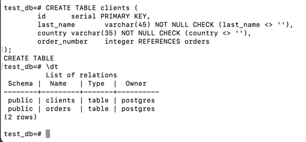

предоставьте привилегии на все операции пользователю test-admin-user на таблицы БД test_db

`GRANT ALL ON orders, clients TO "test-admin-user";`

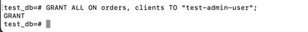

создайте пользователя test-simple-user

`CREATE USER "test-simple-user";`

предоставьте пользователю test-simple-user права на SELECT/INSERT/UPDATE/DELETE данных таблиц БД test_db

`GRANT SELECT,INSERT,UPDATE,DELETE ON orders, clients to "test-simple-user";`

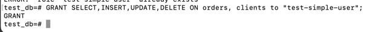

**Таблица orders:**

id (serial primary key)

наименование (string)

цена (integer)

**Таблица clients:**

id (serial primary key)

фамилия (string)

страна проживания (string, index)

заказ (foreign key orders)

Приведите:

**итоговый список БД после выполнения пунктов выше**

`SELECT table_name FROM information_schema.tables
WHERE table_schema NOT IN ('information_schema','pg_catalog');`

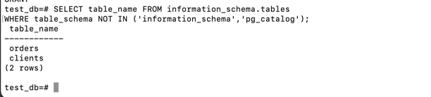

**описание таблиц (describe)**

`\d+ orders`

`\d+ clients`

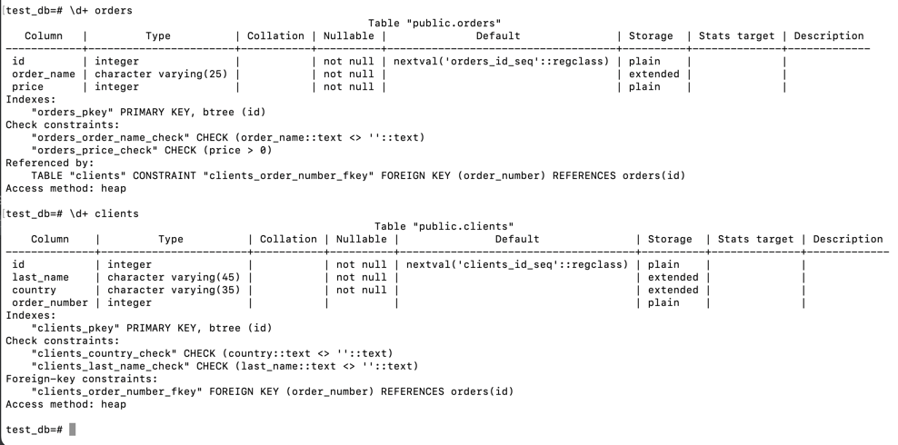

**SQL-запрос для выдачи списка пользователей с правами над таблицами test_db**

`SELECT table_name,grantee,privilege_type 
FROM information_schema.table_privileges
WHERE table_schema NOT IN ('information_schema','pg_catalog');`

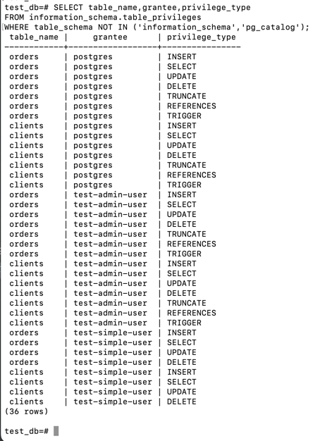

**список пользователей с правами над таблицами test_db**

`SELECT table_name,grantee,privilege_type 
FROM information_schema.table_privileges
WHERE table_schema NOT IN ('information_schema','pg_catalog');`

**Задача 3**

Используя SQL синтаксис - наполните таблицы следующими тестовыми данными:

**Таблица orders**

Наименование	цена

Шоколад	10

Принтер	3000

Книга	500

Монитор	7000

Гитара	4000

`INSERT INTO orders VALUES (1, 'Шоколад', 10), (2, 'Принтер', 3000), (3, 'Книга', 500), (4, 'Монитор', 7000), (5, 'Гитара', 4000);
`

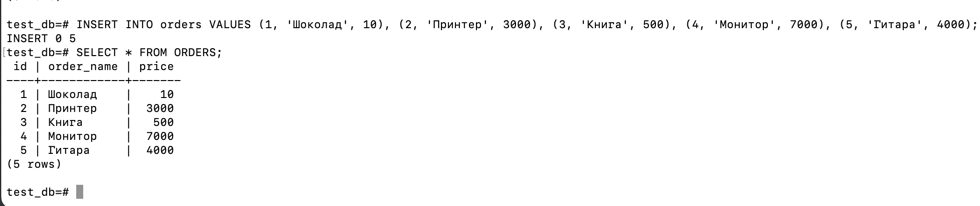

**Таблица clients**

ФИО	Страна проживания

Иванов Иван Иванович	USA

Петров Петр Петрович	Canada

Иоганн Себастьян Бах	Japan

Ронни Джеймс Дио	Russia

Ritchie Blackmore	Russia

`INSERT INTO clients VALUES (1, 'Иванов Иван Иванович', 'USA'), (2, 'Петров Петр Петрович', 'Canada'), (3, 'Иоганн Себастьян Бах', 'Japan'), (4, 'Ронни Джеймс Дио', 'Russia'), (5, 'Ritchie Blackmore', 'Russia');`

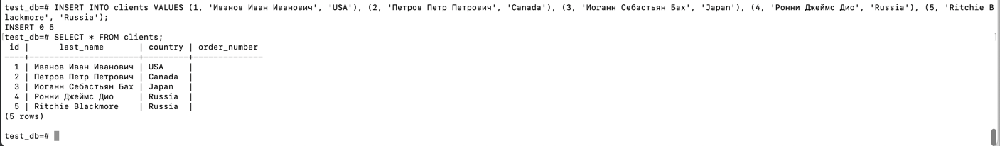

Используя SQL синтаксис:

вычислите количество записей для каждой таблицы

`SELECT count(*) FROM clients;`

` SELECT count(*) FROM orders;`

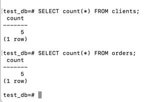

приведите в ответе:

запросы

результаты их выполнения.

**Задача 4**

Часть пользователей из таблицы clients решили оформить заказы из таблицы orders.

Используя foreign keys свяжите записи из таблиц, согласно таблице:

ФИО	Заказ

Иванов Иван Иванович	Книга

Петров Петр Петрович	Монитор

Иоганн Себастьян Бах	Гитара

Приведите SQL-запросы для выполнения данных операций.

`UPDATE clients SET order_number = (SELECT id FROM orders WHERE order_name = 'Книга') WHERE last_name = 'Иванов Иван Иванович';`

`UPDATE clients SET order_number = (SELECT id FROM orders WHERE order_name = 'Монитор') WHERE last_name = 'Петров Петр Петрович';`

`UPDATE clients SET order_number = (SELECT id FROM orders WHERE order_name = 'Гитара') WHERE last_name = 'Иоганн Себастьян Бах';`

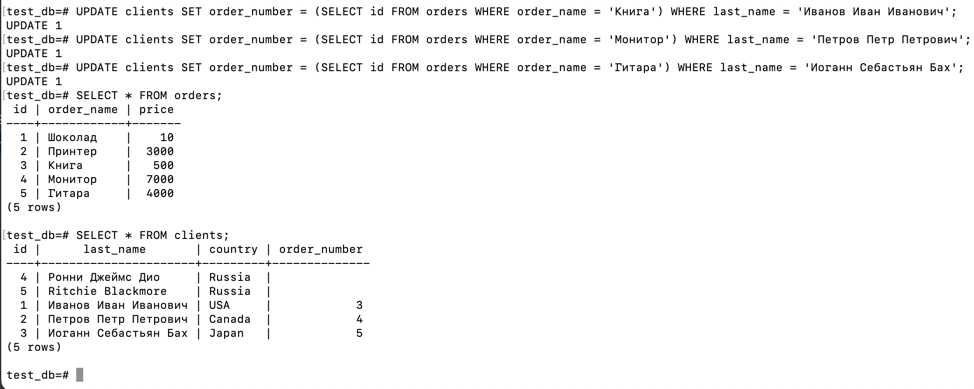

Приведите SQL-запрос для выдачи всех пользователей, которые совершили заказ, а также вывод данного запроса.

`SELECT last_name FROM clients WHERE order_number IS NOT NULL;`

Подсказка - используйте директиву UPDATE.

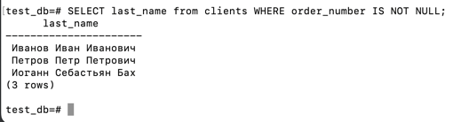

**Задача 5**

**Получите полную информацию по выполнению запроса выдачи всех пользователей из задачи 4 (используя директиву EXPLAIN).**

**Приведите получившийся результат и объясните что значат полученные значения.**

`EXPLAIN SELECT * FROM clients WHERE order_number IS NOT NULL;`

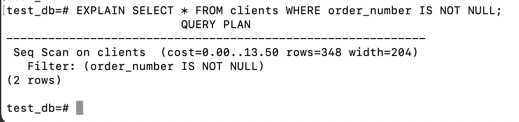

cost - стоимость операции, row - ожидаемое число строк, width - средняя ширина строки в байтах

**Задача 6**

Создайте бэкап БД test_db и поместите его в volume, предназначенный для бэкапов (см. Задачу 1).

находясь в контейнере, создать бэкап:

`pg_dump -U postgres test_db > /var/lib/postgresql/bckp/backups1.sql`

Остановите контейнер с PostgreSQL (но не удаляйте volumes).

`test_db-# \q`

`root@server1:~/sql# docker stop postgresql`

Поднимите новый пустой контейнер с PostgreSQL.

`root@server1:~/sql# docker run -d --name postgresql5 -e POSTGRES_PASSWORD=postgresql15 -p 5436:5436 -v $HOME/docker/volumes/postgres/data:/var/lib/postgresql/data -v $HOME/docker/volumes/postgres/bckp:/var/lib/postgresql/bckp postgres:12`

`e4428510428c03a7cd46fd3516ebbbbf80033fb819e10c616966fc8b0a7ed2bc`

`root@server1:~/sql# docker exec -it postgresql5 psql -U postgres -d test_db`

`psql (12.13 (Debian 12.13-1.pgdg110+1))`

`Type "help" for help.`

``test_db=#``

Восстановите БД test_db в новом контейнере.

`test_db=# psql -U postgres test_db -f /var/lib/postgresql/bckp/backups1.sql`

Приведите список операций, который вы применяли для бэкапа данных и восстановления.

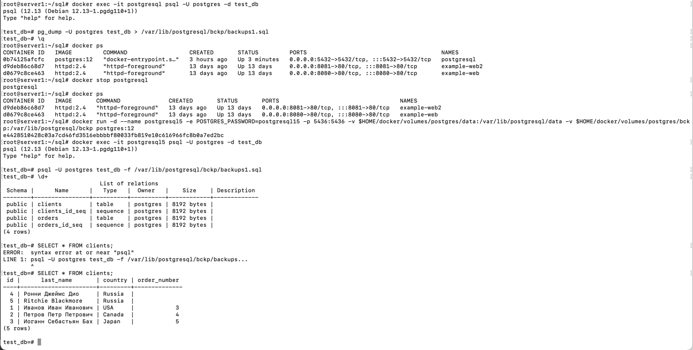

