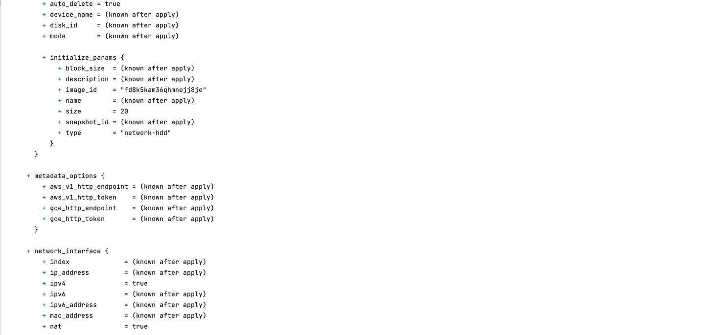

**Домашнее задание к занятию "7.3. Основы и принцип работы Терраформ"**

**Задача 1. Создадим бэкэнд в S3 (необязательно, но крайне желательно).**

Если в рамках предыдущего задания у вас уже есть аккаунт AWS, 
то давайте продолжим знакомство со взаимодействием терраформа и aws.

Создайте s3 бакет, iam роль и пользователя от которого будет работать терраформ. 

Можно создать отдельного пользователя, а можно использовать созданного в рамках предыдущего задания, 
просто добавьте ему необходимы права, как описано здесь.

Зарегистрируйте бэкэнд в терраформ проекте как описано по ссылке выше.

создание сервисного аккаунта:

` yc iam service-account create --name default \ 
  --description "service account" `

id: aje4ofq2hpt96gqf6s7k
folder_id: b1g5et62diug35tdgb70
created_at: "2022-12-17T15:45:23.913794097Z"
name: default
description: service account

`yc iam access-key create --service-account-name default \
  --description "key is for bucket"`

access_key:
  id: ajeggl5c22hv3g42rom6
  service_account_id: aje4ofq2hpt96gqf6s7k
  created_at: "2022-12-17T15:49:24.989330926Z"
  description: key is for bucket
  key_id: YCAJEb_yGszI67YxlnKuVcrWv
secret: YCMOSkHvfbTEFkntLlyacBTPwq0-zG8bTqlfs8X8

Добавить права админа:

`yc resource-manager folder add-access-binding default \
  --role admin \
  --subject serviceAccount:aje4ofq2hpt96gqf6s7k`

бакет:

 

ниже убрать

просмотре ролей:
yc iam service-account list-access-bindings default 
назначение роли:
yc iam service-account add-access-binding default \
  --role editor \
  --subject serviceAccount:aje4ofq2hpt96gqf6s7k

**Задача 2. Инициализируем проект и создаем воркспейсы.**

1. Выполните terraform init:

если был создан бэкэнд в S3, то терраформ создат файл стейтов в S3 и запись в таблице dynamodb.

иначе будет создан локальный файл со стейтами.

2. Создайте два воркспейса stage и prod.

3. В уже созданный aws_instance добавьте зависимость типа инстанса от вокспейса, что бы в разных ворскспейсах 
использовались разные instance_type.
4. Добавим count. Для stage должен создаться один экземпляр ec2, а для prod два.

terraform plan:

terraform apply:

