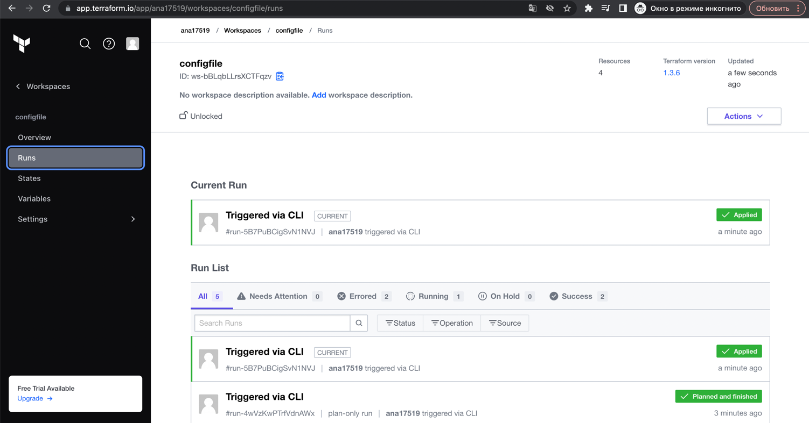
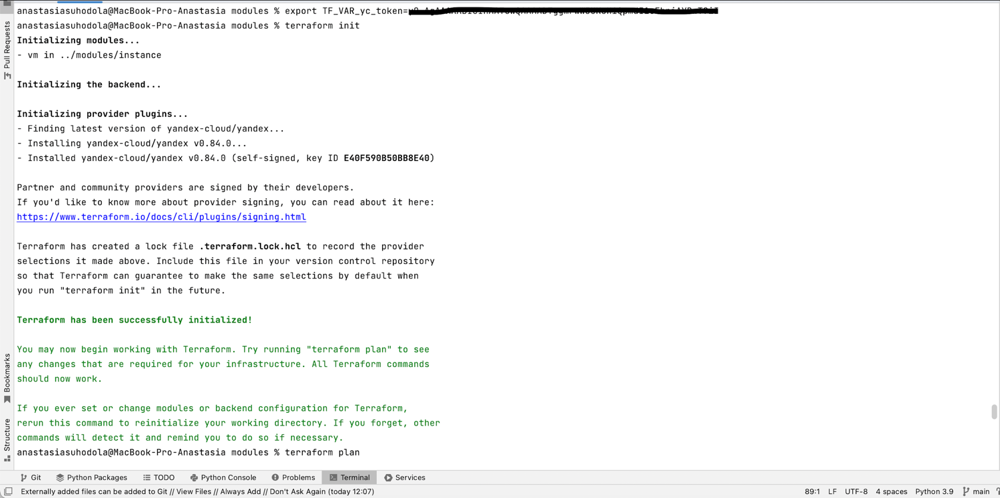
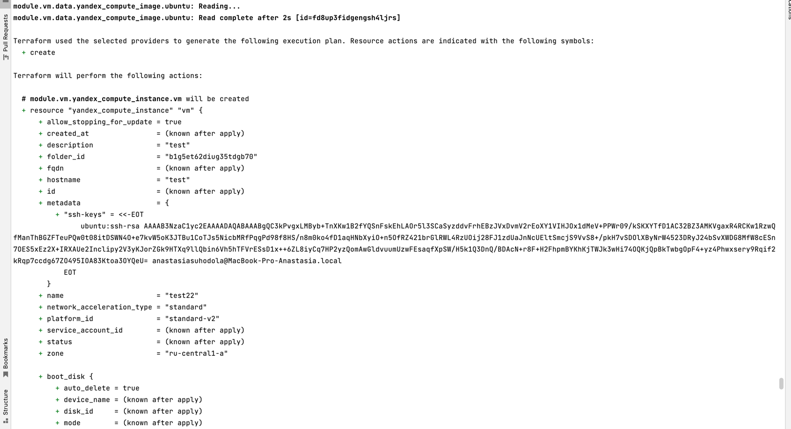
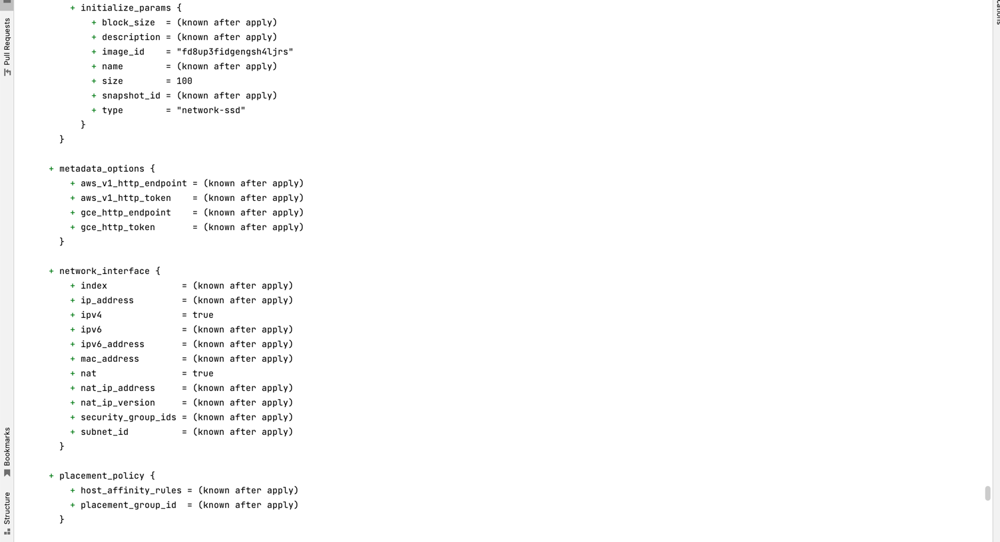

**Домашнее задание к занятию "7.4. Средства командной работы над инфраструктурой."**

**Задача 1. Настроить terraform cloud (необязательно, но крайне желательно).**

В это задании предлагается познакомиться со средством командой работы над инфраструктурой предоставляемым разработчиками терраформа.

Зарегистрируйтесь на https://app.terraform.io/. (регистрация бесплатная и не требует использования платежных инструментов).
Создайте в своем github аккаунте (или другом хранилище репозиториев) отдельный репозиторий с 
конфигурационными файлами прошлых занятий (или воспользуйтесь любым простым конфигом).
Зарегистрируйте этот репозиторий в https://app.terraform.io/.

Выполните plan и apply.

В качестве результата задания приложите снимок экрана с успешным применением конфигурации.

В блок terraform добавлено organization и имя проекта в workspaces:
```
terraform {

   cloud {

    organization = "ana17519"

      workspaces {
      name = "configfile"
    }
  }
  ...
```




plan:


apply:


ui:


repo:  [https://github.com/ana17519/configfile/tree/main/terraform](https://github.com/ana17519/configfile/tree/main/terraform)


**Задача 2. Написать серверный конфиг для атлантиса.**

**Смысл задания – познакомиться с документацией о серверной конфигурации и конфигурации уровня репозитория.**

Создай server.yaml который скажет атлантису:

1. Укажите, что атлантис должен работать только для репозиториев в вашем github (или любом другом) аккаунте.
2. На стороне клиентского конфига разрешите изменять workflow, то есть для каждого репозитория можно будет указать свои дополнительные команды.
3. В workflow используемом по-умолчанию сделайте так, что бы во время планирования не происходил lock состояния.

Создай atlantis.yaml который, если поместить в корень terraform проекта, скажет атлантису:

1. Надо запускать планирование и аплай для двух воркспейсов stage и prod.
2. Необходимо включить автопланирование при изменении любых файлов *.tf.

В качестве результата приложите ссылку на файлы server.yaml и atlantis.yaml.

[server.yaml](terraform/server.yaml)

[atlantis.yaml](terraform/atlantis.yaml)


**Задача 3. Знакомство с каталогом модулей.**

В каталоге модулей найдите официальный модуль от aws для создания ec2 инстансов.

Изучите как устроен модуль. 

Задумайтесь, будете ли в своем проекте использовать этот модуль или непосредственно ресурс aws_instance без помощи модуля?
В рамках предпоследнего задания был создан ec2 при помощи ресурса aws_instance. 

Создайте аналогичный инстанс при помощи найденного модуля.
**В качестве результата задания приложите ссылку на созданный блок конфигураций.**

Для yandex-cloud не нашла готовых модулей, поэтому для практики решила использовать ранее написанные конфигурации с предыдущих занятий.

Создала директорию [modules](modules), в ней sub-директорию [instance](modules/instance), в которой содержатся ранее написанные конфигурации,
изменения содержатся в файле [vars](modules/instance/vars.tf) - удалены default значения, оставлены только типы переменных.

Файл [instances.tf](modules/instances.tf) содержит объявление модуля, ссылку на источник - source = "../modules/instance" и объявление переменных.
Файл [vars.tf](modules/vars.tf) содержит значения переменных.

Т.о. структура:

```
modules
  instance
    -main.tf
    -outputs.tf
    -vars.tf
    -versions.tf
  instances.tf - содержит объявление модуля
  vars.tf - значения переменных
```






 applying:


user interface:

