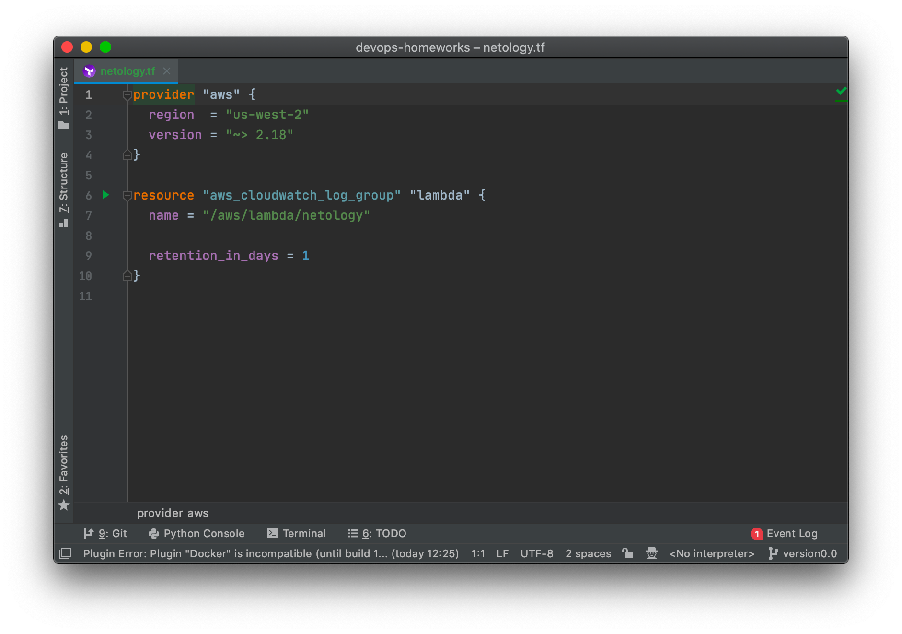
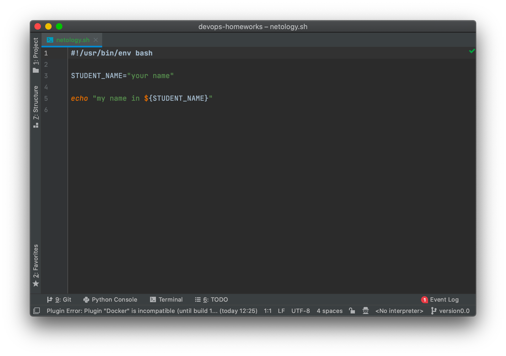
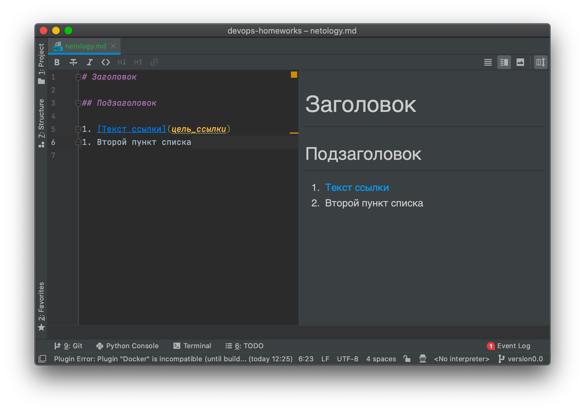
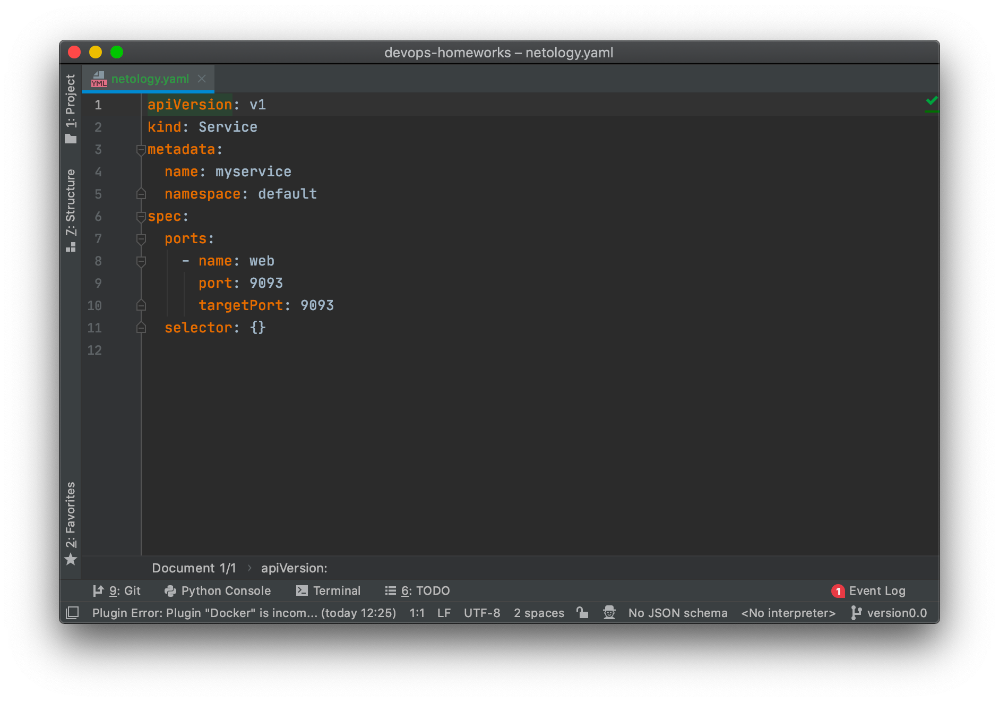
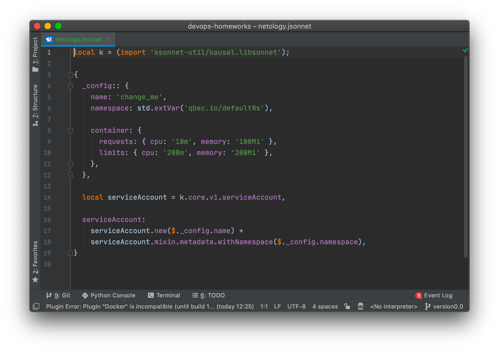
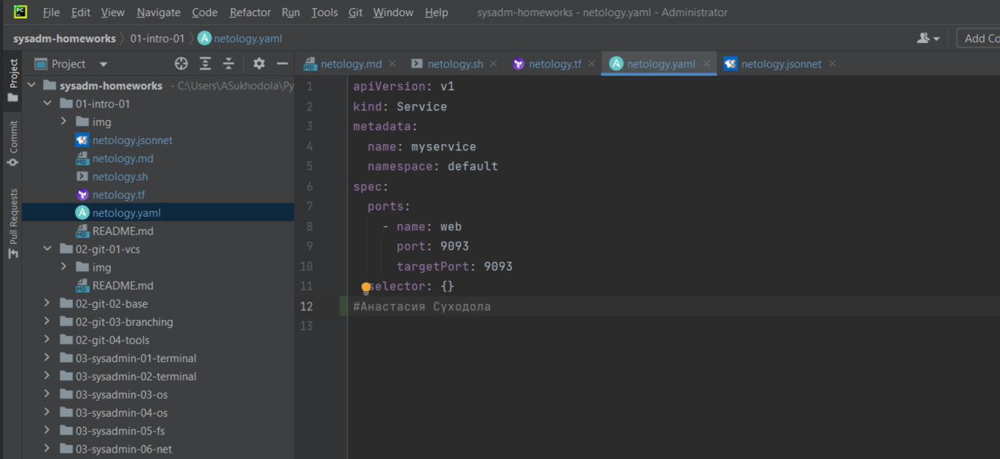
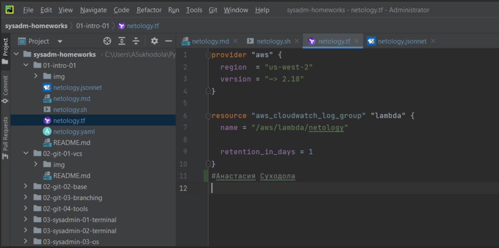
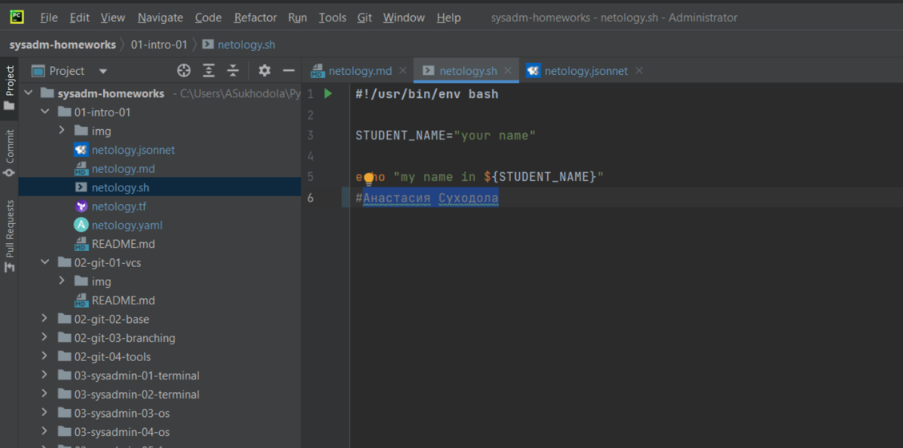
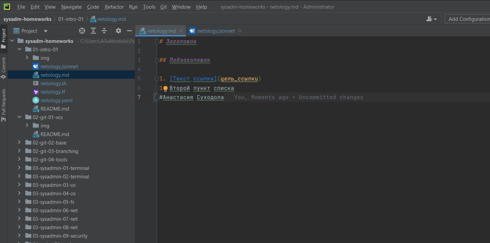

**Домашнее задание к занятию «Введение в DevOps»**

**Цель задания**

**В результате выполнения задания вы:**

1. научитесь настраивать окружение для работы;
2. опишите процесс решения задачи в соответствии с жизненным циклом разработки ПО.

**Инструкция к заданию**
**Домашнее задание выполните в файле README.md в своём репозитории на GitHub или в Google Doc.**

1. Сделайте копию [«Шаблона для домашнего задания»](https://docs.google.com/document/d/1youKpKm_JrC0UzDyUslIZW2E2bIv5OVlm_TQDvH5Pvs/edit) себе на Google Диск.
2. В названии файла введите корректное название лекции, ваши фамилию и имя.
3. Зайдите в «Настройки доступа» и откройте доступ «Просматривать могут все в интернете, у кого есть ссылка». Инструкция «Как предоставить доступ к файлам и папкам на Google Диске» доступна по ссылке.
4. Выполните домашнее задание, запишите ответы и добавьте необходимые скриншоты в свой Google Doc.
5. Для проверки домашнего задания отправьте ссылку на ваш документ в личном кабинете.
6. Любые вопросы по решению задач задавайте в чате учебной группы.

**Дополнительные материалы для выполнения задания**

* [PyCharm Community Edition.](https://www.jetbrains.com/ru-ru/pycharm/download/#section=mac)
* [Visual Studio Code](https://code.visualstudio.com/Download).

**Задание 1. Подготовка рабочей среды**

Вы пришли на новое место работы или приобрели новый компьютер. Сначала надо настроить окружение для дальнейшей работы.

**Что нужно сделать**

Шаг 1. Установить PyCharm Community Edition. Это бесплатная версия IDE. В качестве альтернативы можно установить Visual Studio Code и дальнейшие шаги проделать в нём. Так вы сможете выбрать более удобный инструмент для себя.

Дальше для примера будут даны скриншоты из PyCharm.

Шаг 2. Установить плагины:

* Terraform.
* MarkDown.
* Yaml или Ansible Support.
* Jsonnet.

Шаг 3. Склонировать текущий репозиторий (команда git clone) или просто создать файлы для проверки плагинов:

* netology.tf — Terraform;
* netology.sh — Bash;
* netology.md — Markdown;
* netology.yaml — YAML;
* netology.jsonnet — Jsonnet.

Шаг 4. Убедитесь, что работает подсветка синтаксиса. Файлы должны выглядеть так:

Terraform:

Bash:

Markdown:

Yaml:

Jsonnet:

В качестве выполненного задания загрузите скриншоты установленной IDE с плагинами в файле README.md собственного репозитория в 
GitHub или в Google Doc.

**Задание 2. Описание жизненного цикла задачи (разработки нового функционала)**

Чтобы лучше понимать предназначение инструментов, с которыми вам предстоит работать, составим схему жизненного цикла задачи в 
идеальном для вас случае.

**Описание истории**

Представьте, что вы работаете в стартапе, который запустил интернет-магазин. Он достаточно успешно развивался, 
и пришло время налаживать процессы: у вас стало больше конечных клиентов, менеджеров и разработчиков.

Сейчас от клиентов вам приходят задачи, связанные с разработкой нового функционала. Задач много, и все они требуют
выкладки на тестовые среды, одобрения тестировщика, проверки менеджером перед показом клиенту. В некоторых случаях вам 
будет необходим откат изменений.

**Решение задачи**

Вам нужно описать процесс решения задачи в соответствии с жизненным циклом разработки программного обеспечения. Использование конкретного метода разработки необязательно.

Для решения главное — прописать по пунктам шаги решения задачи (релизации в конечный результат) с участием менеджера, разработчика (или команды разработчиков), тестировщика (или команды тестировщиков) и себя как DevOps-инженера.

Ответ пришлите в свободной форме.

Решение:
 
В проекте участвуют:

1. команда разработки (back)
2. команда разработки (front)
3. команда тестирования (back+front)
4. product owner (1 чел)
5. devops (1 чел)

Разработка:

back:

Есть проект с приложением (есть master ветка, релизная ветка). Под новую фичу (доработку) создается отдельная ветка c 
указанием задачи из jira - feature/MMM-123. Мелкие фиксы можно лить в сразу в мастер (до 10 строк), более крупные через 
mr/pr - fix/MMM-124.
Новые фичи проходят ревью, изменения вливаются в мастер после 2 апрувов коллег-разработчиков.
Unit-тесты пишут разработчики, покрытие кода не менее 80%.

 front:

Есть проект с приложением (есть master ветка, релизная ветка). Под новую фичу (доработку) создается отдельная ветка c 
указанием задачи из jira - feature/MMM 123. 

Мелкие фиксы можно лить в сразу в мастер (до 10 строк), более крупные через mr/pr - fix/MMM-124. 
Новые фичи проходят ревью, изменения вливаются в мастер после 2 апрувов коллег-разработчиков.
Unit-тесты пишут разработчики, покрытие кода не менее 80%.

 Тестирование:

Есть проект для тестов (главная master ветка), в котором 2 модуля / пакета, один для тестов фронта, второй для 
тестов бэка. Под новую фичу (доработку) создается отдельная ветка c указанием задачи из jira - feature/MMM-123. 
Мелкие фиксы можно лить в сразу в мастер (до 10 строк), более крупные через mr/pr - fix/MMM-124. Изменения вливаются
в мастер после 1 апрува коллеги-тестировщика.

Среды:
локалка, stage, prod

Репозиторий: gitlab

Запуск тестов: gitlab

 Процесс:
 
у менеджера (product owner) есть бэклог с задачами для разработки, исходя из понимания, что критично для бизнеса, 
PO понимает, что должны команды сделать ближайшее время для выпуска определенного функционала.
Перед началом спринта проходит планирование у команд. К примеру, команды разработки оценивают, сколько задач может 
взять в спринт, учитывая емкость команды и сложность задач, задачи приоритизируются. Задачи для тестирования 
идут в зависимости от того, что возьмут разработки, команда понимает, что успеет покрыть тестами.

Итак, как может пройти спринт:
Разработчики бэка взяли условно 3 задачи (новые сервисы), делают одновременно, независимо друг от друга. 
Разработчики фронта взяли 2 задачи (новые сервисы), могут писать фронт на заглушках, пока бэк не готов + 1 
задача на доработку уже существующего функционала.
По мере готовности задач разработчики бэка пушат новые ветки в репозиторий, создают mr, проходят ревью, 
вносят правки в код. Пока задача разработчика еще на ревью, или пока не готова влиться в мастер 
(например, ждет ревью), тестировщик может взять фичу разработки, и начинает писать тесты, запуская проект локально (если требуется).
Тесты по мере готовности пушат в ветки, создаются мержи, тесты проходят ревью.
В случае, если тестировщик нашел баги, баги создаются в джире, разработчик правит в своей же ветке.
Стабильные версии с текущим кодом мержатся в мастер, собирается в релизную ветку. Изменения готовы к выкатке на стейдж.

Devops-инженер имеет пайплайн, согласно которому проект собирается, затем деплоится и запускаются тесты.
Если произошла какая-то ошибка при билде, идет отправка сообщения в чат и зачастую, разработчики смотрят причину падения билда.
После сборки проекта (допустим бэк) и получения какой-то версии, происходит деплой на стейдж этой версии, по факту деплоя
- пинг в чатик, после чего запускаются unit-тесты (пинг о результате в чатик), затем регресс (ранее написанные тестировщиками 
- тесты) + тесты на новый функционал (в ямл файле указываются последовательности build, deploy stage, test, deploy prod), 
- для деплоя значение переменных, для тестов - откуда взять тесты + команда запуска + куда публиковать отчет о прохождении
- - allure server к примеру.
Как упоминалось, результаты билдов, деплоя, тестов пушатся в чатики (у указанием какая шла фаза, успешно или нет и тп), 
- кроме того, логи можно посмотреть в кибане, метрики в графане, отслеживается, сколько ресурсов занято к примеру.
Если билд не прошел, разработчик смотрит, в чем проблема, возможно, где-то в инвентори что-то не указано, не прописано 
- или упали юнит-тесты, в таких случаях вносят правки.
В случае, если регресс упал, тестировщик смотрит прогон, по мере необходимости создает баги, разработчики правят и выкладка 
- происходит по новой. Есть предложения по автоматическому созданию багов по с приложением логов их аллюр к примеру.
Если найден критичный баг, в таком случае происходит откат версии на предыдущую, прогоняется регресс.
В случае, если на стейдже ничего не упало и тесты прошли, происходит выкладка на prod.
На проде devops-инженер также мониторит графану (например) для отслеживания метрик, данных. 

По договоренности с PO в релиз включается минимум 2 фичи, может быть 1 доработка + 1 новая фича или 2 новых фичи.
Для выкаток фронта схожий пайплайн.
Если на проде нашли некритичный баг, то возможен хотфикс + регресс.
Ежедневно проходят митинги, в которых члены команды рассказывают статус работ.
Под конец спринта проходит ретро с обсуждением, что было хорошо и / или плохо предыдущего спринта. А также планирование 
задач на след спринт.
 Задача devops - непрерывная интеграция и поставка обновленных версий, минимизация ручного включения.

