**Домашнее задание к занятию "1. Введение в Ansible"**

**Подготовка к выполнению**

* Установите ansible версии 2.10 или выше.
* Создайте свой собственный публичный репозиторий на github с произвольным именем.
* Скачайте playbook из репозитория с домашним заданием и перенесите его в свой репозиторий.

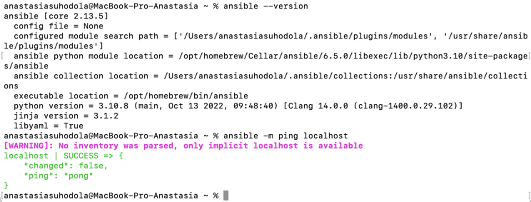

[https://github.com/ana17519/practise-ansible](https://github.com/ana17519/practise-ansible)

**Основная часть**

1. Попробуйте запустить playbook на окружении из test.yml, зафиксируйте какое значение имеет факт some_fact 
для указанного хоста при выполнении playbook'a.

`ansible-playbook -i inventory/test.yml site.yml`

some_fact имеет значение 12

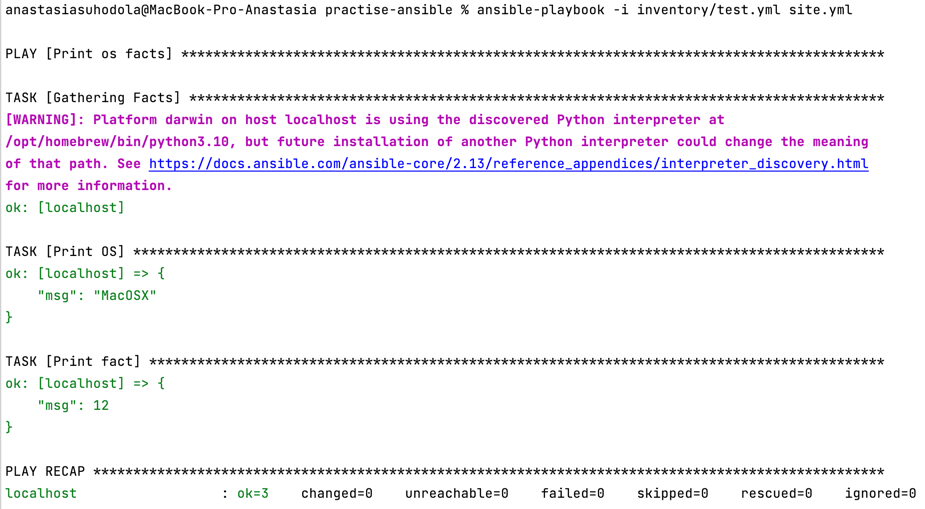

2. Найдите файл с переменными (group_vars) в котором задаётся найденное в первом пункте значение и поменяйте его 
на 'all default fact'.

group_vars/all/examp.yml:

```
---
  some_fact: 'all default fact'
  
```
3. Воспользуйтесь подготовленным (используется docker) или создайте собственное окружение для проведения дальнейших испытаний.
4. Проведите запуск playbook на окружении из prod.yml. Зафиксируйте полученные значения some_fact для каждого из managed host.

centos:

`docker run --rm -it --name centos7 centos:7`

ubuntu:

[Dockerfile](../../Dockerfile)
```
docker build -t ubuntu1 -f Dockerfile .
docker run --rm -it --name ubuntu ubuntu1
```
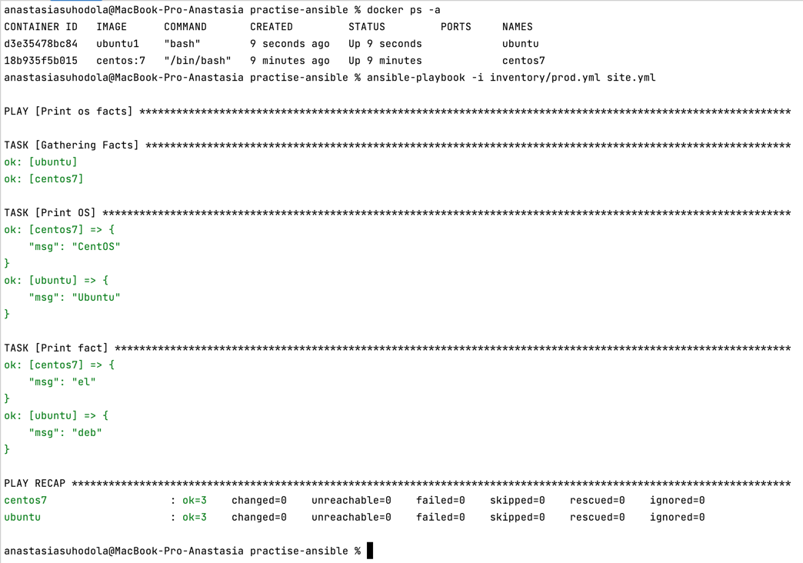

5. Добавьте факты в group_vars каждой из групп хостов так, чтобы для some_fact получились следующие значения: 
для deb - 'deb default fact', для el - 'el default fact'.
6. Повторите запуск playbook на окружении prod.yml. Убедитесь, что выдаются корректные значения для всех хостов.

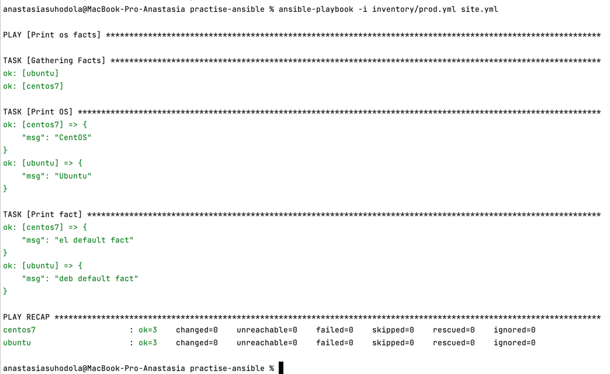

7. При помощи ansible-vault зашифруйте факты в group_vars/deb и group_vars/el с паролем netology.
```
ansible-vault encrypt group_vars/deb/examp.yml
ansible-vault encrypt group_vars/el/examp.yml
```
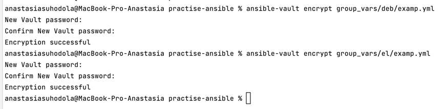

8. Запустите playbook на окружении prod.yml. При запуске ansible должен запросить у вас пароль. Убедитесь в работоспособности.

`ansible-playbook -i inventory/prod.yml site.yml --ask-vault-pass`

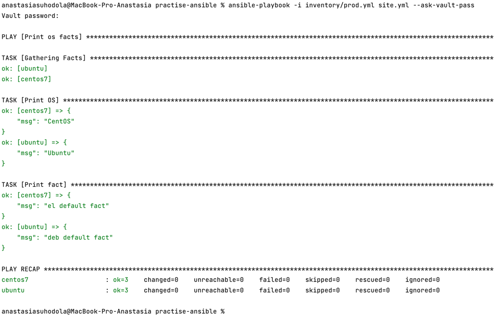

9. Посмотрите при помощи ansible-doc список плагинов для подключения. Выберите подходящий для работы на control node.

```
ansible-doc -t connection -l | grep control
ansible-doc -t connection local     
       
This connection plugin allows ansible to execute tasks on the Ansible 'controller' instead of on a remote host.
```

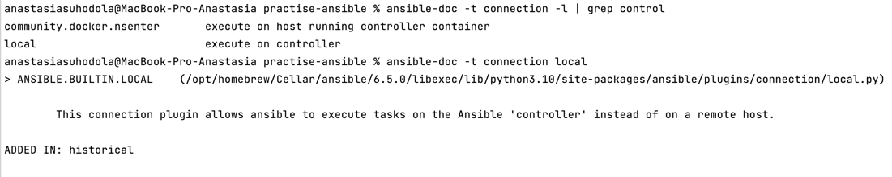

10. В prod.yml добавьте новую группу хостов с именем local, в ней разместите localhost с необходимым типом подключения.

```
  local:
    hosts:
      localhost:
        ansible_connection: local
```
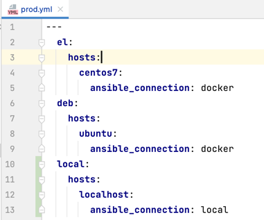

11. Запустите playbook на окружении prod.yml. При запуске ansible должен запросить у вас пароль. 
Убедитесь что факты some_fact для каждого из хостов определены из верных group_vars.

`ansible-playbook -i inventory/prod.yml site.yml --ask-vault-pass`

some_fact для localhost берется из group_vars/all/examp.yml - значение по умолчанию, если не определено др. значение, а оно не определено
```
TASK [Print fact] *******************************************************************************************************************************************************************
ok: [centos7] => {
    "msg": "el default fact"
}
ok: [ubuntu] => {
    "msg": "deb default fact"
}
ok: [localhost] => {
    "msg": "all default fact"
}
```
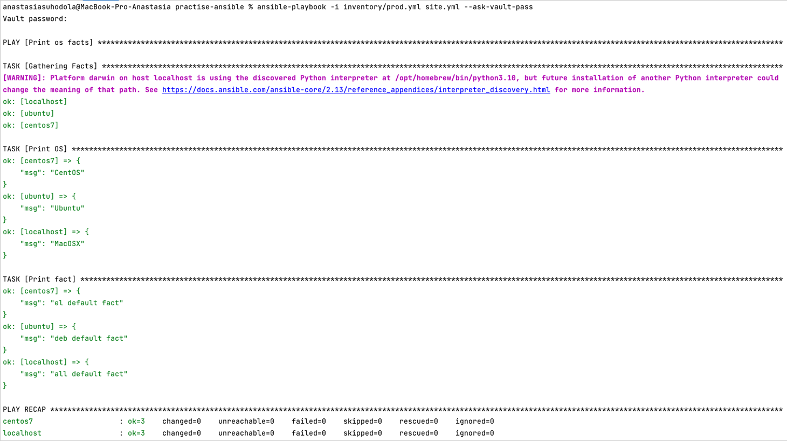
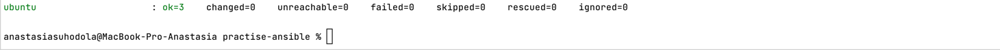

12. Заполните README.md ответами на вопросы. Сделайте git push в ветку master. 
В ответе отправьте ссылку на ваш открытый репозиторий с изменённым playbook и заполненным README.md.

[https://github.com/ana17519/practise-ansible/tree/master](https://github.com/ana17519/practise-ansible/tree/master)

**Необязательная часть**

1. При помощи ansible-vault расшифруйте все зашифрованные файлы с переменными.

```
ansible-vault decrypt group_vars/deb/examp.yml
ansible-vault decrypt group_vars/el/examp.yml
```
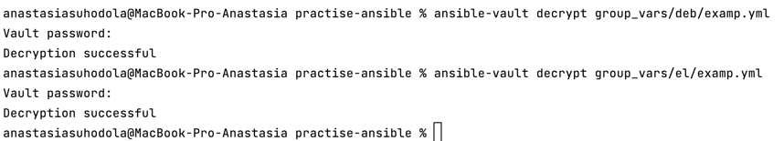

2. Зашифруйте отдельное значение PaSSw0rd для переменной some_fact паролем netology. 
Добавьте полученное значение в group_vars/all/exmp.yml.

`ansible-vault encrypt_string "PaSSw0rd"`

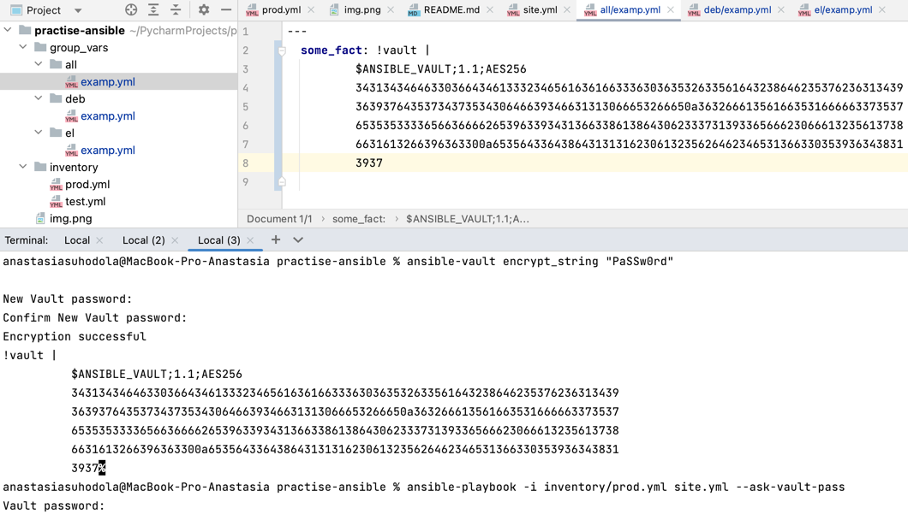

3. Запустите playbook, убедитесь, что для нужных хостов применился новый fact.

`ansible-playbook -i inventory/prod.yml site.yml --ask-vault-pass`

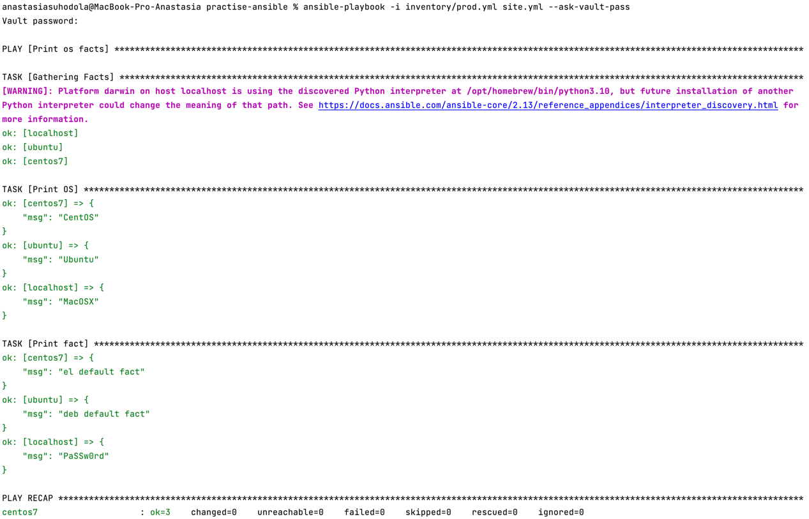
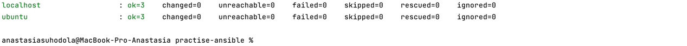

5. Добавьте новую группу хостов fedora, самостоятельно придумайте для неё переменную. 
В качестве образа можно использовать этот.

`docker run --rm -it --name fedora pycontribs/fedora`

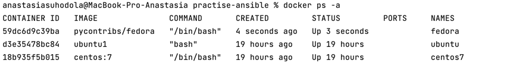

```
  fed:
    hosts:
      fedora:
        ansible_connection: docker
```

6. Напишите скрипт на bash: автоматизируйте поднятие необходимых контейнеров, запуск ansible-playbook и остановку контейнеров.

[docker.sh](https://github.com/ana17519/practise-ansible/blob/main/docker.sh)

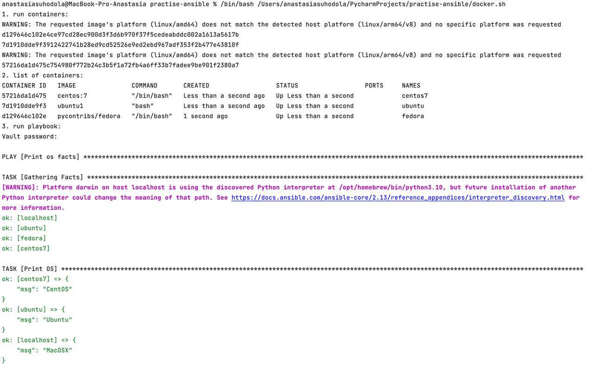
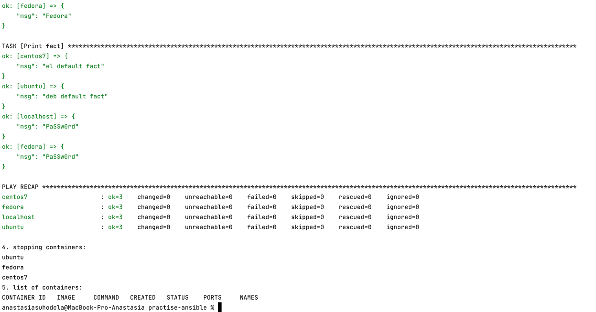

7. Все изменения должны быть зафиксированы и отправлены в вашей личный репозиторий.

[https://github.com/ana17519/practise-ansible/tree/main](https://github.com/ana17519/practise-ansible/tree/main)