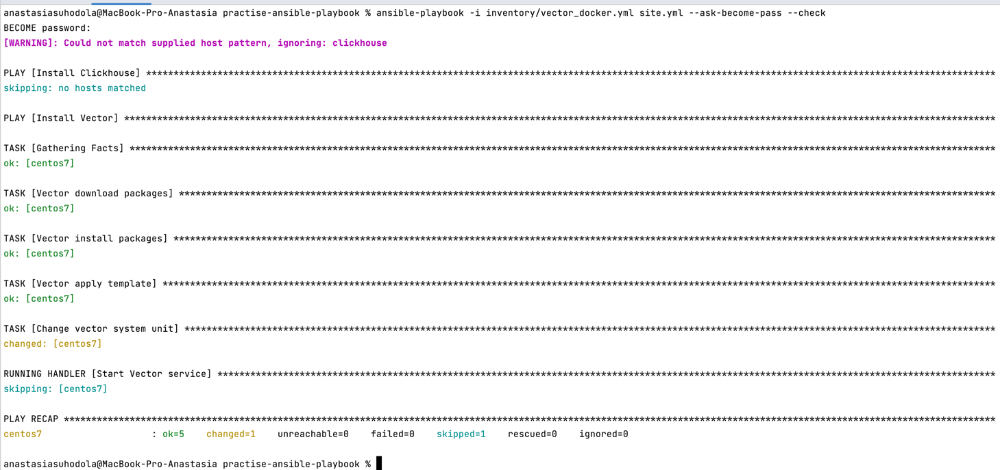

**Домашнее задание к занятию "2. Работа с Playbook"**

**Подготовка к выполнению**
1. (Необязательно) Изучите, что такое clickhouse и vector
2. Создайте свой собственный (или используйте старый) публичный репозиторий на github с произвольным именем.
3. Скачайте playbook из репозитория с домашним заданием и перенесите его в свой репозиторий.
4. Подготовьте хосты в соответствии с группами из предподготовленного playbook.

**Основная часть**

1. Приготовьте свой собственный inventory файл prod.yml.

первоначально видоизменила файл prod.yml, попробовав добавить подключения local, однако были проблемы с install, процесс долго висел, 
команда top не особо помогла, тк было много запущенных процессов
```
---
clickhouse:
  hosts:
    clickhouse-01:
      ansible_connection: local
```

после чего решила попробовать запустить clickhouse в docker (clickhouse_docker.yml):

```
---
clickhouse:
  hosts:
    centos7:
      ansible_connection: docker
      
```      
centos:

`docker run --rm -it --name centos7 centos:7`

site.yml также изменен: корректировка по пакетам и добавление прав:

[https://github.com/ana17519/practise-ansible-playbook/blob/main/site.yml](https://github.com/ana17519/practise-ansible-playbook/blob/main/site.yml)

команда запуска:

` ansible-playbook -i inventory/clickhouse_docker.yml site.yml --ask-become-pass `


2. Допишите playbook: нужно сделать ещё один play, который устанавливает и настраивает vector.
3. При создании tasks рекомендую использовать модули: get_url, template, unarchive, file. 
4. Tasks должны: скачать нужной версии дистрибутив, выполнить распаковку в выбранную директорию, установить vector.
5. Запустите ansible-lint site.yml и исправьте ошибки, если они есть.

поправлено 2 failures.


6. Попробуйте запустить playbook на этом окружении с флагом --check.

` ansible-playbook -i inventory/vector_docker.yml site.yml --ask-become-pass --check`



7. Запустите playbook на prod.yml окружении с флагом --diff. Убедитесь, что изменения на системе произведены.


8. Повторно запустите playbook с флагом --diff и убедитесь, что playbook идемпотентен.


9. Подготовьте README.md файл по своему playbook. В нём должно быть описано: 
что делает playbook, какие у него есть параметры и теги.

[https://github.com/ana17519/practise-ansible-playbook/blob/main/README.md](https://github.com/ana17519/practise-ansible-playbook/blob/main/README.md)

10. Готовый playbook выложите в свой репозиторий, поставьте тег 08-ansible-02-playbook 
на фиксирующий коммит, в ответ предоставьте ссылку на него.

[https://github.com/ana17519/practise-ansible-playbook/releases/tag/08-ansible-02-playbook](https://github.com/ana17519/practise-ansible-playbook/releases/tag/08-ansible-02-playbook)