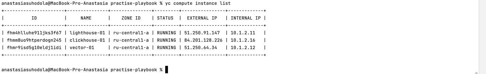
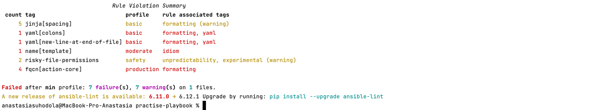
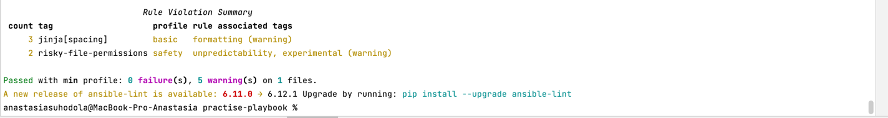
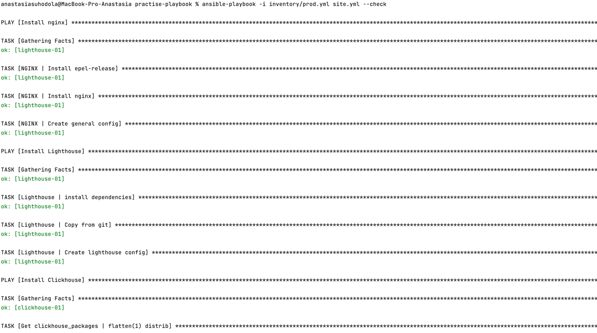
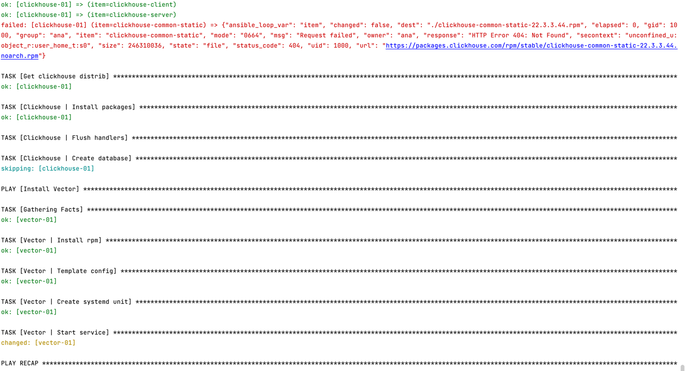
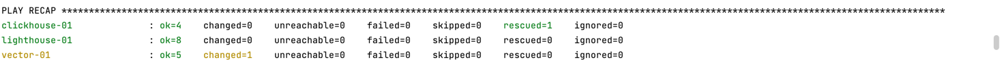
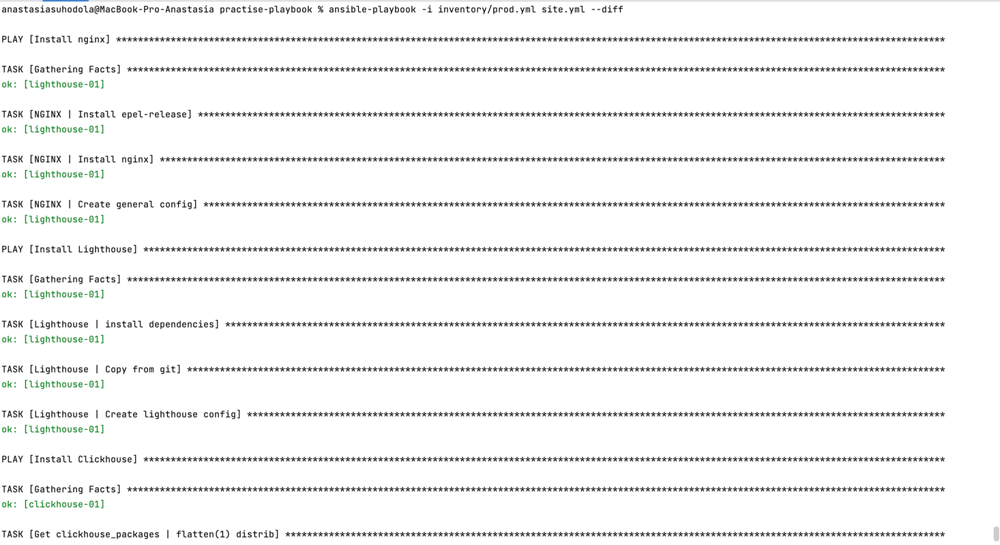
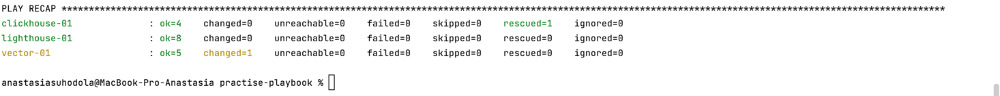
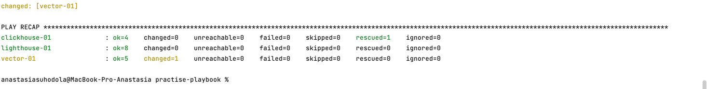
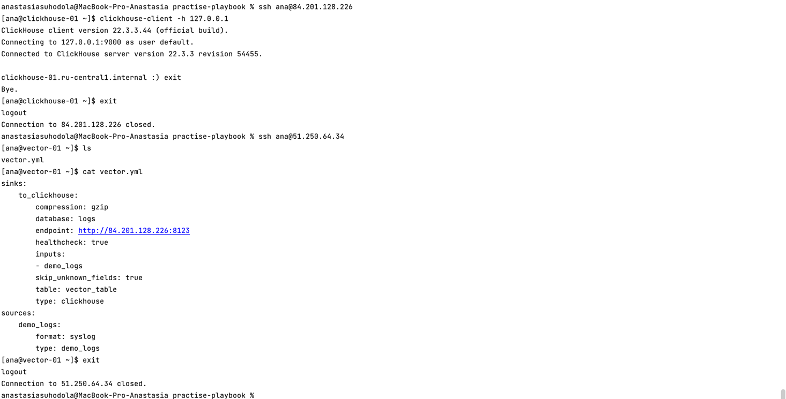

**Домашнее задание к занятию "3. Использование Yandex Cloud"**

**Подготовка к выполнению**

1. Подготовьте в Yandex Cloud три хоста: для clickhouse, для vector и для lighthouse.

в site.yml к каждому host добавлен remote_user, тк дефолтное имя юзера (anastasiasuhodola) имеет больше 16 символов (через ui) :

`  remote_user: ana`

2. Ссылка на репозиторий LightHouse: [https://github.com/VKCOM/lighthouse](https://github.com/VKCOM/lighthouse)

**Основная часть**

1. Допишите playbook: нужно сделать ещё один play, который устанавливает и настраивает lighthouse.
2. При создании tasks рекомендую использовать модули: get_url, template, yum, apt.
3. Tasks должны: скачать статику lighthouse, установить nginx или любой другой webserver, настроить его 
конфиг для открытия lighthouse, запустить webserver.
4. Приготовьте свой собственный inventory файл prod.yml. 
5. Запустите ansible-lint site.yml и исправьте ошибки, если они есть.

исправлено:

6. Попробуйте запустить playbook на этом окружении с флагом --check.

` ansible-playbook -i inventory/prod.yml site.yml --check`

7. Запустите playbook на prod.yml окружении с флагом --diff. Убедитесь, что изменения на системе произведены.

` ansible-playbook -i inventory/prod.yml site.yml --diff`

8. Повторно запустите playbook с флагом --diff и убедитесь, что playbook идемпотентен.

9. Подготовьте README.md файл по своему playbook. В нём должно быть описано: что делает playbook, 
какие у него есть параметры и теги.

[https://github.com/ana17519/practise-playbook/blob/main/README.md](https://github.com/ana17519/practise-playbook/blob/main/README.md)

10. Готовый playbook выложите в свой репозиторий, поставьте тег 08-ansible-03-yandex на фиксирующий коммит, 
в ответ предоставьте ссылку на него.

[https://github.com/ana17519/practise-playbook/releases/tag/08-ansible-03-yandex](https://github.com/ana17519/practise-playbook/releases/tag/08-ansible-03-yandex)

Проверки:

