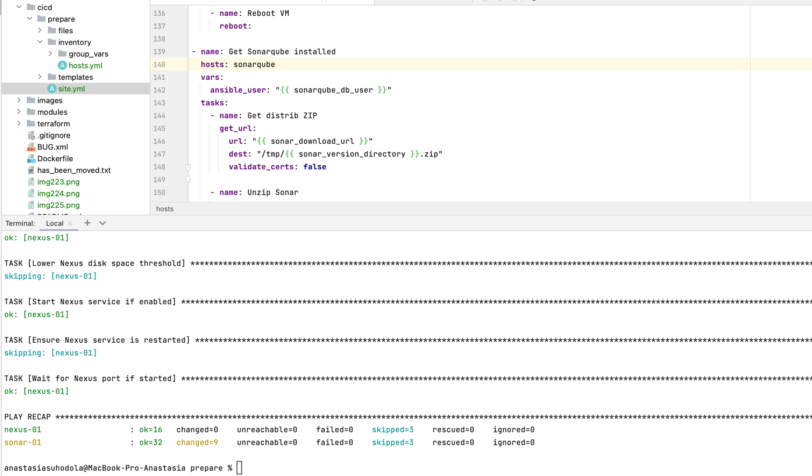
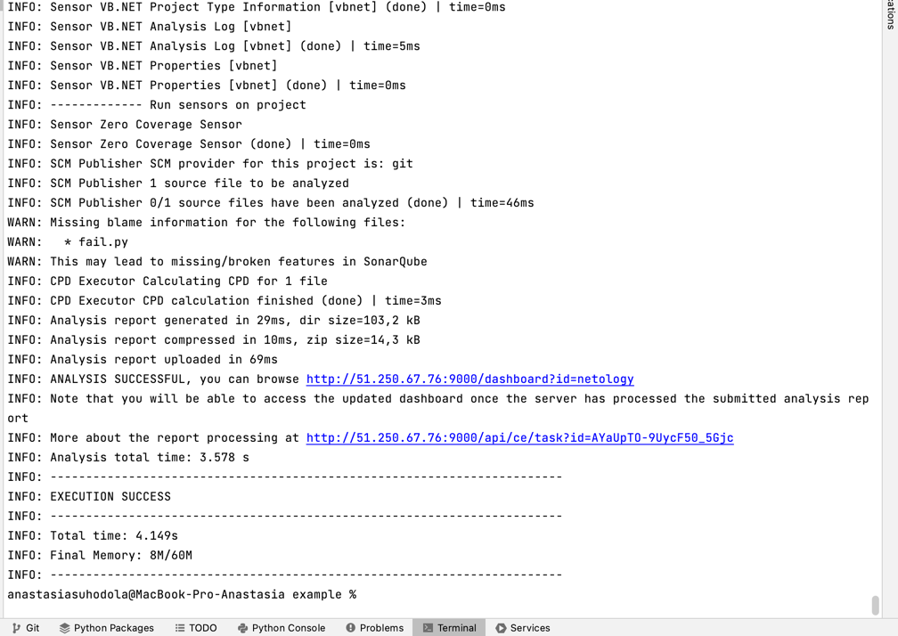
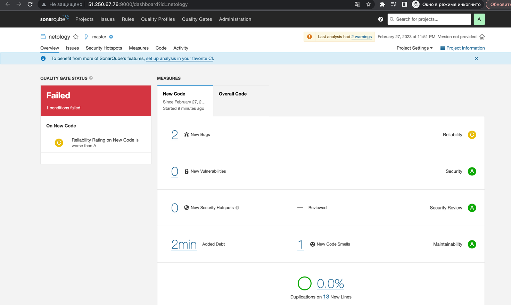
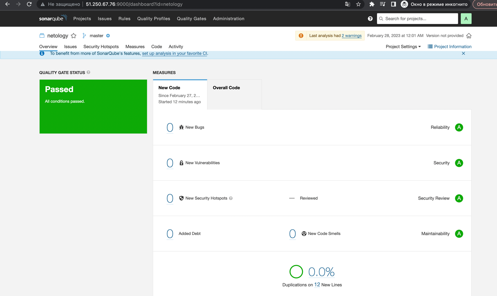
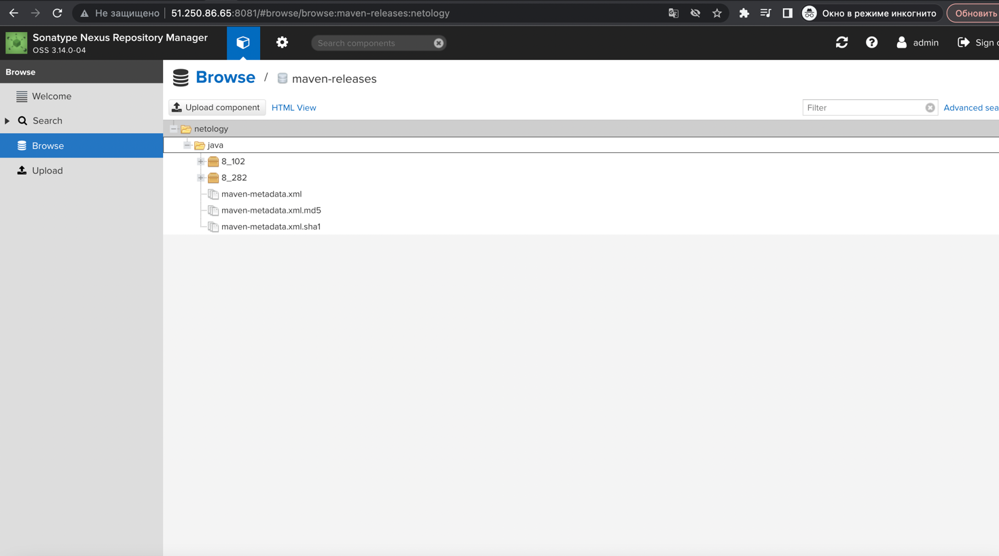

**Домашнее задание к занятию 9 «Процессы CI/CD»**

**Подготовка к выполнению**

1. Создайте два VM в Yandex Cloud с параметрами: 2CPU 4RAM Centos7 (остальное по минимальным требованиям).

2. Пропишите в inventory playbook созданные хосты.
3. Добавьте в files файл со своим публичным ключом (id_rsa.pub). Если ключ называется иначе — найдите таску в плейбуке, которая использует id_rsa.pub имя, и исправьте на своё.
4. Запустите playbook, ожидайте успешного завершения.

`ansible-playbook -i inventory/hosts.yml site.yml`

5. Проверьте готовность SonarQube через браузер.
6. Зайдите под admin\admin, поменяйте пароль на свой.

7. Проверьте готовность Nexus через бразуер.
8. Подключитесь под admin\admin123, поменяйте пароль, сохраните анонимный доступ.

`admin123
admin1234`

**Знакомоство с SonarQube**

**Основная часть**

1. Создайте новый проект, название произвольное.
2. Скачайте пакет sonar-scanner, который вам предлагает скачать SonarQube.
3. Сделайте так, чтобы binary был доступен через вызов в shell (или поменяйте переменную PATH, или любой другой, удобный вам способ).
4. Проверьте `sonar-scanner --version`.

5. Запустите анализатор против кода из директории example с дополнительным ключом `-Dsonar.coverage.exclusions=fail.py`.
6. Посмотрите результат в интерфейсе.

7. Исправьте ошибки, которые он выявил, включая warnings.
8. Запустите анализатор повторно — проверьте, что QG пройдены успешно.
9. Сделайте скриншот успешного прохождения анализа, приложите к решению ДЗ.

**Знакомство с Nexus**

**Основная часть**

1. В репозиторий maven-public загрузите артефакт с GAV-параметрами:

* groupId: netology;
* artifactId: java;
* version: 8_282;
* classifier: distrib;
* type: tar.gz.

2. В него же загрузите такой же артефакт, но с version: 8_102.
3. Проверьте, что все файлы загрузились успешно.

4. В ответе пришлите файл maven-metadata.xml для этого артефекта.

**Знакомство с Maven**

**Подготовка к выполнению**

1. Скачайте дистрибутив с maven.
2. Разархивируйте, сделайте так, чтобы binary был доступен через вызов в shell (или поменяйте переменную PATH, или любой другой, удобный вам способ).
3. Удалите из apache-maven-<version>/conf/settings.xml упоминание о правиле, отвергающем HTTP- соединение — раздел mirrors —> id: my-repository-http-unblocker.
4. Проверьте ` mvn --version`.
5. Заберите директорию mvn с pom.

**Основная часть**

1. Поменяйте в `pom.xml` блок с зависимостями под ваш артефакт из первого пункта задания для Nexus (java с версией 8_282).
2. Запустите команду ` mvn package` в директории с pom.xml, ожидайте успешного окончания.

`mvn -s settings.xml -U package`

3. Проверьте директорию ~/.m2/repository/, найдите ваш артефакт.

4. В ответе пришлите исправленный файл `pom.xml`.

[pom.xml](../../cicd/example/pom.xml)