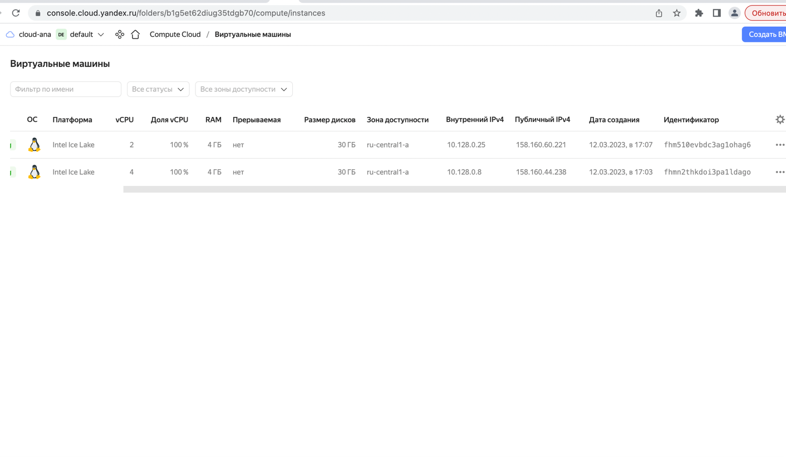
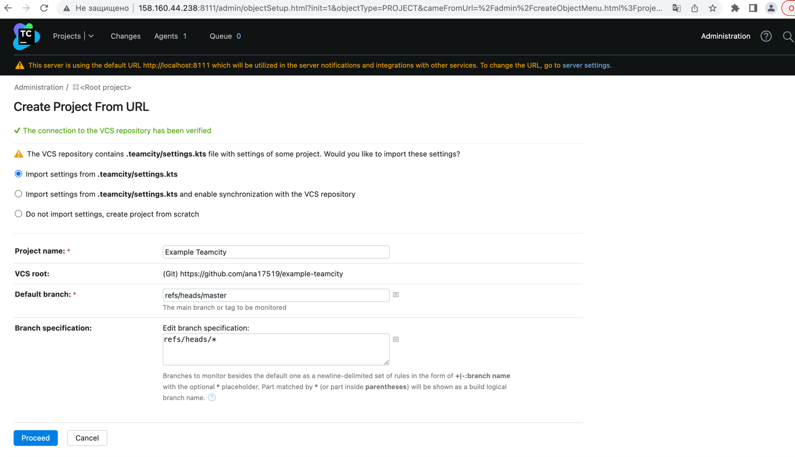
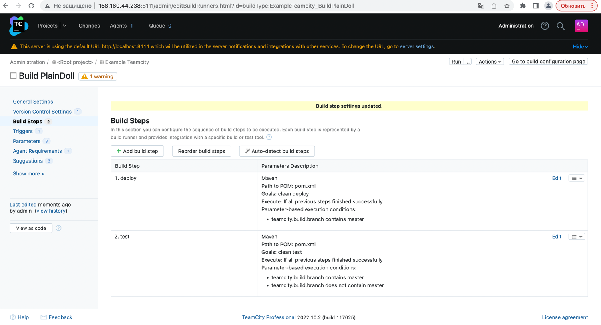
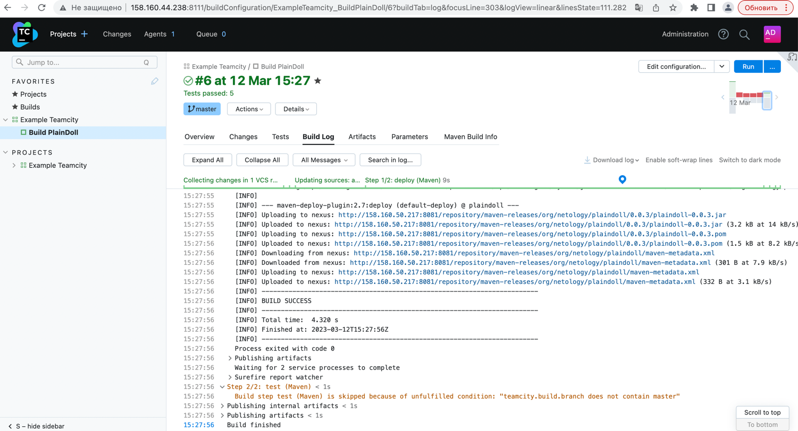
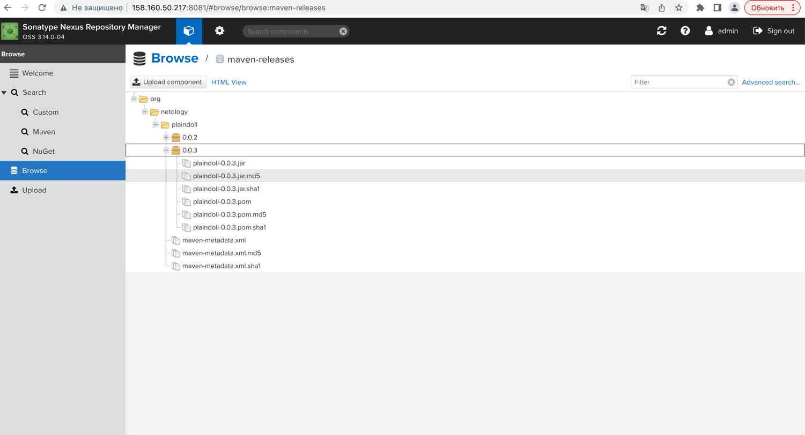
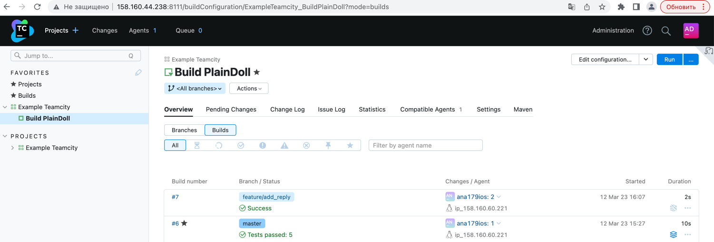
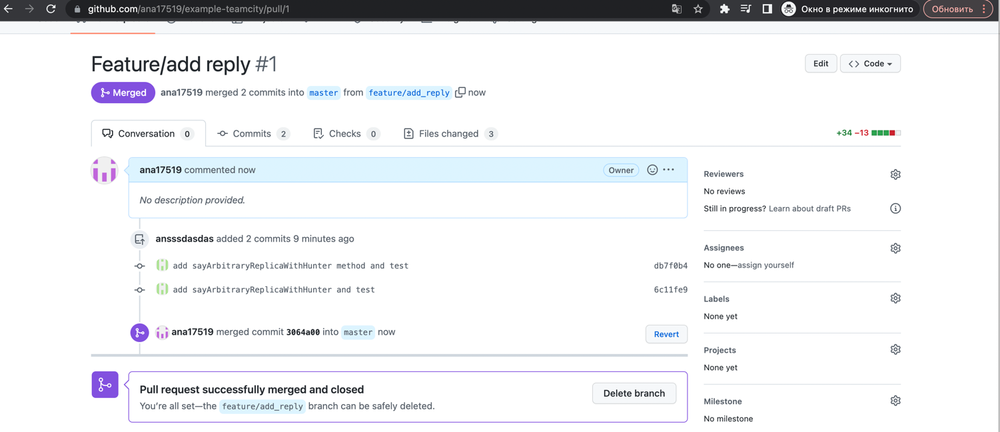

**Домашнее задание к занятию 11 «Teamcity»**

**Подготовка к выполнению**

1. В Yandex Cloud создайте новый инстанс (4CPU4RAM) на основе образа `jetbrains/teamcity-server`.
2. Дождитесь запуска teamcity, выполните первоначальную настройку.
3. Создайте ещё один инстанс (2CPU4RAM) на основе образа `jetbrains/teamcity-agent`. 
Пропишите к нему переменную окружения `SERVER_URL: "http://<teamcity_url>:8111"`.
4. Авторизуйте агент.

5. Сделайте fork [репозитория](https://github.com/aragastmatb/example-teamcity). 
6. Создайте VM (2CPU4RAM) и запустите [playbook](../../teamcity).

`ansible-playbook -i inventory/hosts.yml site.yml`

**Основная часть**

1. Создайте новый проект в `teamcity` на основе [fork](https://github.com/ana17519/example-teamcity).
2. Сделайте autodetect конфигурации.

3. Сохраните необходимые шаги, запустите первую сборку master.

4. Поменяйте условия сборки: если сборка по ветке master, то должен происходит `mvn clean deploy`, иначе `mvn clean test`.

5. Для deploy будет необходимо загрузить [settings.xml](https://github.com/netology-code/mnt-homeworks/blob/MNT-video/09-ci-05-teamcity/teamcity/settings.xml) 
в набор конфигураций maven у teamcity, предварительно записав туда креды для подключения к nexus.
6. В pom.xml необходимо поменять ссылки на репозиторий и nexus.
7. Запустите сборку по master, убедитесь, что всё прошло успешно и артефакт появился в nexus.

8. Мигрируйте build configuration в репозиторий.
9. Создайте отдельную ветку `feature/add_reply` в репозитории.
10. Напишите новый метод для класса Welcomer: метод должен возвращать произвольную реплику, содержащую слово hunter.
11. Дополните тест для нового метода на поиск слова hunter в новой реплике.
12. Сделайте push всех изменений в новую ветку репозитория.
13. Убедитесь, что сборка самостоятельно запустилась, тесты прошли успешно.

14. Внесите изменения из произвольной ветки `feature/add_reply` в `master` через `Merge`.

15. Убедитесь, что нет собранного артефакта в сборке по ветке master.
16. Настройте конфигурацию так, чтобы она собирала `.jar` в артефакты сборки.

17. Проведите повторную сборку мастера, убедитесь, что сбора прошла успешно и артефакты собраны.

18. Проверьте, что конфигурация в репозитории содержит все настройки конфигурации из teamcity.
19. В ответе пришлите ссылку на репозиторий.

[репозиторий](https://github.com/ana17519/example-teamcity)