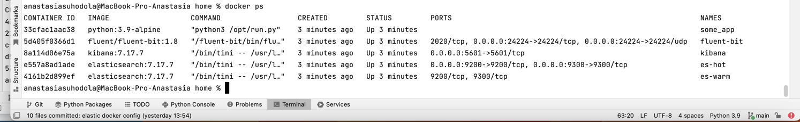
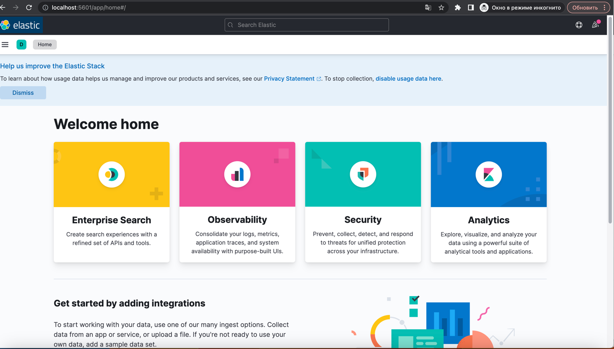
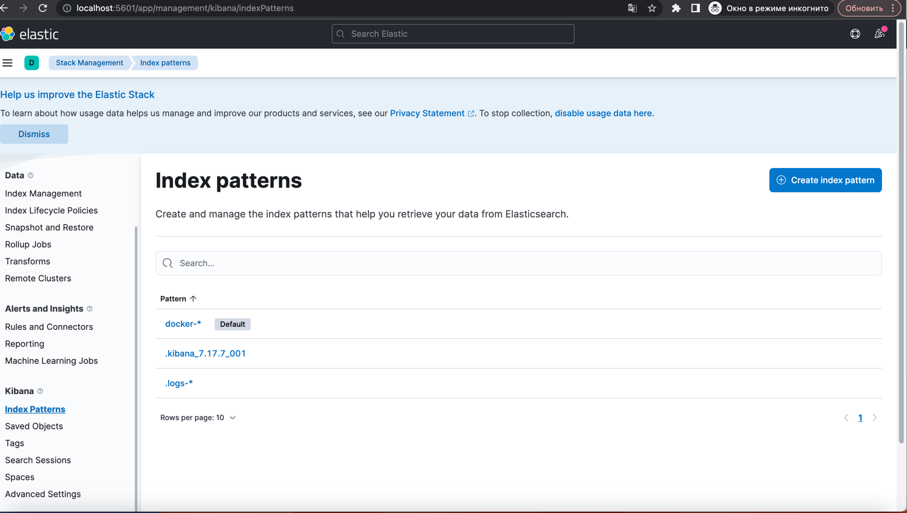
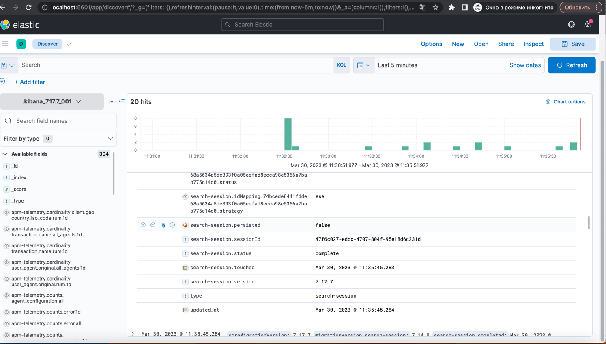
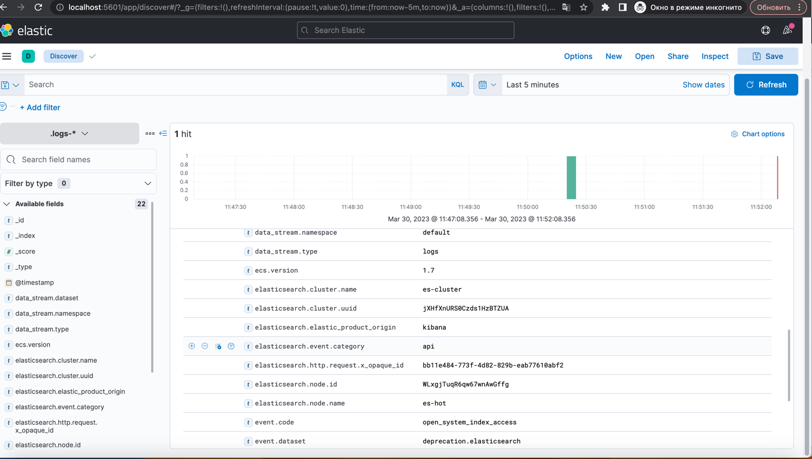
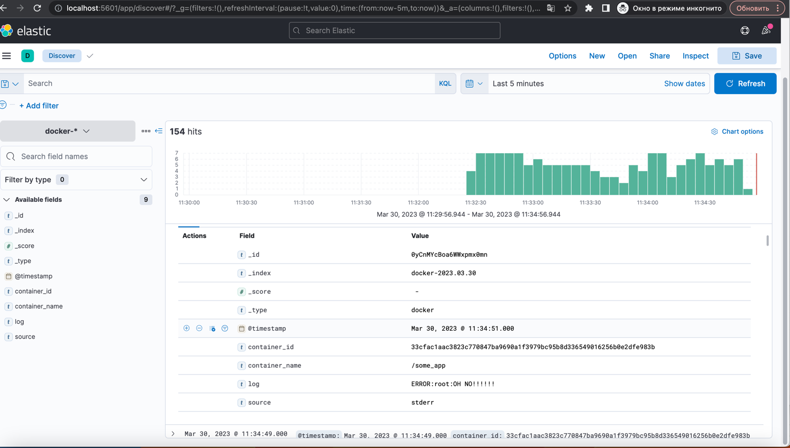

**Домашнее задание к занятию 15 «Система сбора логов Elastic Stack»**

**Дополнительные ссылки**

При выполнении задания используйте дополнительные ресурсы:

* [поднимаем elk в docker](https://www.elastic.co/guide/en/elasticsearch/reference/current/docker.html);
* [поднимаем elk в docker с filebeat и docker-логами](https://www.sarulabs.com/post/5/2019-08-12/sending-docker-logs-to-elasticsearch-and-kibana-with-filebeat.html);
* [конфигурируем logstash](https://www.elastic.co/guide/en/logstash/current/configuration.html);
* [плагины filter для logstash](https://www.elastic.co/guide/en/logstash/current/filter-plugins.html);
* [конфигурируем filebeat](https://www.elastic.co/guide/en/beats/libbeat/5.3/config-file-format.html);
* [привязываем индексы из elastic в kibana](https://www.elastic.co/guide/en/kibana/current/index-patterns.html);
* [как просматривать логи в kibana](https://www.elastic.co/guide/en/kibana/current/discover.html);
* [решение ошибки increase vm.max_map_count elasticsearch](https://stackoverflow.com/questions/42889241/how-to-increase-vm-max-map-count).

В процессе выполнения в зависимости от системы могут также возникнуть не указанные здесь проблемы.

Используйте output stdout filebeat/kibana и api elasticsearch для изучения корня проблемы и её устранения.

**Задание 1**

**Вам необходимо поднять в докере и связать между собой:**

* elasticsearch (hot и warm ноды);
* logstash;
* kibana;
* filebeat.

Logstash следует сконфигурировать для приёма по tcp json-сообщений.

Filebeat следует сконфигурировать для отправки логов docker вашей системы в logstash.

В директории [help](https://github.com/netology-code/mnt-homeworks/tree/MNT-video/10-monitoring-04-elk/help) находится манифест docker-compose и конфигурации filebeat/logstash для быстрого выполнения этого задания.

Результатом выполнения задания должны быть:

* скриншот docker ps через 5 минут после старта всех контейнеров (их должно быть 5);
* скриншот интерфейса kibana;
* docker-compose манифест (если вы не использовали директорию help);
* ваши yml-конфигурации для стека (если вы не использовали директорию help).

[docker-compose манифест](../../elastic/home/docker-compose.yml) 

[yml-конфигурации для стека](../../elastic/home/configs)

**Задание 2**

Перейдите в меню [создания index-patterns](http://localhost:5601/app/management/kibana/indexPatterns/create) 
в kibana и создайте несколько index-patterns из имеющихся.

Перейдите в меню просмотра логов в kibana (Discover) и самостоятельно изучите, 
как отображаются логи и как производить поиск по логам.

В манифесте директории help также приведено dummy-приложение, которое генерирует рандомные события в stdout-контейнера. 

Эти логи должны порождать индекс `logstash-*` в elasticsearch. 
Если этого индекса нет — воспользуйтесь советами и источниками из раздела «Дополнительные ссылки» этого задания.

вместо `logstash-*` `docker-*` 
