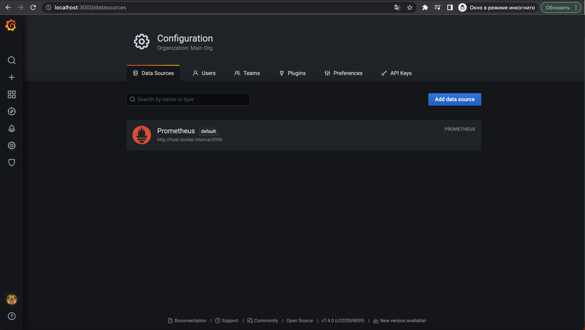
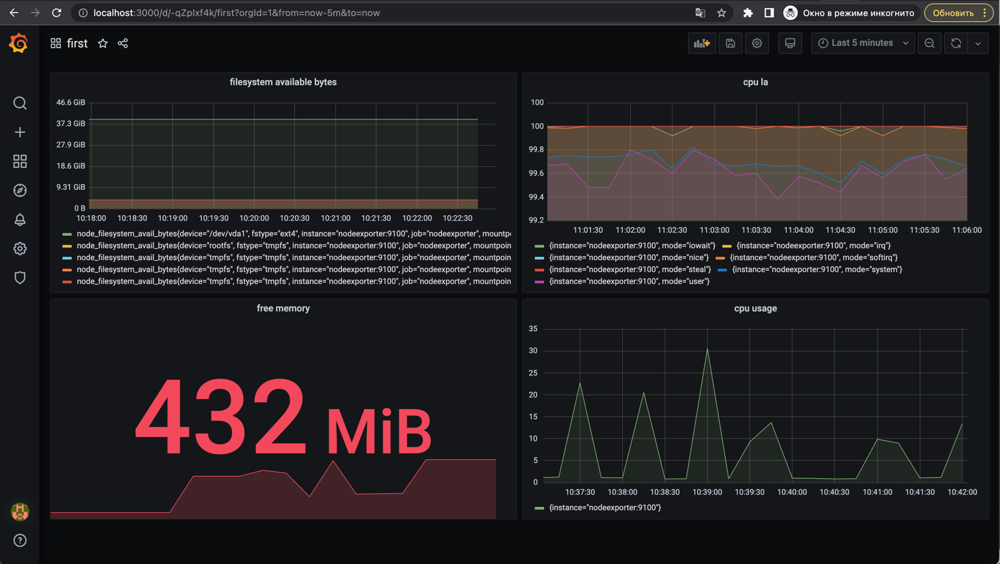
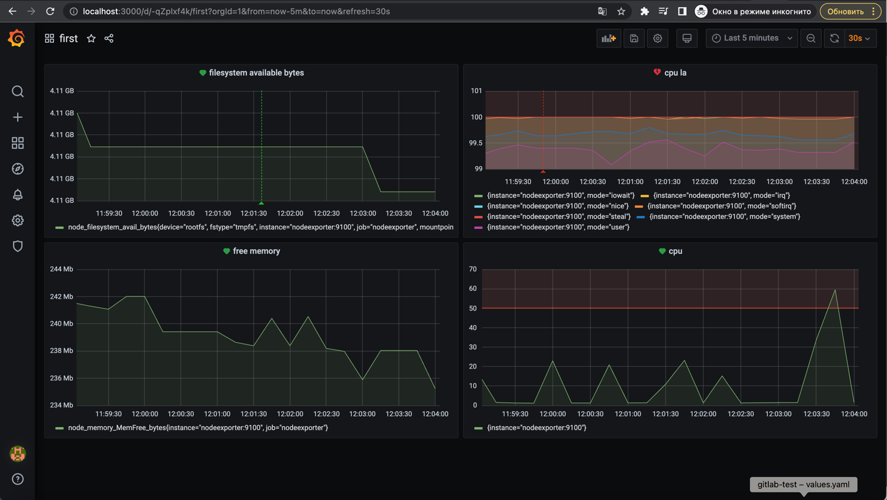
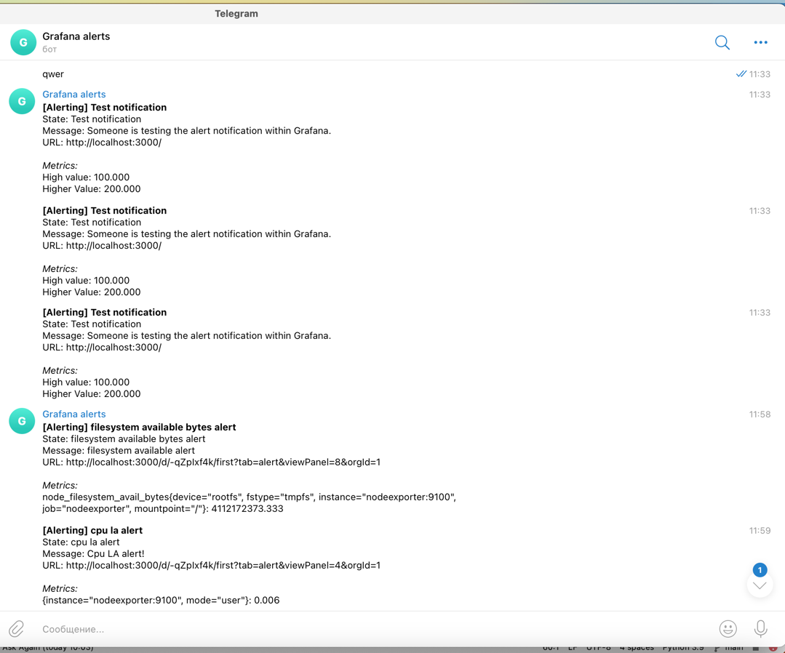

**Домашнее задание к занятию 14 «Средство визуализации Grafana»**

**Обязательные задания**

**Задание 1**

1. Используя директорию [help](https://github.com/netology-code/mnt-homeworks/tree/MNT-video/10-monitoring-03-grafana/help) внутри этого домашнего задания, запустите связку prometheus-grafana.
2. Зайдите в веб-интерфейс grafana, используя авторизационные данные, указанные в манифесте docker-compose.
3. Подключите поднятый вами prometheus, как источник данных.
4. Решение домашнего задания — скриншот веб-интерфейса grafana со списком подключенных Datasource.

**Задание 2**

Изучите самостоятельно ресурсы:

1. [PromQL tutorial for beginners and humans](https://valyala.medium.com/promql-tutorial-for-beginners-9ab455142085).
2. [Understanding Machine CPU usage](https://www.robustperception.io/understanding-machine-cpu-usage/).
3. [Introduction to PromQL, the Prometheus query language](https://grafana.com/blog/2020/02/04/introduction-to-promql-the-prometheus-query-language/).

Создайте Dashboard и в ней создайте Panels:

* утилизация CPU для nodeexporter (в процентах, 100-idle);

`100 - (avg by (instance) (rate(node_cpu_seconds_total{job="nodeexporter",mode="idle"}[1m])) * 100)`

* CPULA 1/5/15;

[//]: # (`avg by &#40;instance,mode&#41; &#40;irate&#40;node_cpu_seconds_total{mode!='idle'}[1m]&#41;&#41;`)
`100 - (avg by (instance,mode) (irate(node_cpu_seconds_total{mode!='idle'}[1m])) * 100)`

[//]: # (100 - &#40;avg by &#40;instance,mode&#41; &#40;irate&#40;node_cpu_seconds_total[1m]&#41;&#41; * 100&#41;)
[//]: # (avg&#40;node_load1{job="nodeexporter"}&#41; /  count&#40;count&#40;node_cpu_seconds_total{job="nodeexporter"}&#41; by &#40;cpu&#41;&#41; * 100)
[//]: # (100 - &#40;avg by&#40;instance&#41; &#40;irate&#40;node_cpu_seconds_total{mode="idle"}[1m]&#41;&#41; * 100 &#41; )
* количество свободной оперативной памяти;

`node_memory_MemFree_bytes` - MemFree - всего свободной оперативной памяти.

* количество места на файловой системе.

`node_filesystem_avail_bytes{device="rootfs", fstype="tmpfs", instance="nodeexporter:9100", job="nodeexporter", mountpoint="/"}`

[//]: # (Пространство файловой системы, доступное пользователям без полномочий root &#40;в байтах&#41;)

Для решения этого задания приведите promql-запросы для выдачи этих метрик, а также скриншот получившейся Dashboard.

[//]: # (Для отображения общего времени работы процессора &#40;сумма времен выполнения задач )
[//]: # (по всем процессорам/ядрам без учета типа idle&#41; в процентах можно использовать следующую метрику: )
[//]: # (100 - &#40;avg by &#40;instance&#41; &#40;irate&#40;node_cpu{job="node",mode="idle"}[5m]&#41;&#41; * 100&#41;)

**Задание 3**

1. Создайте для каждой Dashboard подходящее правило alert — можно обратиться к первой лекции в блоке «Мониторинг».
2. В качестве решения задания приведите скриншот вашей итоговой Dashboard.

**Задание 4**

1. Сохраните ваш Dashboard. Для этого перейдите в настройки Dashboard, выберите в боковом меню «JSON MODEL». 
Далее скопируйте отображаемое json-содержимое в отдельный файл и сохраните его.
2. В качестве решения задания приведите листинг этого файла.

[json model](../../grafana/json_model.json)