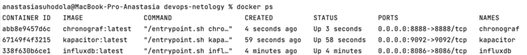
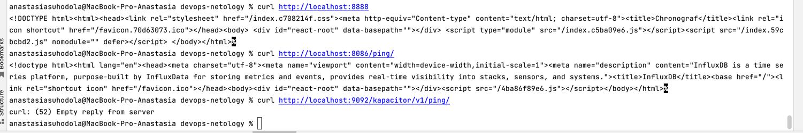
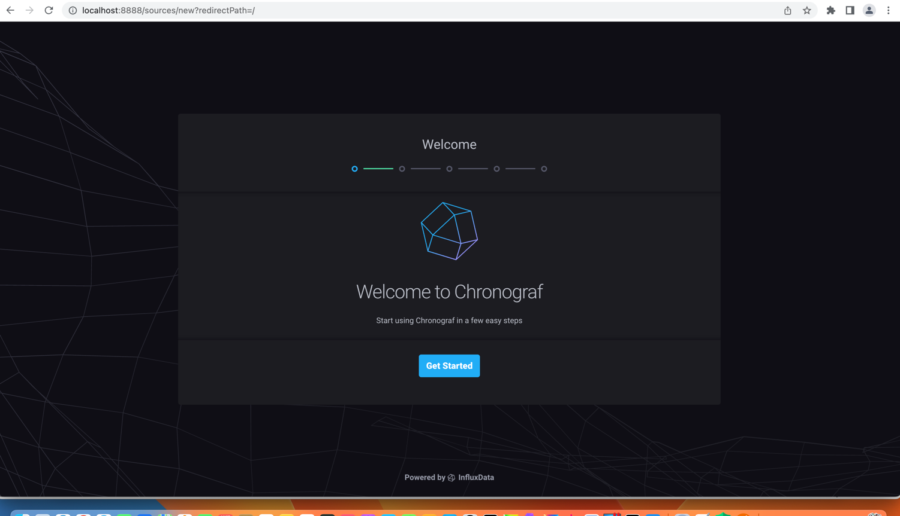
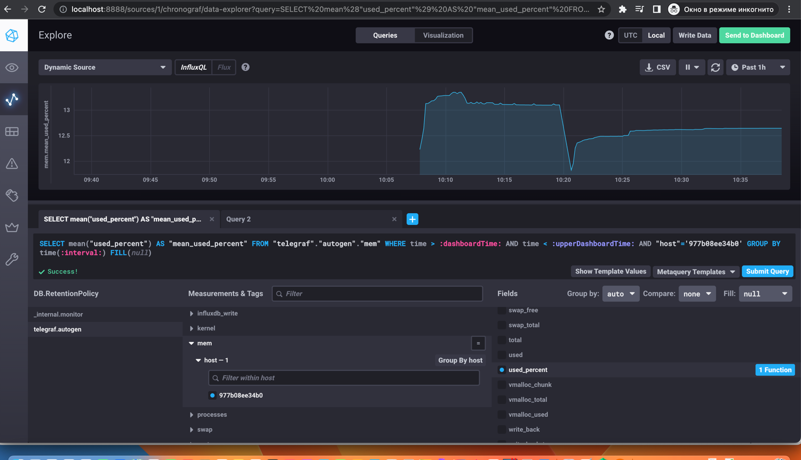
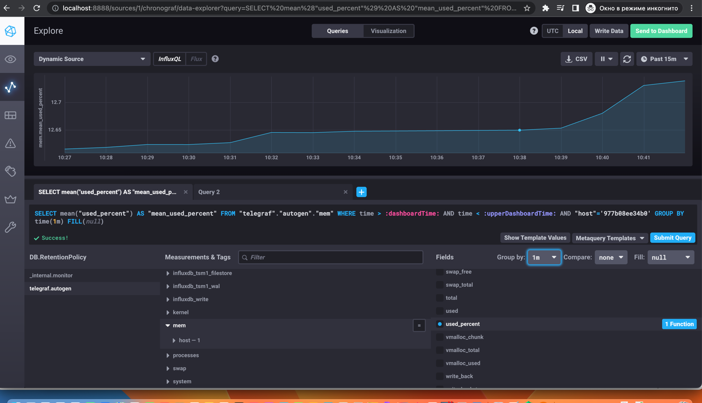
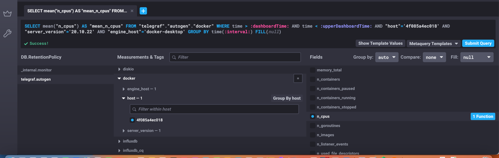
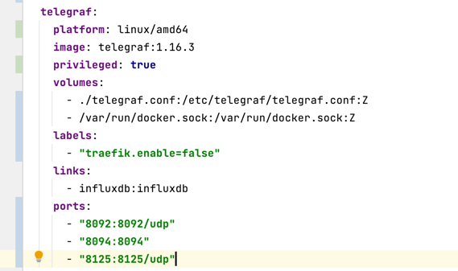
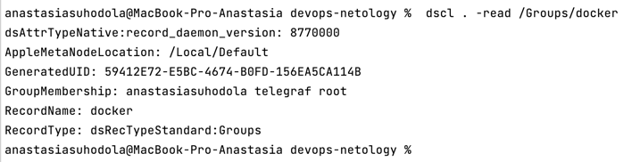

**Домашнее задание к занятию 13 «Введение в мониторинг»**

**Обязательные задания**

1. **Вас пригласили настроить мониторинг на проект. На онбординге вам рассказали, что проект представляет 
из себя платформу для вычислений с выдачей текстовых отчётов, которые сохраняются на диск. 
Взаимодействие с платформой осуществляется по протоколу http. 
Также вам отметили, что вычисления загружают 
ЦПУ. Какой минимальный набор метрик вы выведите в мониторинг и почему?**

Минимальный набор метрик для мониторинга:

* CPU LA - информация о нагрузке на центральный процессор
* RAM/swap - информация об утечках памяти
* inodes - переполнение индексных дискрипторов
* FS - свободное место на диске
* Rate — количество запросов в единицу времени (например, rps на микросервис или сервер)
* Errors — количество ошибок
* Duration (latency) — время обработки одного запроса

Далее добавила бы метрики работоспособности, производительности приложения:

* IOPS - число операций с диском в секунду

2. **Менеджер продукта, посмотрев на ваши метрики, сказал, что ему непонятно, что такое RAM/inodes/CPUla. 
Также он сказал, что хочет понимать, насколько мы выполняем свои обязанности перед клиентами и какое 
качество обслуживания. Что вы можете ему предложить?**

* RAM - загруженность оперативной памяти 
* inodes - это структура данных в которой хранится информация о файле или директории в файловой системе, метрика показывает переполнение индексных дискрипторов
* CPU LA - информация о нагрузке на центральный процессор

Для понимания, насколько выполняются обязанности перед клиентами и какое 
качество обслуживания, заключить текущий SLA (Service level agreement) 
— «соглашение об уровне доступности сервиса», которое определяется как
обязательство перед клиентом и понимать текущий SLI - индикатор качества обслуживания.
Если SLI не превышает SLA, то обязательства перед клиентом выполняются.

Нужно заключить соглашение по основным метрикам: доступность платформы, количество успешно сохраненных отчётов, 
время формирования текстовых отчётов.

3. **Вашей DevOps-команде в этом году не выделили финансирование на построение системы сбора логов. 
Разработчики, в свою очередь, хотят видеть все ошибки, которые выдают их приложения. 
Какое решение вы можете предпринять в этой ситуации, чтобы разработчики получали ошибки приложения?**

Можно использовать, к примеру, ELK stack с открытым исходным кодом, предоставить доступ в kibana для разработчиков 
и тестировщиков на индексы, соответствующие сервисам, для анализа собранных логов.

4. **Вы, как опытный SRE, сделали мониторинг, куда вывели отображения выполнения SLA = 99% 
по http-кодам ответов. Этот параметр вычисляется по формуле: summ_2xx_requests/summ_all_requests.
Он не поднимается выше 70%, но при этом в вашей системе нет кодов ответа 5xx и 4xx. Где у вас ошибка?**

В понятие SLA = 99% входит не только коды ответов, но и время ответа, доступность хоста.
К примеру, если модель 2 микросервиса, условно клиент и сервис, синхронное взаимодействие, посылаю запрос на клиент, 
который перенаправляется на сервис, но сервис не доступен, значит клиент не получит ответ. Повлияет ли это на SLA? 
думаю, да.

5. **Опишите основные плюсы и минусы pull и push систем мониторинга.**

* Push-модель подразумевает отправку данных с агентов (рабочих машин, с которых собирается мониторинг) в
систему мониторинга через вспомогательные службы или программы (через UDP);
* Pull-модель подразумевает последовательный или параллельный сбор системой мониторинга с агентов 
накопленной информации из вспомогательных служб;

плюсы Push-модели:
* упрощение репликации данных в разные системы мониторинга или их резервные копии
* более гибкая настройка пакетов данных с метриками
* UDP - менее затратный способ передачи данных, из-за чего может возрасти производительность сбора метрик

плюсы Pull-модели:
* легче контролировать подлинность данных
* можно настроить единый proxy-server до всех агентов с TLS
* упрощенная отладка получения данных с агентов

минусы Pull-модели:
* привязанность к инструментам, оперирующим pull'ами

минусы Push-модели:
* UDP не гаранирует доставку

**6. Какие из ниже перечисленных систем относятся к push модели, а какие к pull? А может есть гибридные?**

1. Prometheus - работает в соответствии и с Pull-моделью
2. TICK - работает в соответствии и с Push-моделью
3. Zabbix - работает в соответствии и с Push-моделью и с Pull-моделью
4. VictoriaMetrics - работает в соответствии и с Push-моделью и с Pull-моделью
5. Nagios - работает в соответствии и с Push-моделью

**7. Склонируйте себе [репозиторий](https://github.com/influxdata/sandbox/tree/master) и запустите TICK-стэк, используя технологии docker и docker-compose.**
В виде решения на это упражнение приведите выводы команд с вашего компьютера (виртуальной машины):

```
- curl http://localhost:8086/ping
- curl http://localhost:8888
- curl http://localhost:9092/kapacitor/v1/ping
```

А также скриншот веб-интерфейса ПО chronograf (http://localhost:8888).

P.S.: если при запуске некоторые контейнеры будут падать с ошибкой - проставьте им режим Z, например ./data:/var/lib:Z






8. **Перейдите в веб-интерфейс Chronograf (http://localhost:8888) и откройте вкладку Data explorer.**

* Нажмите на кнопку Add a query
* Изучите вывод интерфейса и выберите БД telegraf.autogen
* В measurments выберите mem->host->telegraf_container_id , а в fields выберите used_percent. 
Внизу появится график утилизации оперативной памяти в контейнере telegraf.
* Вверху вы можете увидеть запрос, аналогичный SQL-синтаксису. Поэкспериментируйте с запросом,
попробуйте изменить группировку и интервал наблюдений.

Для выполнения задания приведите скриншот с отображением метрик утилизации места на диске (disk->host->telegraf_container_id) из веб-интерфейса.




**9. Изучите список [telegraf inputs](https://github.com/influxdata/telegraf/tree/master/plugins/inputs).
Добавьте в конфигурацию telegraf следующий плагин - [docker](https://github.com/influxdata/telegraf/tree/master/plugins/inputs/docker):**

```
[[inputs.docker]]
  endpoint = "unix:///var/run/docker.sock"
```

Дополнительно вам может потребоваться донастройка контейнера telegraf в docker-compose.yml дополнительного volume и режима privileged:
```
  telegraf:
    image: telegraf:1.4.0
    privileged: true
    volumes:
      - ./etc/telegraf.conf:/etc/telegraf/telegraf.conf:Z
      - /var/run/docker.sock:/var/run/docker.sock:Z
    links:
      - influxdb
    ports:
      - "8092:8092/udp"
      - "8094:8094"
      - "8125:8125/udp"
```

После настройки перезапустите `telegraf`, обновите веб-интерфейс и приведите скриншотом список `measurements` в веб-интерфейсе базы
`telegraf.autogen` . 
Там должны появиться метрики, связанные с docker.

Факультативно можете изучить какие метрики собирает telegraf после выполнения данного задания.





[//]: # (https://github.com/jmlcas/InfluxDB)