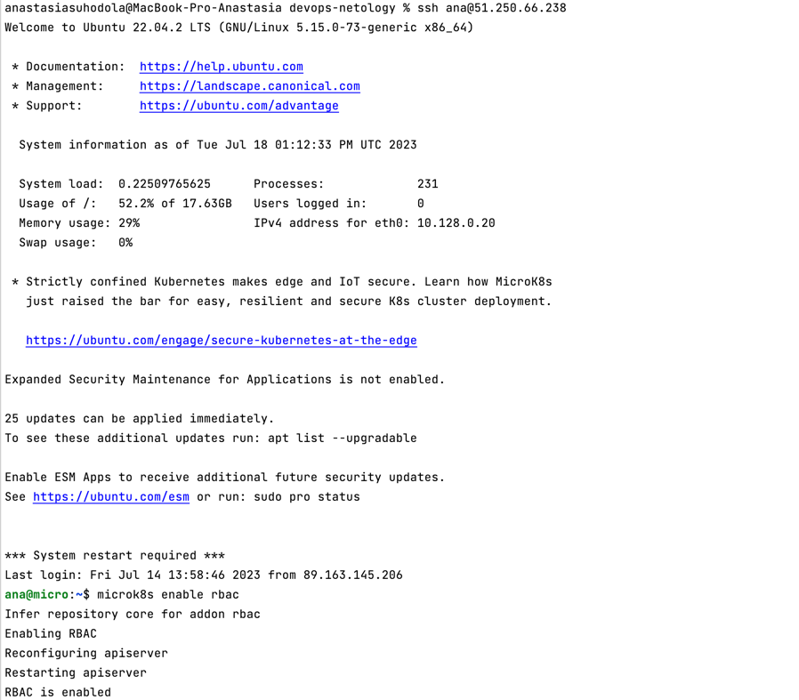
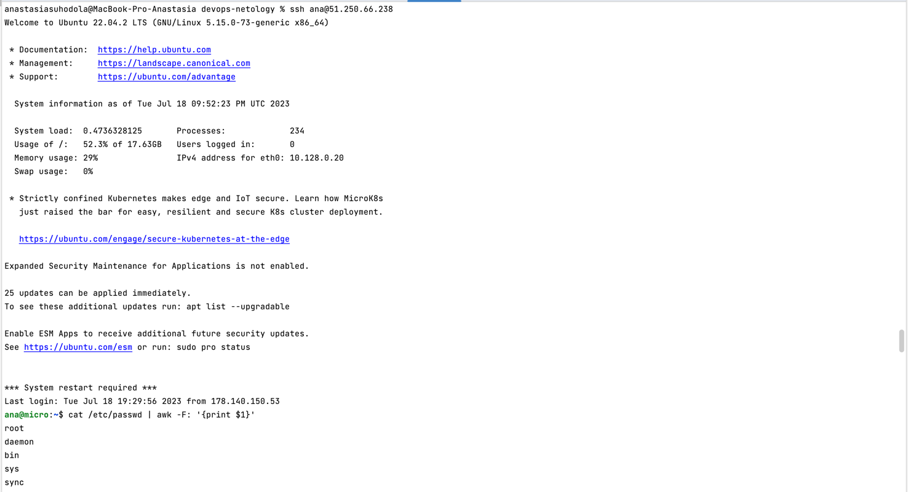
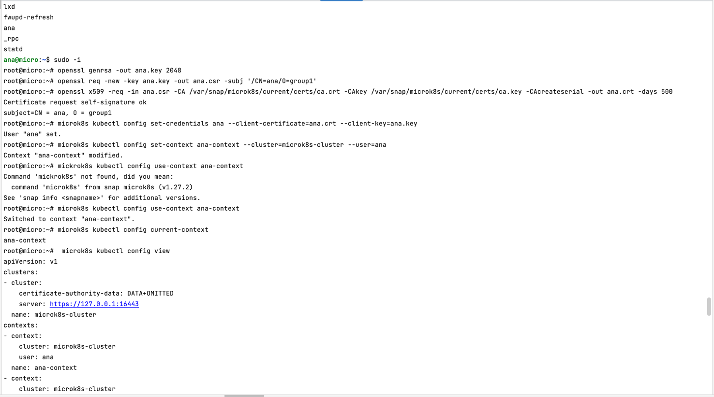
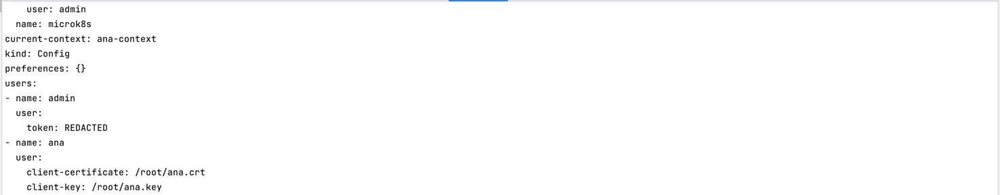
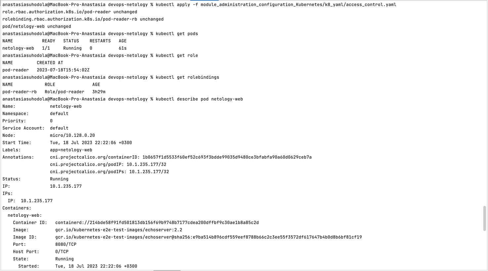
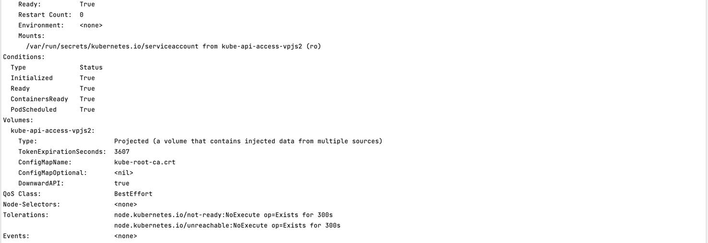
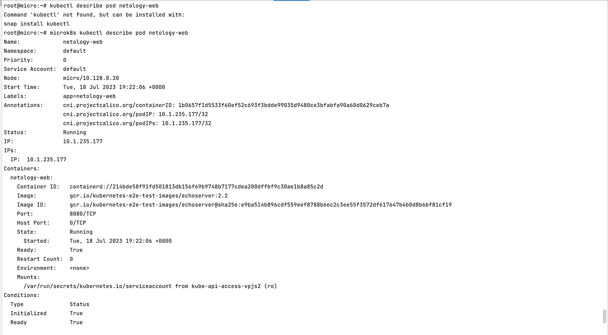
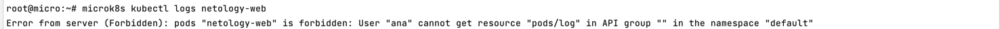
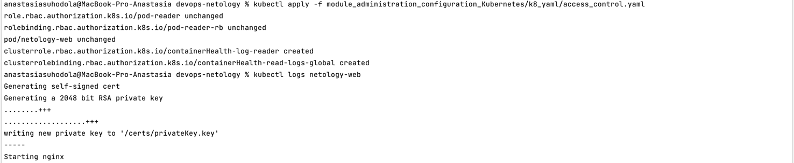
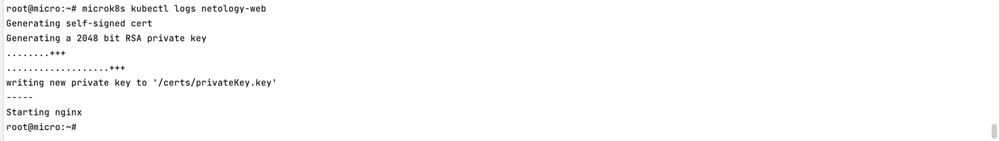

**Домашнее задание к занятию «Управление доступом»**

**Цель задания**

**В тестовой среде Kubernetes нужно предоставить ограниченный доступ пользователю.**

**Чеклист готовности к домашнему заданию**
1. Установлено k8s-решение, например MicroK8S.
2. Установленный локальный kubectl.
3. Редактор YAML-файлов с подключённым github-репозиторием.

**Инструменты / дополнительные материалы, которые пригодятся для выполнения задания**
1. Описание [RBAC](https://kubernetes.io/docs/reference/access-authn-authz/rbac/).
2. [Пользователи и авторизация RBAC в Kubernetes.](https://habr.com/ru/companies/flant/articles/470503/)
3. [RBAC with Kubernetes in Minikube.](https://medium.com/@HoussemDellai/rbac-with-kubernetes-in-minikube-4deed658ea7b)

**Задание 1. Создайте конфигурацию для подключения пользователя**

1. Создайте и подпишите `SSL-сертификат` для подключения к кластеру.
2. Настройте конфигурационный файл `kubectl` для подключения.
3. Создайте роли и все необходимые настройки для пользователя.
4. Предусмотрите права пользователя. Пользователь может просматривать
логи подов и их конфигурацию (`kubectl logs pod <pod_id>, kubectl describe pod <pod_id>`).
5. Предоставьте манифесты и скриншоты и/или вывод необходимых команд.

[манифест](k8_yaml/access_control.yaml)

Включение rbac:

Проверка наличия пользователя, создание ключа с помощью OpenSSL, запроса на подпись клиента (CSR), 
сертификата (CRT), установление записи пользователя в kubeconfig и записи контекста в kubeconfig, просмотр kubeconfig:

apply манифестов на локальной машине:

проверка `kubectl describe pod`:

добавление кластерной роли:

проверка `kubectl logs pod`:

