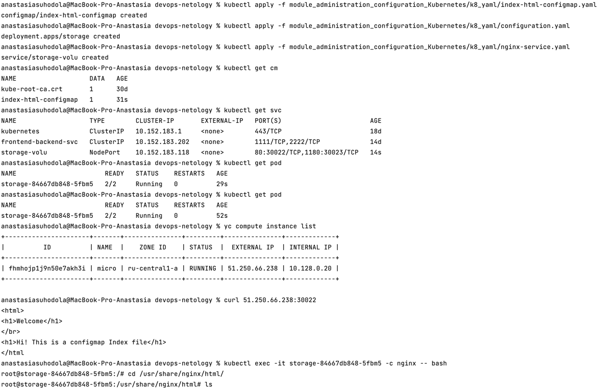
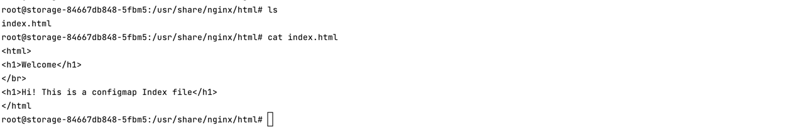
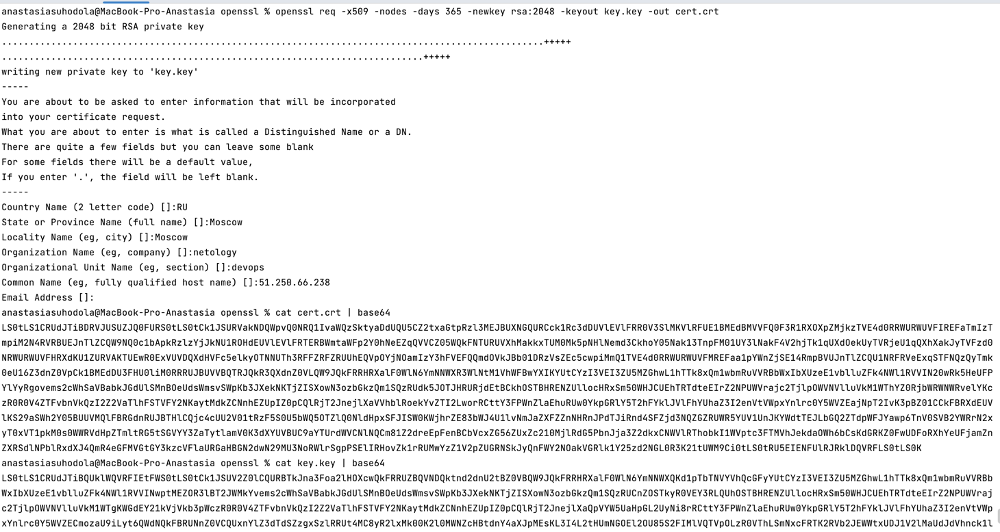
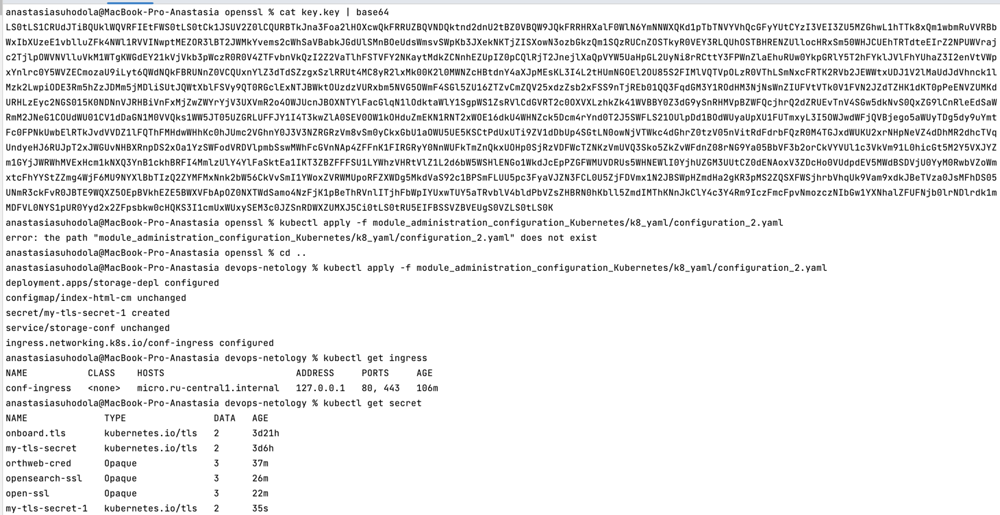
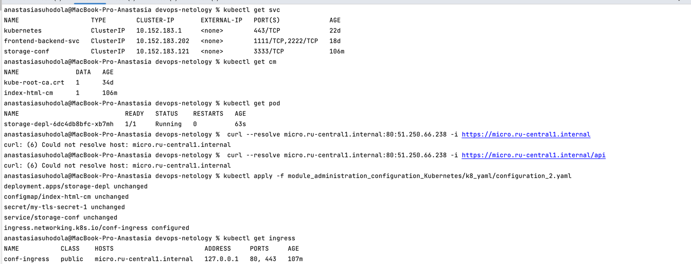
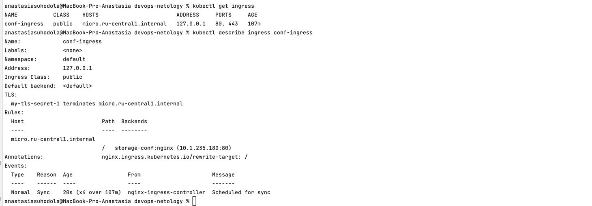
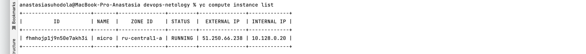

**Домашнее задание к занятию «Конфигурация приложений»**

**Цель задания**

В тестовой среде Kubernetes необходимо создать конфигурацию и продемонстрировать работу приложения.

**Чеклист готовности к домашнему заданию**
1. Установленное K8s-решение (например, MicroK8S).
2. Установленный локальный kubectl.
3. Редактор YAML-файлов с подключенным GitHub-репозиторием.

**Инструменты и дополнительные материалы, которые пригодятся для выполнения задания**
1. Описание [Secret](https://kubernetes.io/docs/concepts/configuration/secret/).
2. Описание [ConfigMap](https://kubernetes.io/docs/concepts/configuration/configmap/).
3. Описание [Multitool](https://github.com/wbitt/Network-MultiTool).

**Задание 1. Создать Deployment приложения и решить возникшую проблему с помощью ConfigMap. Добавить веб-страницу**

1. Создать `Deployment` приложения, состоящего из контейнеров `Nginx` и `multitool`.
2. Решить возникшую проблему с помощью `ConfigMap`.
3. Продемонстрировать, что `pod` стартовал и оба контейнера работают.
4. Сделать простую веб-страницу и подключить её к `Nginx` с помощью `ConfigMap`. 
Подключить `Service` и показать вывод `curl` или в браузере.
5. Предоставить манифесты, а также скриншоты или вывод необходимых команд.

[манифест service](k8_yaml/nginx-service.yaml)

[манифест cm](k8_yaml/index-html-configmap.yaml)

[манифест deployment](k8_yaml/configuration.yaml)

**Задание 2. Создать приложение с вашей веб-страницей, доступной по HTTPS**

1. Создать `Deployment` приложения, состоящего из `Nginx`.
2. Создать собственную веб-страницу и подключить её как `ConfigMap` к приложению.
3. Выпустить самоподписной сертификат SSL. Создать Secret для использования сертификата.
4. Создать Ingress и необходимый Service, подключить к нему SSL в вид. Продемонстировать доступ к приложению по HTTPS.
5. Предоставить манифесты, а также скриншоты или вывод необходимых команд.

[манифест](k8_yaml//configuration_2.yaml)

