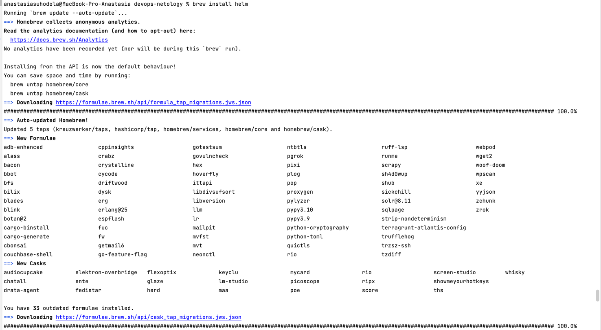

**Домашнее задание к занятию «Helm»**

**Цель задания**

В тестовой среде Kubernetes необходимо установить и обновить приложения с помощью Helm.

**Чеклист готовности к домашнему заданию**
1. Установленное k8s-решение, например, MicroK8S.
2. Установленный локальный kubectl.
3. Установленный локальный Helm.
4. Редактор YAML-файлов с подключенным репозиторием GitHub.

**Инструменты и дополнительные материалы, которые пригодятся для выполнения задания**
1. [Инструкция](https://helm.sh/docs/intro/install/) по установке Helm. [Helm completion](https://helm.sh/docs/helm/helm_completion/).

**Задание 1. Подготовить Helm-чарт для приложения**
1. Необходимо упаковать приложение в чарт для деплоя в разные окружения.
2. Каждый компонент приложения деплоится отдельным deployment’ом или statefulset’ом.
3. В переменных чарта измените образ приложения для изменения версии.

**Задание 2. Запустить две версии в разных неймспейсах**
1. Подготовив чарт, необходимо его проверить. Запуститe несколько копий приложения.
2. Одну версию в `namespace=app1`, вторую версию в том же неймспейсе, третью версию в `namespace=app2`.
3. Продемонстрируйте результат.

[манифест deployment](helm/nginx/charts/nginx/templates/deployment.yaml)

[манифест chart](helm/nginx/charts/nginx/Chart.yaml)

[манифест values_first](helm/nginx/charts/nginx/values.yaml)

[манифест values_second](helm/nginx/charts/nginx/values2.yaml)

[манифест values_third](helm/nginx/charts/nginx/values3.yaml)