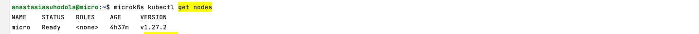

**Домашнее задание к занятию «Kubernetes. Причины появления. Команда kubectl»**

**Цель задания**

Для экспериментов и валидации ваших решений вам нужно подготовить тестовую среду для работы с Kubernetes. 
Оптимальное решение — развернуть на рабочей машине или на отдельной виртуальной машине MicroK8S.

**Чеклист готовности к домашнему заданию**

Личный компьютер с ОС Linux или MacOS

или

ВМ c ОС Linux в облаке либо ВМ на локальной машине для установки MicroK8S

**Инструкция к заданию**

1. Установка MicroK8S:

* `sudo apt update`,
* `sudo apt install snapd`,
* `sudo snap install microk8s --classic`,
* добавить локального пользователя в группу `sudo usermod -a -G microk8s $USER`,
* изменить права на папку с конфигурацией `sudo chown -f -R $USER ~/.kube`.

2. Полезные команды:

* проверить статус `microk8s status --wait-ready`;
* подключиться к microK8s и получить информацию можно через команду microk8s command, например, `microk8s kubectl get nodes`;
* включить addon можно через команду `microk8s enable`;
* список addon `microk8s status`;
* вывод конфигурации `microk8s config`;
* проброс порта для подключения локально `microk8s kubectl port-forward -n kube-system service/kubernetes-dashboard 10443:443`.


3. Настройка внешнего подключения:

* отредактировать файл `/var/snap/microk8s/current/certs/csr.conf.template`
```
# [ alt_names ]
# Add
# IP.4 = 123.45.67.89
```
* обновить сертификаты `sudo microk8s refresh-certs --cert front-proxy-client.crt`.


4. Установка kubectl:

* ``curl -LO https://storage.googleapis.com/kubernetes-release/release/`curl -s https://storage.googleapis.com/kubernetes-release/release/stable.txt`/bin/linux/amd64/kubectl``;
* `chmod +x ./kubectl`;
* `sudo mv ./kubectl /usr/local/bin/kubectl`;
* настройка автодополнения в текущую сессию bash source <(kubectl completion bash);
* добавление автодополнения в командную оболочку bash echo "source <(kubectl completion bash)" >> ~/.bashrc.


**Инструменты и дополнительные материалы, которые пригодятся для выполнения задания**

1. [Инструкция](https://microk8s.io/docs/getting-started) по установке MicroK8S.
2. [Инструкция](https://kubernetes.io/ru/docs/reference/kubectl/cheatsheet/#bash) по установке автодополнения kubectl.
3. [Шпаргалка](https://kubernetes.io/ru/docs/reference/kubectl/cheatsheet/) по kubectl.

**Задание 1. Установка MicroK8S**

1. Установить MicroK8S на локальную машину или на удалённую виртуальную машину.
2. Установить dashboard.
3. Сгенерировать сертификат для подключения к внешнему ip-адресу.


файл отредактирован и сертификат обновлен: `/var/snap/microk8s/current/certs/csr.conf.template`


**Задание 2. Установка и настройка локального kubectl**

1. Установить на локальную машину kubectl.
2. Настроить локально подключение к кластеру.
3. Подключиться к дашборду с помощью port-forward.

Локально установлен kubectl:


у меня mac m1, ошибка вот такая:

```
anastasiasuhodola@MacBook-Pro-Anastasia devops-netology % kubectl get nodes  
error: error loading config file "/Users/anastasiasuhodola/.kube/config": yaml: line 6: could not find expected ':'
```

ниже листинг файла `~/.kube/config`:

```
apiVersion: v1
clusters:
- cluster:
    certificate-authority-data:
LS0tLS1CRUdJTiBDRVJUSUZJQ0FURS0tLS0tCk1JSUREekNDQWZlZ0F3SUJBZ0lVT2lZMm41cjlhQ01SNHVDS2JhWW1rTlNiaFFVd0RRWUpLb1pJaHZjTkFRRUwKQlFBd0Z6RVZNQk1HQTFVRUF3d01NVEF1TVRVeUxqRTRNeTR4TUI0WERUSXpNRFl3T0RFeU16ZzFNbG9YRFRNegpNRFl3TlRFeU16ZzFNbG93RnpFVk1CTUdBMVVFQXd3TU1UQXVNVFV5TGpFNE15NHhNSUlCSWpBTkJna3Foa2lHCjl3MEJBUUVGQUFPQ0FROEFNSUlCQ2dLQ0FRRUEyY1ZHeGZwMFBtOFVpNlZIS3hibEdpa2hXai9Rci93ZjhmN2EKN1VneWp3MkNLMGtZenNzRUtwZXp5LzNXUmFBTUtHSmZGNjhqeit3VFpOYzFHbERtV09EZ0pld2prZE5OVzIzNAovYUo1ajVveFJGdzRmQ0Q1WThUb3dIdFdDT3g5eDlFTzBGUmd3SldBcGxOcVBzRVE4eGJYTmM3VWkzZWJKdncyCllVZmVVd3VTckpkd1RLREFFOGNETTZZTzR6YnkxMnY4dnFHN1NxVmNkeTNyamVTUFFnWkxtSmJ2cXRuemZNODAKaEFDTmtSYW5lQmMrZFVQckRQTlgzNDdUdytxT3Q0NHFyWW9sOUprVG5DR0ZodlpuRlZJamJkMjNYcjl3SjZmTgpUVVlLclZvRFF3ZEZsZkhBbkJhZW5qNjdzV1F4bW44elhnYW5FdnZNN3B3dUI0dWRrd0lEQVFBQm8xTXdVVEFkCkJnTlZIUTRFRmdRVTJUd2x6Q1dRVXMxWVNWZUdmclNiYzZxcWc5a3dId1lEVlIwakJCZ3dGb0FVMlR3bHpDV1EKVXMxWVNWZUdmclNiYzZxcWc5a3dEd1lEVlIwVEFRSC9CQVV3QXdFQi96QU5CZ2txaGtpRzl3MEJBUXNGQUFPQwpBUUVBb0NFUDBDQ3h3akltS0NPbzkybGpkNmg1OTE2elVibTh5NFNXY2hTS3VITE5zMXdsTG9qdGt2Rm5IeGxwClJtWFJOL2J6UmgraHp2bkxjeGszSUtWTHozMnJIUktLL1hJK1RoRDlyZ0pWbW56Snd3STIrWVptSnhOa1hWYm8KcEZCODcxWjdXZHc0NFJlWXRTdDVNcy9pR0FBZmkyK1BFRG11MDR1aWc4SFBaTVVxaUFYZHcrYStENVBnb1VRUgowUWtwNFBjWll5d1ppVkU2SEVtdUdPVUkvQ1FvN0dqN3lySXZ0VmFlYmRnaWJHSnNwNnZlRGZOeDZwZytHSnI4CmZ1Nmt2dmtaT00xc2pRV3F5TlNqSUxvT2w4MnYrYkNycGdhV3ozZlhFRGJpSHJ1K1pIQk5tUXpaN1g2YjBzUjkKNlBtUzV0QndsbkdZMjhRUlo0a09GaXJDOWc9PQotLS0tLUVORCBDRVJUSUZJQ0FURS0tLS0tCg==
    server: https://158.160.50.178:16443
  name: microk8s-cluster
contexts:
  - context:
      cluster: microk8s-cluster
      user: admin
    name: microk8s
current-context: microk8s
kind: Config
preferences: {}
users:
  - name: admin
    user:
      token: VERIVVpmY1hVZ0xaVkJkb2hlR20vNnlWZlRtTXJRNkR3bDM5TFQ1ZUEzQT0K
```
это тот же самый фвйл конфига, но ip заменен на внешний адрес виртуалки: `158.160.50.178`

прошу подсказать, как это можно поправить? yaml lint проблем не нашел


в качестве workaround создала вторую виртуалку ubuntu, скачала туда `kubectl` и подложила вышеупомянутый файл в `~/.kube/config`:


вывод команды аналоничный как в первой виртуалке: `microk8s kubectl get nodes`




вывод дашборда:

(указан токен из конфига VERIVVpmY1hVZ0xaVkJkb2hlR20vNnlWZlRtTXJRNkR3bDM5TFQ1ZUEzQT0K)


