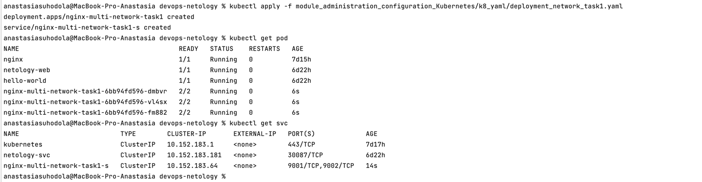
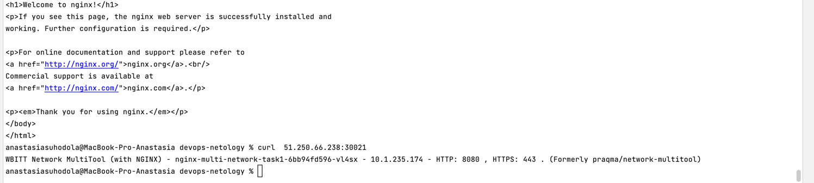

**Домашнее задание к занятию «Сетевое взаимодействие в K8S. Часть 1»**

**Цель задания**

В тестовой среде Kubernetes необходимо обеспечить доступ к приложению, установленному в предыдущем 
ДЗ и состоящему из двух контейнеров, по разным портам в разные контейнеры как внутри кластера, так и снаружи.

**Чеклист готовности к домашнему заданию**
1. Установленное k8s-решение (например, MicroK8S).
2. Установленный локальный kubectl.
3. Редактор YAML-файлов с подключённым Git-репозиторием.

**Инструменты и дополнительные материалы, которые пригодятся для выполнения задания**
* Описание [Deployment](https://kubernetes.io/docs/concepts/workloads/controllers/deployment/) и примеры манифестов.
* Описание [Service](https://kubernetes.io/docs/concepts/services-networking/service/).
* Описание [Multitool](https://github.com/wbitt/Network-MultiTool).

**Задание 1. Создать Deployment и обеспечить доступ к контейнерам приложения по разным портам из другого Pod внутри кластера**

1. Создать `Deployment` приложения, состоящего из двух контейнеров (`nginx` и `multitool`), с количеством реплик 3 шт.
2. Создать `Service`, который обеспечит доступ внутри кластера до контейнеров приложения из п.1 по порту 9001 — 
`nginx` 80, по 9002 — `multitool` 8080.

3. Создать отдельный `Pod` с приложением `multitool` и убедиться с помощью `curl`, что из пода есть доступ 
до приложения из п.1 по разным портам в разные контейнеры.

4. Продемонстрировать доступ с помощью `curl` по доменному имени сервиса.

5. Предоставить манифесты `Deployment` и `Service` в решении, а также скриншоты или вывод команды п.4.

[манифест](k8_yaml/deployment_network_task1.yaml)

**Задание 2. Создать Service и обеспечить доступ к приложениям снаружи кластера**

1. Создать отдельный `Service` приложения из Задания 1 с возможностью доступа снаружи кластера к `nginx`, 
используя тип `NodePort`.
2. Продемонстрировать доступ с помощью браузера или `curl` с локального компьютера.
3. Предоставить манифест и `Service` в решении, а также скриншоты или вывод команды п.2.

[манифест](k8_yaml/service_network_task2_hm4.yaml)