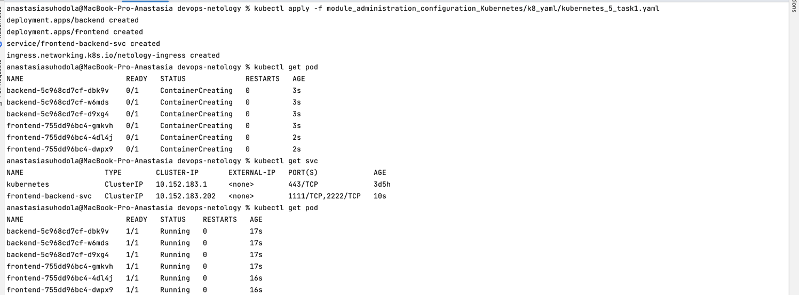
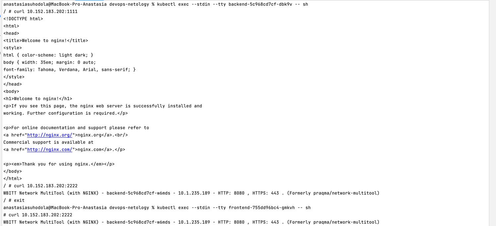
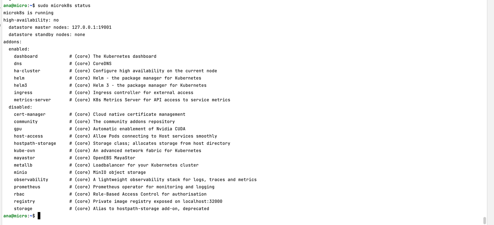
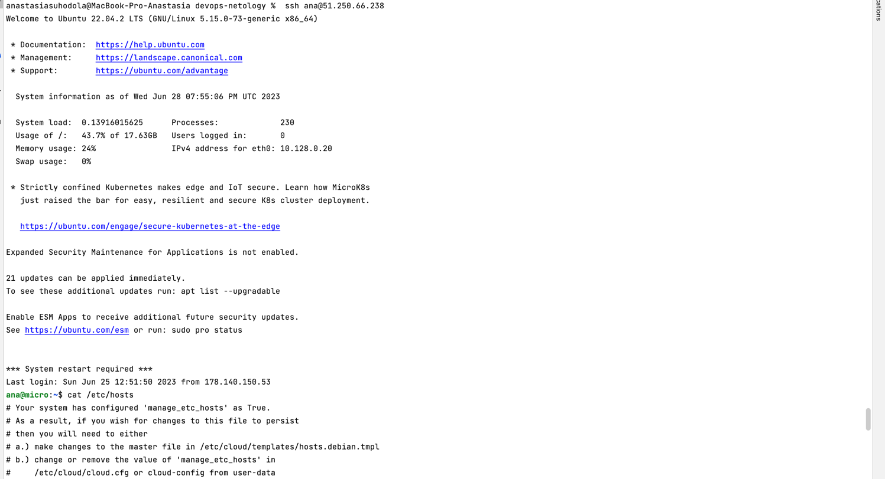
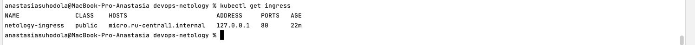
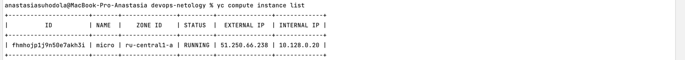
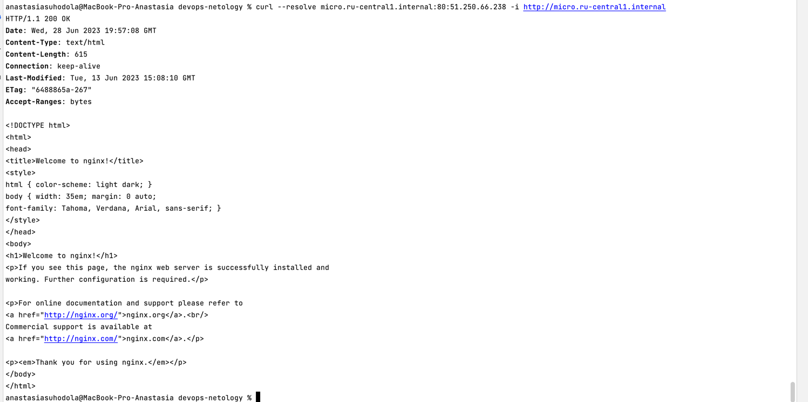
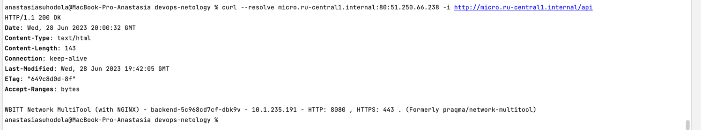

**Домашнее задание к занятию «Сетевое взаимодействие в K8S. Часть 2»**

**Цель задания**

В тестовой среде Kubernetes необходимо обеспечить доступ к приложению, установленному в предыдущем 
ДЗ и состоящему из двух контейнеров, по разным портам в разные контейнеры как внутри кластера, так и снаружи.

**Чеклист готовности к домашнему заданию**
1. Установленное k8s-решение (например, MicroK8S).
2. Установленный локальный kubectl.
3. Редактор YAML-файлов с подключённым Git-репозиторием.

**Инструменты и дополнительные материалы, которые пригодятся для выполнения задания**
* Описание [Deployment](https://kubernetes.io/docs/concepts/workloads/controllers/deployment/) и примеры манифестов.
* Описание [Service](https://kubernetes.io/docs/concepts/services-networking/service/).
* Описание [Ingress](https://kubernetes.io/docs/concepts/services-networking/ingress/)
* Описание [Multitool](https://github.com/wbitt/Network-MultiTool).

**Задание 1. Создать Deployment приложений backend и frontend**

1. Создать `Deployment` приложения `frontend` из образа `nginx` с количеством реплик `3` шт.
2. Создать `Deployment` приложения `backend` из образа `multitool`.
3. Добавить `Service`, которые обеспечат доступ к обоим приложениям внутри кластера.
4. Продемонстрировать, что приложения видят друг друга с помощью `Service`.
5. Предоставить манифесты `Deployment` и `Service` в решении, а также скриншоты или вывод команды п.4.

[манифест](k8_yaml/kubernetes_5_task1.yaml)

**Задание 2. Создать Ingress и обеспечить доступ к приложениям снаружи кластера**

1. Включить `Ingress-controller` в MicroK8S.

2. Создать `Ingress`, обеспечивающий доступ снаружи по IP-адресу кластера MicroK8S так, 
чтобы при запросе только по адресу открывался `frontend` а при добавлении `/api - backend`.

3. Продемонстрировать доступ с помощью браузера или `curl` с локального компьютера.
4. Предоставить манифесты и скриншоты или вывод команды п.2.

[манифест](k8_yaml/kubernetes_5_task1.yaml)