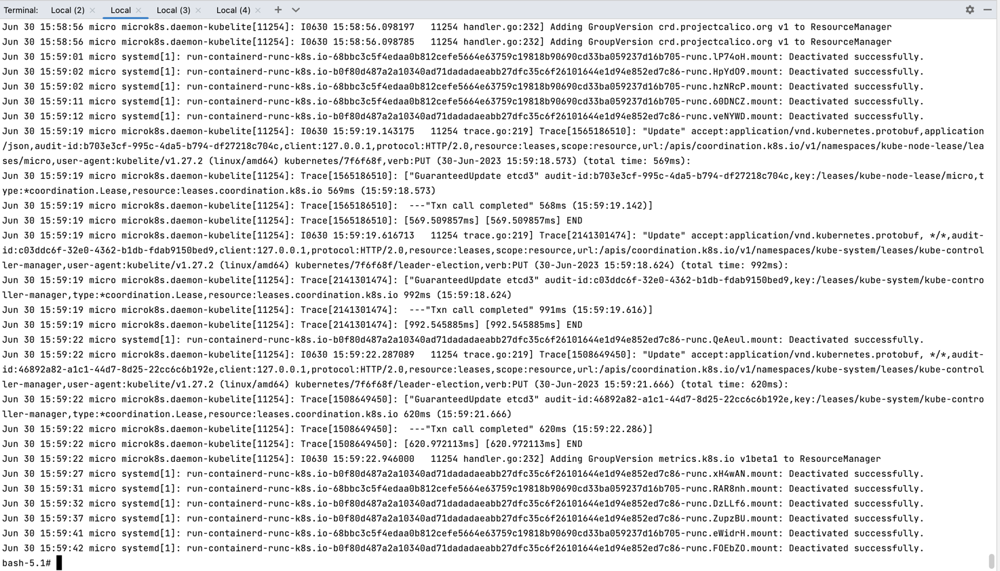

**Домашнее задание к занятию «Хранение в K8s. Часть 1»**

**Цель задания**

В тестовой среде для работы с Kubernetes, установленной в предыдущем ДЗ, необходимо развернуть 
Deployment с приложением, состоящим из нескольких контейнеров, и масштабировать его.

**Чеклист готовности к домашнему заданию**

* Установленное k8s-решение (например, MicroK8S).
* Установленный локальный kubectl.
* Редактор YAML-файлов с подключённым git-репозиторием.

**Дополнительные материалы для выполнения задания**

1. [Инструкция по установке MicroK8S](https://microk8s.io/docs/getting-started).
2. Описание [Volumes](https://kubernetes.io/docs/concepts/storage/volumes/).
3. Описание [Multitool](https://github.com/wbitt/Network-MultiTool).

**Задание 1**

**Что нужно сделать**

Создать Deployment приложения, состоящего из двух контейнеров и обменивающихся данными.

1. Создать Deployment приложения, состоящего из контейнеров `busybox` и `multitool`.
2. Сделать так, чтобы `busybox` писал каждые пять секунд в некий файл в общей директории.
3. Обеспечить возможность чтения файла контейнером `multitool`.
4. Продемонстрировать, что `multitool` может читать файл, который периодоически обновляется.
5. Предоставить манифесты `Deployment` в решении, а также скриншоты или вывод команды из п. 4.

[манифест](k8_yaml/storage_1.yaml)

**Задание 2**

**Что нужно сделать**

Создать DaemonSet приложения, которое может прочитать логи ноды.

1. Создать `DaemonSet` приложения, состоящего из `multitool`.
2. Обеспечить возможность чтения файла `/var/log/syslog` кластера `MicroK8S`.
3. Продемонстрировать возможность чтения файла изнутри пода.
4. Предоставить манифесты `DaemonSet`, а также скриншоты или вывод команды из п. 2.

[манифест](k8_yaml/storage_1.yaml)