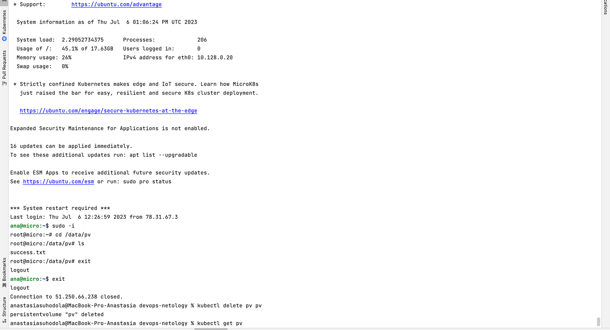
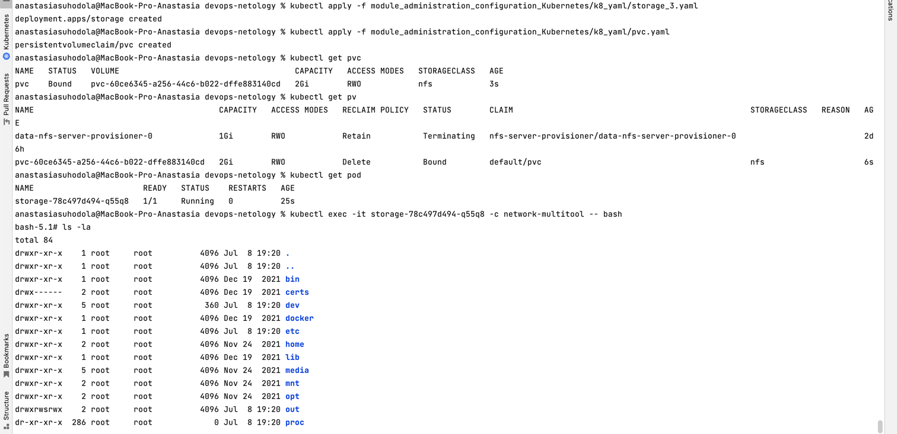

**Домашнее задание к занятию «Хранение в K8s. Часть 2»**

**Цель задания**

В тестовой среде Kubernetes нужно создать PV и продемонстрировать запись и хранение файлов.

**Чеклист готовности к домашнему заданию**
1. Установленное K8s-решение (например, MicroK8S).
2. Установленный локальный kubectl.
3. Редактор YAML-файлов с подключенным GitHub-репозиторием.

**Дополнительные материалы для выполнения задания**

1. [Инструкция по установке NFS в MicroK8S.](https://microk8s.io/docs/nfs)
2. Описание [Persistent Volumes](https://kubernetes.io/docs/concepts/storage/persistent-volumes/).
3. Описание [динамического провижининга](https://kubernetes.io/docs/concepts/storage/dynamic-provisioning/).
4. Описание [Multitool](https://github.com/wbitt/Network-MultiTool).

**Задание 1**

Что нужно сделать

**Создать Deployment приложения, использующего локальный PV, созданный вручную.**

1. Создать Deployment приложения, состоящего из контейнеров `busybox` и `multitool`.
2. Создать `PV` и `PVC` для подключения папки на локальной ноде, которая будет использована в поде.exi
3. Продемонстрировать, что `multitool` может читать файл, в который `busybox` пишет каждые пять секунд в общей директории.
4. Удалить `Deployment` и `PVC`. Продемонстрировать, что после этого произошло с `PV`. Пояснить, почему.
5. Продемонстрировать, что файл сохранился на локальном диске ноды. Удалить `PV`. 
Продемонстрировать что произошло с файлом после удаления PV. Пояснить, почему.
6. Предоставить манифесты, а также скриншоты или вывод необходимых команд.

После удаления соответствующего PersistentVolumeClaim, PersistentVolume остаётся, 
и отмечается как Released, однако становится недоступен для новых PersistentVolumeClaim, 
т.к. содержит данные предыдущего PersistentVolumeClaim.

После удаления PV файл остался, тк `persistentVolumeReclaimPolicy: Retain`, 
Retain политика позволяет выполнять ручную очистку диска, не автоматически

[манифест](k8_yaml/storage_2.yaml)

**Задание 2**

Что нужно сделать

**Создать Deployment приложения, которое может хранить файлы на NFS с динамическим созданием PV.**

1. Включить и настроить `NFS-сервер` на `MicroK8S`.
2. Создать `Deployment` приложения состоящего из `multitool`, и подключить к нему `PV`, 
созданный автоматически на сервере `NFS`.
3. Продемонстрировать возможность чтения и записи файла изнутри пода.
4. Предоставить манифесты, а также скриншоты или вывод необходимых команд.

[манифест pvc](k8_yaml/pvc.yaml)

[манифест deployment](k8_yaml/storage_3.yaml)