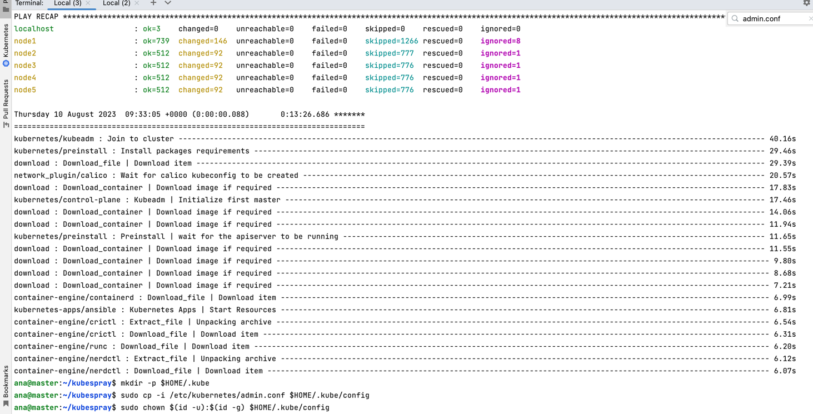

**Домашнее задание к занятию «Установка Kubernetes»**

**Цель задания**

Установить кластер K8s.

**Чеклист готовности к домашнему заданию**
1. Развёрнутые ВМ с ОС Ubuntu 20.04-lts.

**Инструменты и дополнительные материалы, которые пригодятся для выполнения задания**
1. [Инструкция по установке kubeadm](https://kubernetes.io/docs/setup/production-environment/tools/kubeadm/create-cluster-kubeadm/).
2. [Документация kubespray](https://kubespray.io/#/).

**Задание 1. Установить кластер k8s с 1 master node**
1. Подготовка работы кластера из 5 нод: 1 мастер и 4 рабочие ноды.
2. В качестве CRI — containerd.
3. Запуск etcd производить на мастере.
4. Способ установки выбрать самостоятельно.

`git clone https://github.com/kubernetes-sigs/kubespray`


`sudo pip3 install -r requirements.txt`

`cp -rfp inventory/sample inventory/mycluster`

`declare -a IPS=( 10.128.0.24  10.128.0.9 10.128.0.30 10.128.0.23  10.128.0.3)`

`CONFIG_FILE=inventory/mycluster/hosts.yaml python3 contrib/inventory_builder/inventory.py ${IPS[@]}`

после добавления `ansible_user: ana` и `etcd` на master:


добавлен приватный ключ и права, запуск плейбука:

```
sudo chmod 0700 ~/.ssh/id_rsa
sudo -i chmod 777 ~/.ssh/id_rsa
ansible-playbook -i inventory/mycluster/hosts.yaml cluster.yml -b -v
```

kubectl должен понимать к чему подключаться используя конфиг:

```
mkdir -p $HOME/.kube
sudo cp -i /etc/kubernetes/admin.conf $HOME/.kube/config
sudo chown $(id -u):$(id -g) $HOME/.kube/config
kubectl get nodes
```





копирую содержимое конфиг-файла на локальную машину:


ожидаемо, не тот ip:


пробовала менять ip на внешний ip виртуалки master 158.160.34.61:


