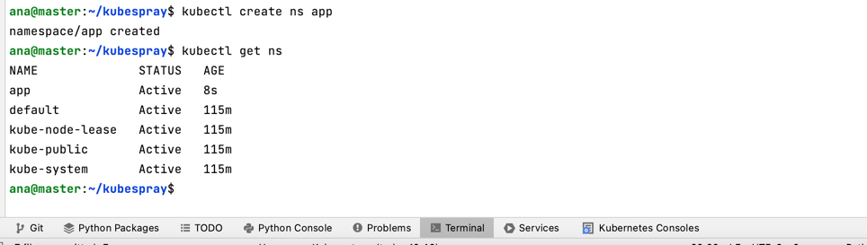
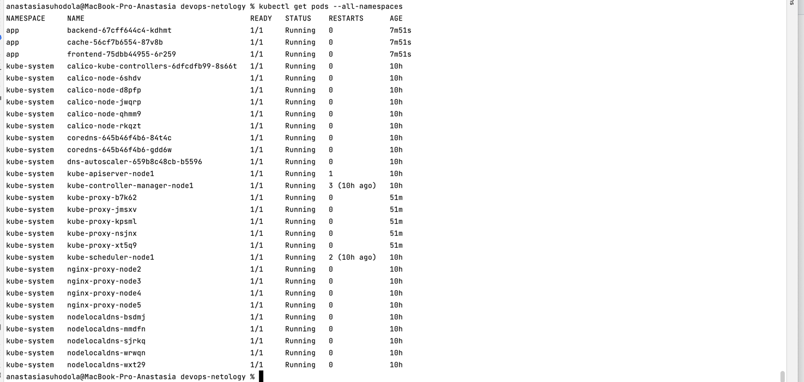
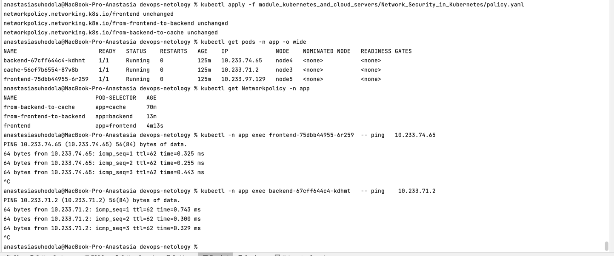
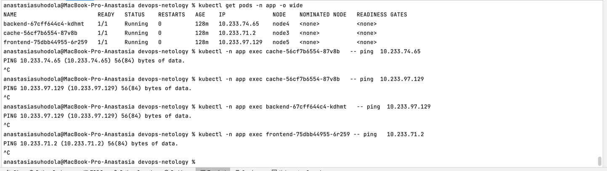

**Домашнее задание к занятию «Как работает сеть в K8s»**

**Цель задания**

Настроить сетевую политику доступа к подам.

**Чеклист готовности к домашнему заданию**

Кластер K8s с установленным сетевым плагином Calico.

**Инструменты и дополнительные материалы, которые пригодятся для выполнения задания**
1. Документация [Calico](https://www.tigera.io/project-calico/).
2. [Network Policy](https://kubernetes.io/docs/concepts/services-networking/network-policies/).
3. [About Network Policy](https://docs.tigera.io/calico/latest/about/kubernetes-training/about-network-policy).

**Задание 1. Создать сетевую политику или несколько политик для обеспечения доступа**

1. Создать deployment'ы приложений frontend, backend и cache и соответсвующие сервисы.
2. В качестве образа использовать network-multitool.
3. Разместить поды в namespace App.
4. Создать политики, чтобы обеспечить доступ frontend -> backend -> cache. 
Другие виды подключений должны быть запрещены.
5. Продемонстрировать, что трафик разрешён и запрещён.

проверка доступа frontend -> backend и backend -> cache:

проверка отсутствия доступа cache -> backend, cache -> frontend,  backend -> frontend и frontend -> cache:

[манифест deployment](kubernetes_nw.yaml)

[манифест network policy](policy.yaml)

