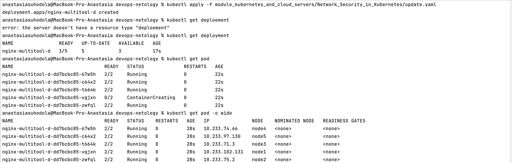
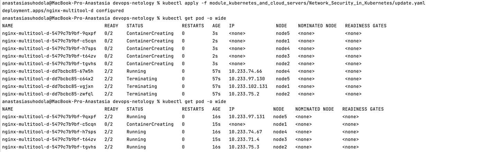
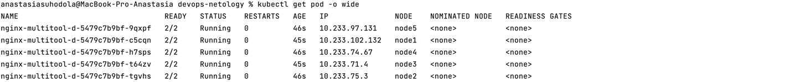
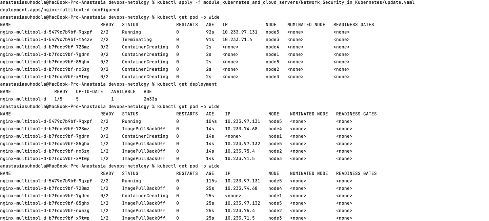
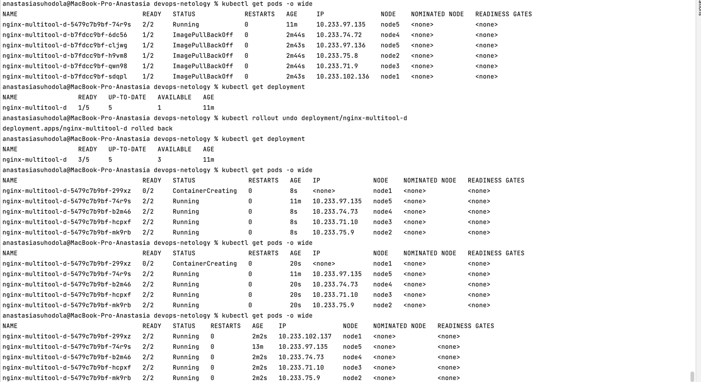

**Домашнее задание к занятию «Обновление приложений»**

**Цель задания**

Выбрать и настроить стратегию обновления приложения.

**Чеклист готовности к домашнему заданию**

Кластер K8s.

**Инструменты и дополнительные материалы, которые пригодятся для выполнения задания**
1. [Документация Updating a Deployment](https://kubernetes.io/docs/concepts/workloads/controllers/deployment/#updating-a-deployment).
2. [Статья про стратегии обновлений](https://habr.com/ru/companies/flant/articles/471620/).

**Задание 1. Выбрать стратегию обновления приложения и описать ваш выбор**
1. Имеется приложение, состоящее из нескольких реплик, которое требуется обновить.
2. Ресурсы, выделенные для приложения, ограничены, и нет возможности их увеличить.
3. Запас по ресурсам в менее загруженный момент времени составляет 20%.
4. Обновление мажорное, новые версии приложения не умеют работать со старыми.
5. Вам нужно объяснить свой выбор стратегии обновления приложения.

Есть следующие стратегии обновления приложения:
* rolling update - постепенное обновление, когда постепенно старые поды приложения заменяются новыми без
простоя кластера
* recreate - повторное создание, все старые поды одновременно удаляются и заменяются новыми
* blue-green - создание копии и переброс траффика, одновременное развертывание старой и новой версии приложения
* canary - частичное обновление и проверка, должно быть 2 версии приложения, новую версию приложения можно
протестировать на небольшой группе пользователей
* a/b тестирование - есть 2 версии приложения и обе собирают метрики с пользователей, чтобы 
понять какая версия приложение удобнее пользователю

В задании указано, что ресурсы, выделенные для приложения, ограничены, и нет возможности их увеличить,
то blue-green, canary, a/b тестирование не подходят, тк для них нужно 2 версии приложения (старую и новую), 
на что нет ресурсов.
Тк указано, что обновление мажорное, новые версии приложения не умеют работать со старыми,
то rolling update - постепенное обновление тоже не подходит, остается recreate.


**Задание 2. Обновить приложение**

1. Создать deployment приложения с контейнерами nginx и multitool. Версию nginx взять 1.19.
Количество реплик — 5.

[манифест](update.yaml)



2. Обновить версию nginx в приложении до версии 1.20, сократив время обновления до минимума. Приложение должно быть доступно.

стратегия RollingUpdate, максимум недоступно под - 4 из 5:
```
  strategy:
    type: RollingUpdate
    rollingUpdate:
      maxSurge: 4
      maxUnavailable: 4
```



3. Попытаться обновить nginx до версии 1.28, приложение должно оставаться доступным.

1 пода всегда доступна:



4. Откатиться после неудачного обновления.




