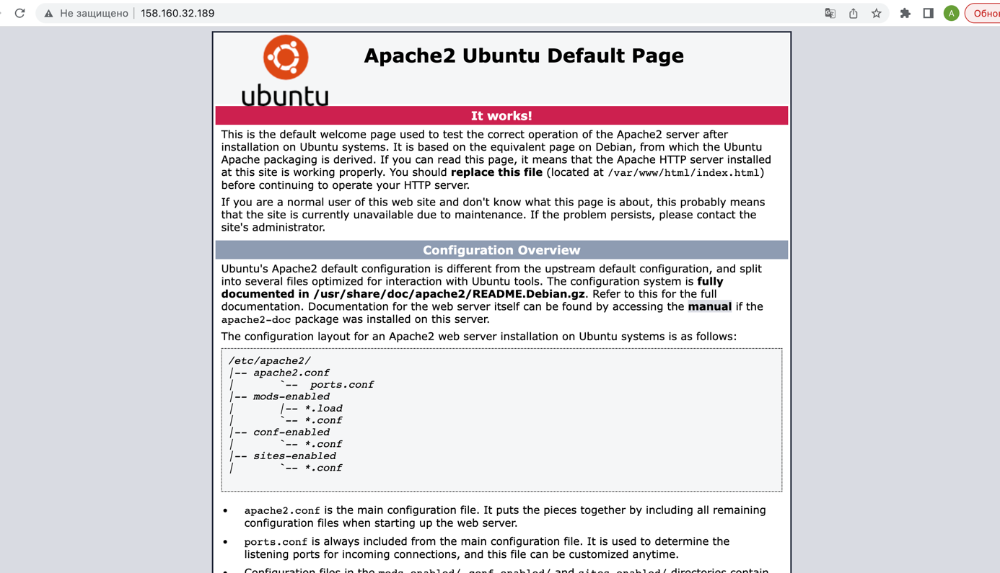

**Домашнее задание к занятию «Вычислительные мощности. Балансировщики нагрузки»**

**Подготовка к выполнению задания**

1. Домашнее задание состоит из обязательной части, которую нужно выполнить на провайдере 
Yandex Cloud, и дополнительной части в AWS (выполняется по желанию).
2. Все домашние задания в блоке 15 связаны друг с другом и в конце представляют пример законченной инфраструктуры.
3. Все задания нужно выполнить с помощью Terraform. Результатом выполненного 
домашнего задания будет код в репозитории.
4. Перед началом работы настройте доступ к облачным ресурсам из Terraform, 
используя материалы прошлых лекций и домашних заданий.

**Задание 1. Yandex Cloud**

Что нужно сделать

1. Создать бакет Object Storage и разместить в нём файл с картинкой:

* Создать бакет в Object Storage с произвольным именем (например, имя_студента_дата).
* Положить в бакет файл с картинкой.
* Сделать файл доступным из интернета.

2. Создать группу ВМ в public подсети фиксированного размера с шаблоном LAMP и 
веб-страницей, содержащей ссылку на картинку из бакета:

* Создать Instance Group с тремя ВМ и шаблоном LAMP. 
Для LAMP рекомендуется использовать image_id = fd827b91d99psvq5fjit.
* Для создания стартовой веб-страницы рекомендуется использовать раздел user_data в [meta_data](https://cloud.yandex.ru/docs/compute/concepts/vm-metadata).
* Разместить в стартовой веб-странице шаблонной ВМ ссылку на картинку из бакета.
* Настроить проверку состояния ВМ.

3. Подключить группу к сетевому балансировщику:

* Создать сетевой балансировщик.
* Проверить работоспособность, удалив одну или несколько ВМ.

**Полезные документы:**

1. [Compute instance group](https://registry.terraform.io/providers/yandex-cloud/yandex/latest/docs/resources/compute_instance_group).
2. [Network Load Balancer](https://registry.terraform.io/providers/yandex-cloud/yandex/latest/docs/resources/lb_network_load_balancer).
3. [Группа ВМ с сетевым балансировщиком](https://cloud.yandex.ru/docs/compute/operations/instance-groups/create-with-balancer).

```
export YC_TOKEN=$(yc iam create-token)
export YC_CLOUD_ID=$(yc config get cloud-id)
export YC_FOLDER_ID=$(yc config get folder-id)
```

бакет:


группа ВМ:


balancer:


открывается дефолтная страница, а не линк на картинку:



файлы:

[main.tf](terraform_s3/main.tf) - main.tf

[vars.tf](terraform_s3/vars.tf) - vars.tf

[vaersions.tf](terraform_s3/versions.tf) - versions.tf

[cloudconfig](cloudconfigone)
