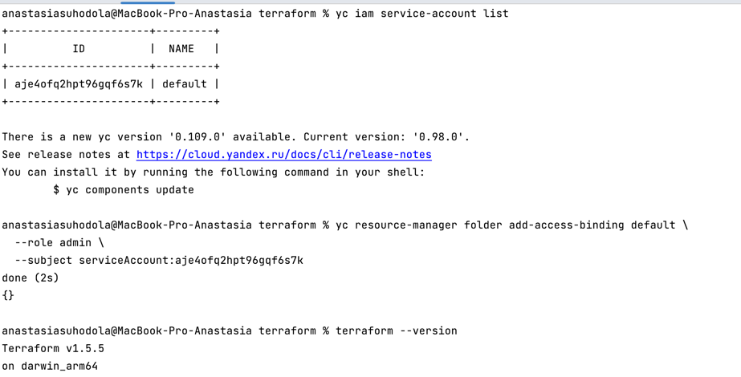
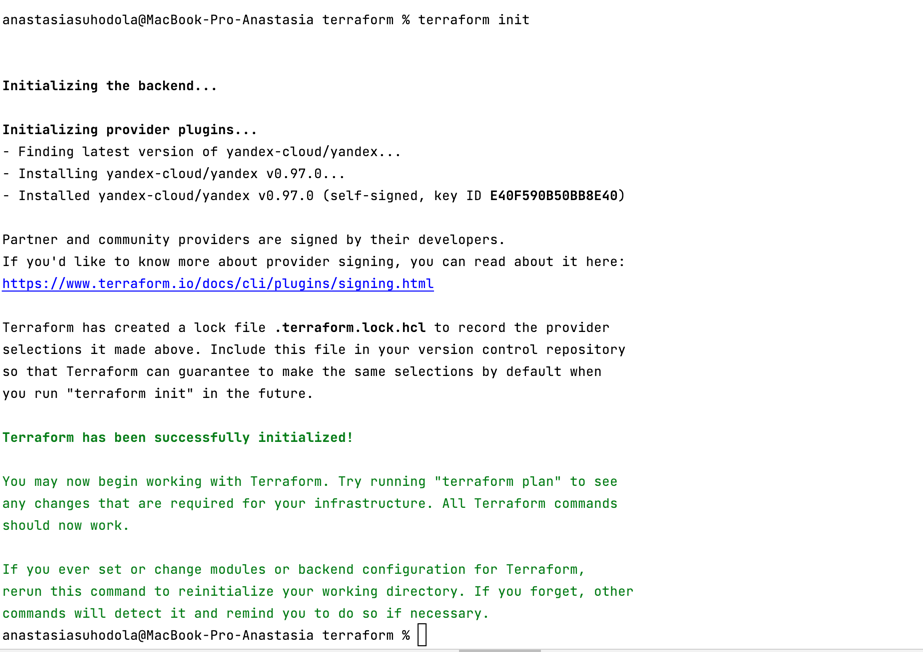
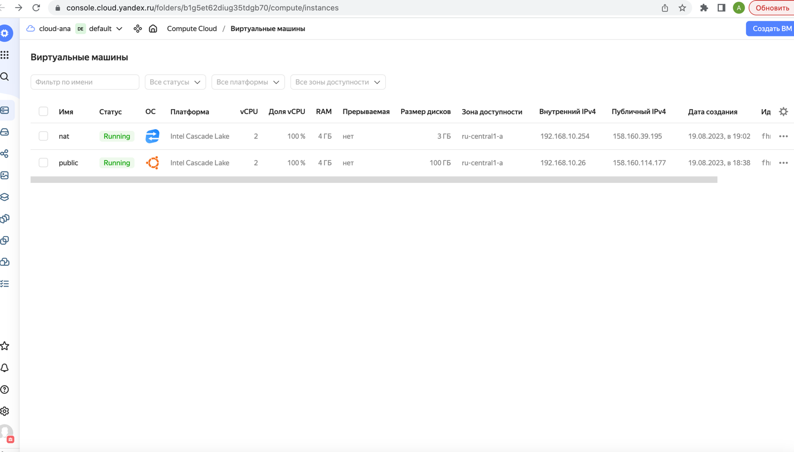
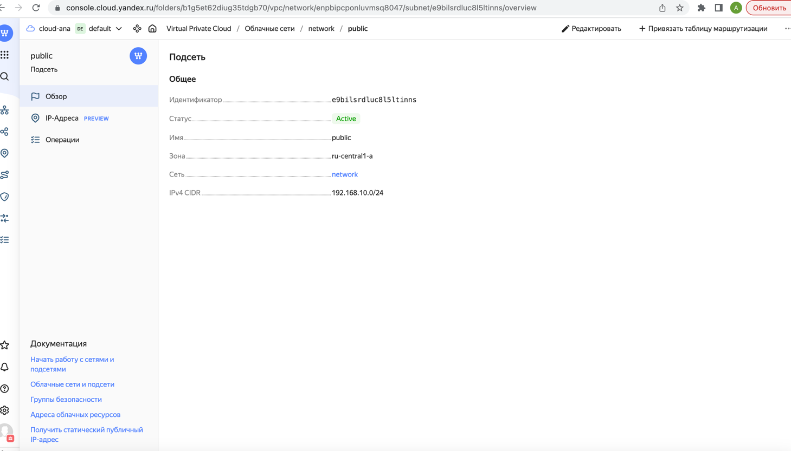
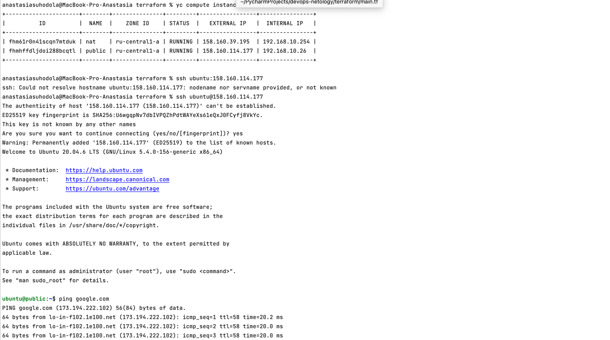
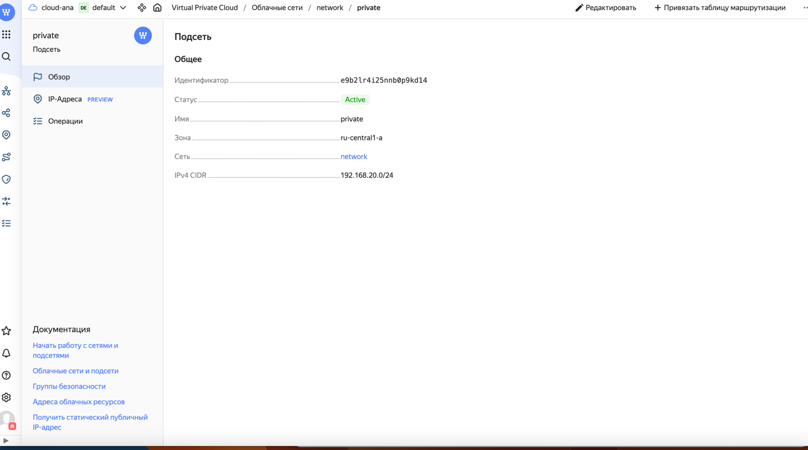
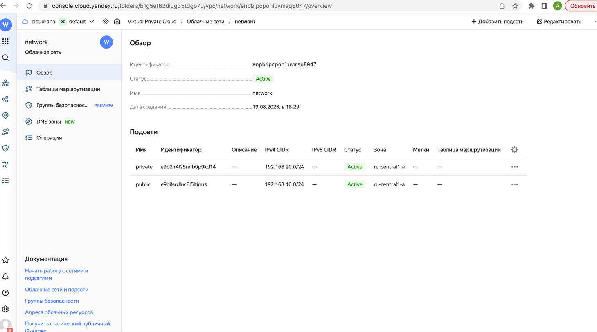
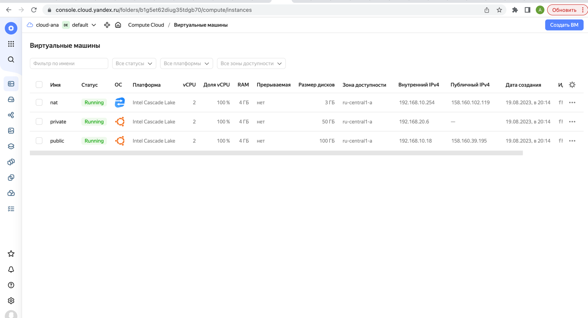
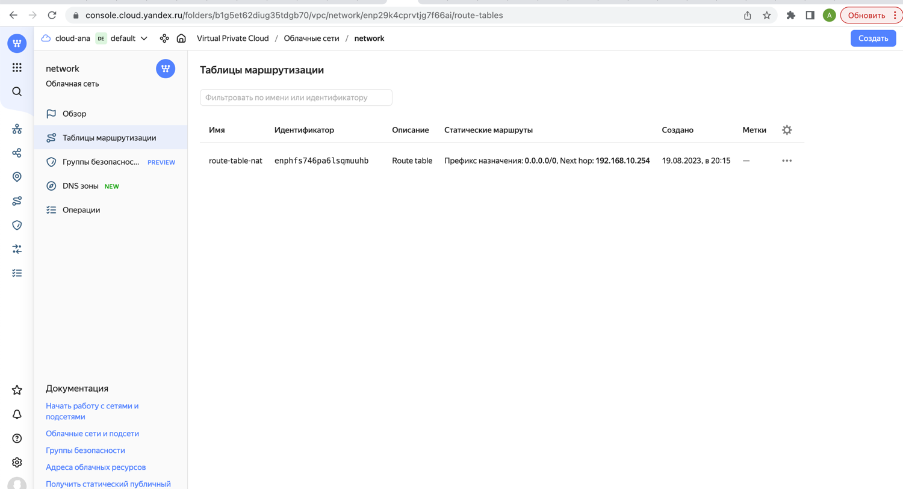

**Домашнее задание к занятию «Организация сети»**

**Подготовка к выполнению задания**

Домашнее задание состоит из обязательной части, которую нужно выполнить на провайдере Yandex Cloud, 
и дополнительной части в AWS (выполняется по желанию).

1. Все домашние задания в блоке 15 связаны друг с другом и в 
конце представляют пример законченной инфраструктуры.
2. Все задания нужно выполнить с помощью Terraform. 
Результатом выполненного домашнего задания будет код в репозитории.
3. Перед началом работы настройте доступ к облачным ресурсам 
из Terraform, используя материалы прошлых лекций и домашнее задание по 
теме «Облачные провайдеры и синтаксис Terraform». Заранее выберите регион (в случае AWS) и зону.

**Задание 1. Yandex Cloud**

Что нужно сделать

1. Создать пустую VPC. Выбрать зону.
2. Публичная подсеть.

* Создать в VPC subnet с названием `public`, сетью `192.168.10.0/24`.
* Создать в этой подсети NAT-инстанс, присвоив ему адрес `192.168.10.254`. 
В качестве `image_id` использовать `fd8qmbqk94q6rhb4m94t`.
* Создать в этой публичной подсети виртуалку с публичным IP, 
подключиться к ней и убедиться, что есть доступ к интернету.









3. Приватная подсеть.

* Создать в VPC subnet с названием `private`, сетью `192.168.20.0/2`4.
* Создать `route table`. Добавить статический маршрут, направляющий 
весь `исходящий` трафик `private` сети в `NAT-инстанс`.
* Создать в этой приватной подсети виртуалку с внутренним IP, 
подключиться к ней через виртуалку, созданную ранее, и убедиться, 
что есть доступ к интернету.







файлы:

[main.tf](terraform/main.tf) - main.tf

[vars.tf](terraform/vars.tf) - vars.tf

[vaersions.tf](terraform/versions.tf) - versions.tf

[cloudconfig](cloudconfig)

в общем я споткнулась на последнем шаге:

* Создать в этой приватной подсети виртуалку с внутренним IP, подключиться к ней через виртуалку, созданную ранее, и убедиться, что есть доступ к интернету.

первоначально создавала вм с такой конфигурацией - публичный ключ взять из папки:

```
metadata = {
  ssh-keys = "ubuntu:${file("~/.ssh/id_rsa.pub")}"
}

```

но в последнем задании при попытке коннекта там пароль просят, нагуглила вот такую штуку:
[vm-metadata](https://cloud.yandex.com/en/docs/compute/concepts/vm-metadata)

преобразовав вот так:

```
  metadata = {
    user-data = "${file("~/.ssh/cloudconfig")}"
  }
```

но теперь пароль стал требовать даже при коннекте на публичную машину

```
anastasiasuhodola@MacBook-Pro-Anastasia terraform %  ssh ubuntu@158.160.39.195 
ubuntu@158.160.39.195's password: 
```
можете подсказать, в какую сторону смотреть?

**Resource Terraform для Yandex Cloud:**

* VPC subnet.
* Route table.
* Compute Instance.