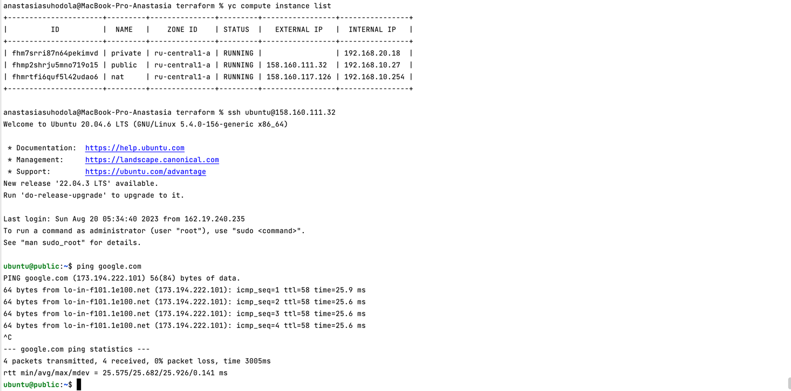
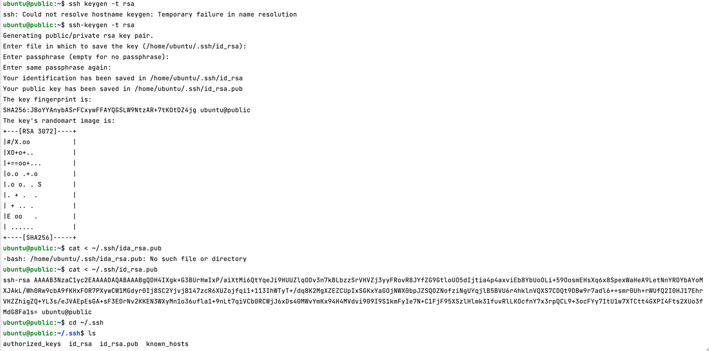
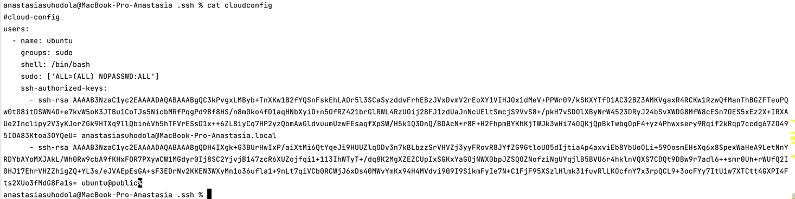
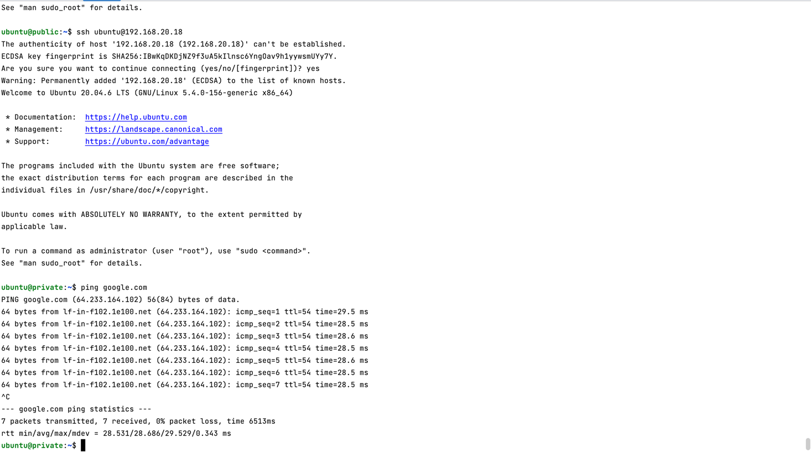
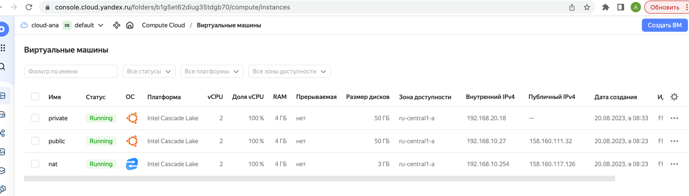
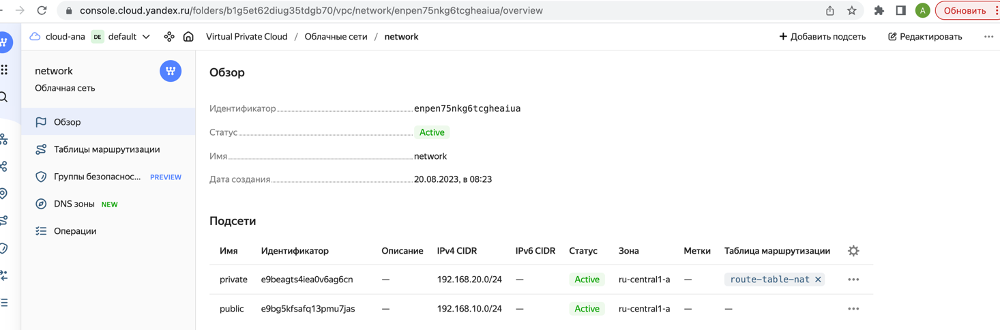
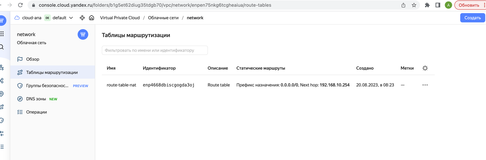

**Домашнее задание к занятию «Организация сети»**

**Подготовка к выполнению задания**

Домашнее задание состоит из обязательной части, которую нужно выполнить на провайдере Yandex Cloud, 
и дополнительной части в AWS (выполняется по желанию).

1. Все домашние задания в блоке 15 связаны друг с другом и в 
конце представляют пример законченной инфраструктуры.
2. Все задания нужно выполнить с помощью Terraform. 
Результатом выполненного домашнего задания будет код в репозитории.
3. Перед началом работы настройте доступ к облачным ресурсам 
из Terraform, используя материалы прошлых лекций и домашнее задание по 
теме «Облачные провайдеры и синтаксис Terraform». Заранее выберите регион (в случае AWS) и зону.

**Задание 1. Yandex Cloud**

Что нужно сделать

1. Создать пустую VPC. Выбрать зону.
2. Публичная подсеть.

* Создать в VPC subnet с названием `public`, сетью `192.168.10.0/24`.
* Создать в этой подсети NAT-инстанс, присвоив ему адрес `192.168.10.254`. 
В качестве `image_id` использовать `fd8qmbqk94q6rhb4m94t`.
* Создать в этой публичной подсети виртуалку с публичным IP, 
подключиться к ней и убедиться, что есть доступ к интернету.


```
export YC_TOKEN=$(yc iam create-token)
export YC_CLOUD_ID=$(yc config get cloud-id)
export YC_FOLDER_ID=$(yc config get folder-id)
```


3. Приватная подсеть.

* Создать в VPC subnet с названием `private`, сетью `192.168.20.0/2`4.
* Создать `route table`. Добавить статический маршрут, направляющий 
весь `исходящий` трафик `private` сети в `NAT-инстанс`.
* Создать в этой приватной подсети виртуалку с внутренним IP, 
подключиться к ней через виртуалку, созданную ранее, и убедиться, 
что есть доступ к интернету.

при создании вм private - добавить публичный ключ от public:

* сгенерировать ключевую пару на машине `public`
* добавить в файл `cloudconfig`
* скопировать в ~/.ssh `cp cloudconfig ~/.ssh`
* изменить блок метадата у машины `private` 
 ```
  metadata = {
    user-data = "${file("~/.ssh/cloudconfig")}"
    #    ssh-keys = "ubuntu:${file("~/.ssh/id_rsa.pub")}"
  }
   ```
* добавить `route_table_id = yandex_vpc_route_table.route-table-nat.id` в приватную подсеть
* выполнить `terraform apply` (перед этим удалить созданную ранее машину private)
* выполнить подключение к машине `public`
* выполнить подключение к машине `private` и проверить `ping google.com`









**Resource Terraform для Yandex Cloud:**

* [VPC subnet](https://registry.terraform.io/providers/yandex-cloud/yandex/latest/docs/resources/vpc_subnet).
* [Route table.](https://registry.terraform.io/providers/yandex-cloud/yandex/latest/docs/resources/vpc_route_table)
* [Compute Instance](https://registry.terraform.io/providers/yandex-cloud/yandex/latest/docs/resources/compute_instance).

файлы:

[main.tf](terraform/main.tf) - main.tf

[vars.tf](terraform/vars.tf) - vars.tf

[vaersions.tf](terraform/versions.tf) - versions.tf

[cloudconfig](cloudconfig)