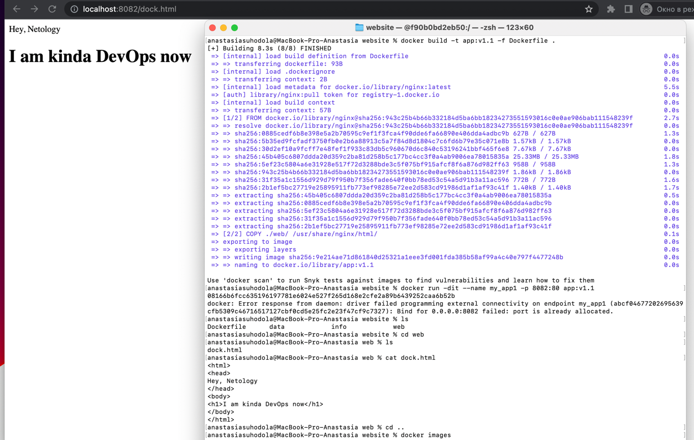
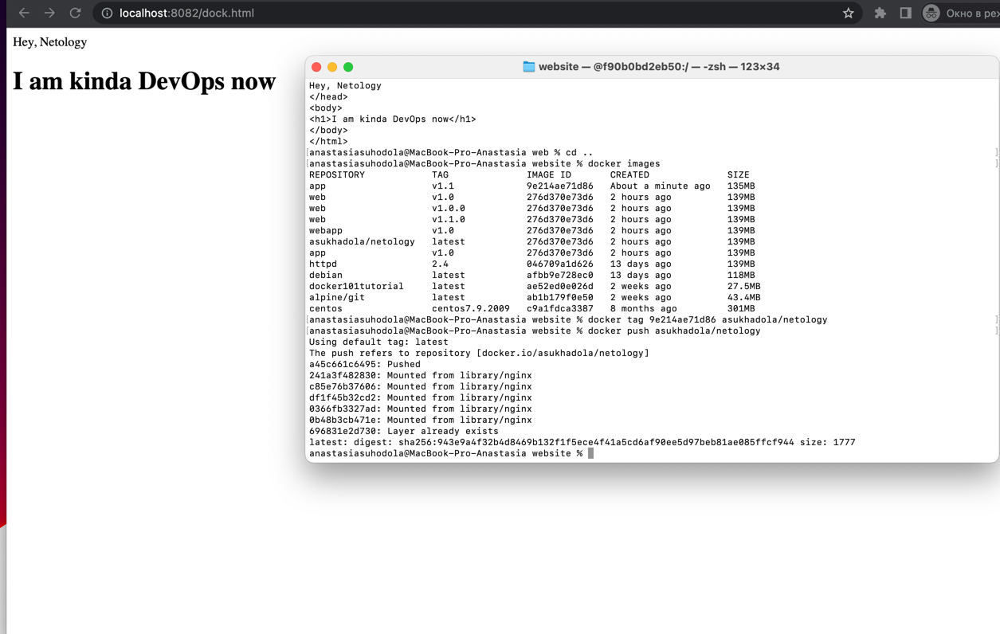
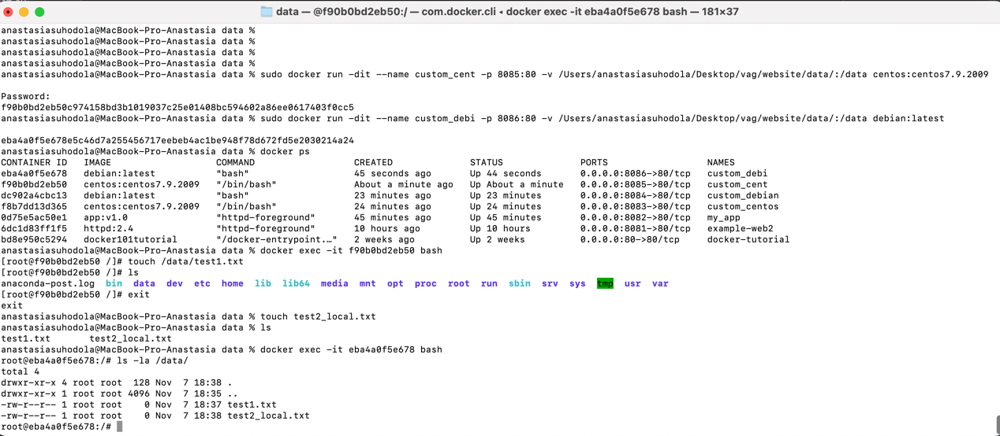

**Домашнее задание к занятию "5.3. Контейнеризация на примере Docker"**

**Задача 1**

Сценарий выполения задачи:

создайте свой репозиторий на https://hub.docker.com;

выберете любой образ, который содержит веб-сервер Nginx;

создайте свой fork образа;

реализуйте функциональность: запуск веб-сервера в фоне с индекс-страницей, содержащей HTML-код ниже:

<html>
<head>
Hey, Netology
</head>
<body>
<h1>I’m DevOps Engineer!</h1>
</body>
</html>

**Опубликуйте созданный форк в своем репозитории и предоставьте ответ в виде ссылки на https://hub.docker.com/username_repo.**

https://hub.docker.com/repository/docker/asukhadola/netology/general

**Задача 2**

Посмотрите на сценарий ниже и ответьте на вопрос: "Подходит ли в этом сценарии использование Docker контейнеров или лучше подойдет виртуальная машина, физическая машина? Может быть возможны разные варианты?"

Детально опишите и обоснуйте свой выбор.

--

Сценарий:

**Высоконагруженное монолитное java веб-приложение;**

монолитное приложение предполагает сборку frontend, backend в одном месте. Так как монолитное веб-приложение высоконагруженное,
то стоит размещать или на физической среде, или можно использовать паравиртуализацию, если накладными расходами можно пренебречь, 
однако контейнеризация не подойдет, так предполагается выполнение одного сервиса в рамках контейнера

**Nodejs веб-приложение;**

Это веб приложение, для таких приложений достаточно докера. В рамках микропроцессрной архитектуры может быть хорошим решением

**Мобильное приложение c версиями для Android и iOS;**

виртуализация с реализацией виртуальной машины

**Шина данных на базе Apache Kafka;**

это "сервис" по трансляции данных из одного формата данных одного приложения в другое. Хорошо применить контейнеризацию, 
так как отсутствуют накладные расходы на виртуализацию, достигается простота масштабирования и управления. 
В данном случае необходимо организация отказоустойчивости.

**Elasticsearch кластер для реализации логирования продуктивного веб-приложения - три ноды elasticsearch, два logstash и две ноды kibana;**

Для прода лучше использовать виртуализация, а отказоустойчивость решается на уровне HA кластера гипервизоров. 
В тестовой среде возможна реализация в контейнерах (для быстрого разворачивания).

**Мониторинг-стек на базе Prometheus и Grafana;**

системы можно развернуть в docker это бысто и можно масштабировать при необходимости.

**Mongodb, как основное хранилище данных для java-приложения;**

можно использовать виртуальную машину, можно контейнер. Разница вероятно всего в нагруженности сервиса при большой нагрузке лучше 
использовать виртуальную машину.

**Gitlab сервер для реализации CI/CD процессов и приватный (закрытый) Docker Registry.**

Можно использовать и виртуальную машину и докер контейнер. Докер позволит масштабировать решение, так же удобно обновлять 
приложение без большого простоя сервиса.
Использование виртуальной машины позволит удобно администрировать сервис.

**Задача 3**

**Запустите первый контейнер из образа centos c любым тэгом в фоновом режиме, подключив папку /data из текущей рабочей директории 
на хостовой машине в /data контейнера;**

`sudo docker run -dit --name custom_cent -p 8085:80 -v /Users/anastasiasuhodola/Desktop/vag/website/data/:/data centos:centos7.9.2009
`

**Запустите второй контейнер из образа debian в фоновом режиме, подключив папку /data из текущей рабочей директории 
на хостовой машине в /data контейнера;**

`sudo docker run -dit --name custom_debi -p 8086:80 -v /Users/anastasiasuhodola/Desktop/vag/website/data/:/data debian:latest 
`

**Подключитесь к первому контейнеру с помощью docker exec и создайте текстовый файл любого содержания в /data;**

`anastasiasuhodola@MacBook-Pro-Anastasia data % docker ps
CONTAINER ID   IMAGE                   COMMAND                  CREATED              STATUS              PORTS                  NAMES
eba4a0f5e678   debian:latest           "bash"                   45 seconds ago       Up 44 seconds       0.0.0.0:8086->80/tcp   custom_debi
f90b0bd2eb50   centos:centos7.9.2009   "/bin/bash"              About a minute ago   Up About a minute   0.0.0.0:8085->80/tcp   custom_cent
``dc902a4cbc13   debian:latest           "bash"                   23 minutes ago       Up 23 minutes       0.0.0.0:8084->80/tcp   custom_debian
f8b7dd13d365   centos:centos7.9.2009   "/bin/bash"              24 minutes ago       Up 24 minutes       0.0.0.0:8083->80/tcp   custom_centos
0d75e5ac50e1   app:v1.0                "httpd-foreground"       45 minutes ago       Up 45 minutes       0.0.0.0:8082->80/tcp   my_app
6dc1d83ff1f5   httpd:2.4               "httpd-foreground"       10 hours ago         Up 10 hours         0.0.0.0:8081->80/tcp   example-web2
bd8e950c5294   docker101tutorial       "/docker-entrypoint.…"   2 weeks ago          Up 2 weeks          0.0.0.0:80->80/tcp     docker-tutorial
``anastasiasuhodola@MacBook-Pro-Anastasia data % docker exec -it f90b0bd2eb50 bash
[root@f90b0bd2eb50 /]# touch /data/test1.txt`
`[root@f90b0bd2eb50 /]# ls
anaconda-post.log  bin  data  dev  etc  home  lib  lib64  media  mnt  opt  proc  root  run  sbin  srv  sys  tmp  usr  var
[root@f90b0bd2eb50 /]# exit
exit`

**Добавьте еще один файл в папку /data на хостовой машине;**

`anastasiasuhodola@MacBook-Pro-Anastasia data % touch test2_local.txt
anastasiasuhodola@MacBook-Pro-Anastasia data % ls
test1.txt	test2_local.txt`

**Подключитесь во второй контейнер и отобразите листинг и содержание файлов в /data контейнера.**

`anastasiasuhodola@MacBook-Pro-Anastasia data % docker exec -it eba4a0f5e678 bash
root@eba4a0f5e678:/# ls -la /data/
total 4`
`drwxr-xr-x 4 root root  128 Nov  7 18:38 .
drwxr-xr-x 1 root root 4096 Nov  7 18:35 ..
-rw-r--r-- 1 root root    0 Nov  7 18:37 test1.txt
-rw-r--r-- 1 root root    0 Nov  7 18:38 test2_local.txt
`

