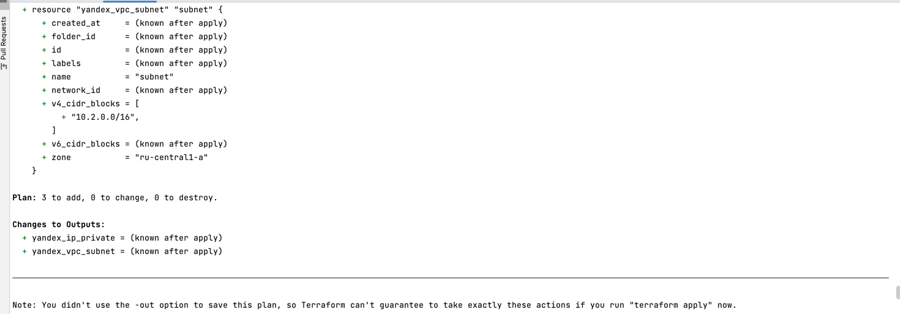
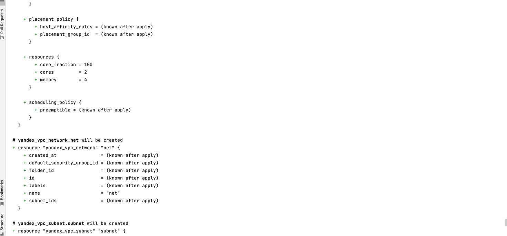

**Домашнее задание к занятию "7.2. Облачные провайдеры и синтаксис Terraform."**

Зачастую разбираться в новых инструментах гораздо интересней понимая то, как они работают изнутри. Поэтому в рамках первого 
необязательного задания предлагается завести свою учетную запись в AWS (Amazon Web Services) или Yandex.Cloud. 
Идеально будет познакомится с обоими облаками, потому что они отличаются.

**Задача 1 (Вариант с Yandex.Cloud).** 
Регистрация в ЯО и знакомство с основами (необязательно, но крайне желательно).

Подробная инструкция на русском языке содержится здесь.
Обратите внимание на период бесплатного использования после регистрации аккаунта.
Используйте раздел "Подготовьте облако к работе" для регистрации аккаунта. Далее раздел "Настройте провайдер" 
для подготовки базового терраформ конфига.

Воспользуйтесь инструкцией на сайте терраформа, что бы не указывать авторизационный токен в коде, 
а терраформ провайдер брал его из переменных окружений.

**Задача 2. Создание yandex_compute_instance через терраформ.**

1. В каталоге terraform вашего основного репозитория, который был создан в начале курсе, создайте файл main.tf и versions.tf.

[main.tf](../../terraform/main.tf) - main.tf

[outputs.tf](../../terraform/outputs.tf) - outputs.tf

[vars.tf](../../terraform/vars.tf) - vars.tf

[vaersions.tf](../../terraform/versions.tf) - versions.tf

2. Зарегистрируйте провайдер для yandex.cloud. Подробную инструкцию можно найти здесь.

Внимание! В гит репозиторий нельзя пушить ваши личные ключи доступа к аккаунту. 
Поэтому в предыдущем задании мы указывали их в виде переменных окружения.

3. В файле main.tf создайте ресурс yandex_compute_image.

4. Если вы выполнили первый пункт, то добейтесь того, что бы команда terraform plan выполнялась без ошибок.

yandex_compute_instance создан:

terraform init:

terraform plan:

terraform apply:

Созданный инстанс в интерфейсе:

В качестве результата задания предоставьте:

1. Ссылку на репозиторий с исходной конфигурацией терраформа.

[https://github.com/ana17519/devops-netology/tree/main/terraform](https://github.com/ana17519/devops-netology/tree/main/terraform)

2. Ответ на вопрос: при помощи какого инструмента (из разобранных на прошлом занятии) можно создать свой образ ami?

Для YandexCloud можно создавать образы при помощи средства шаблонизации packer.
